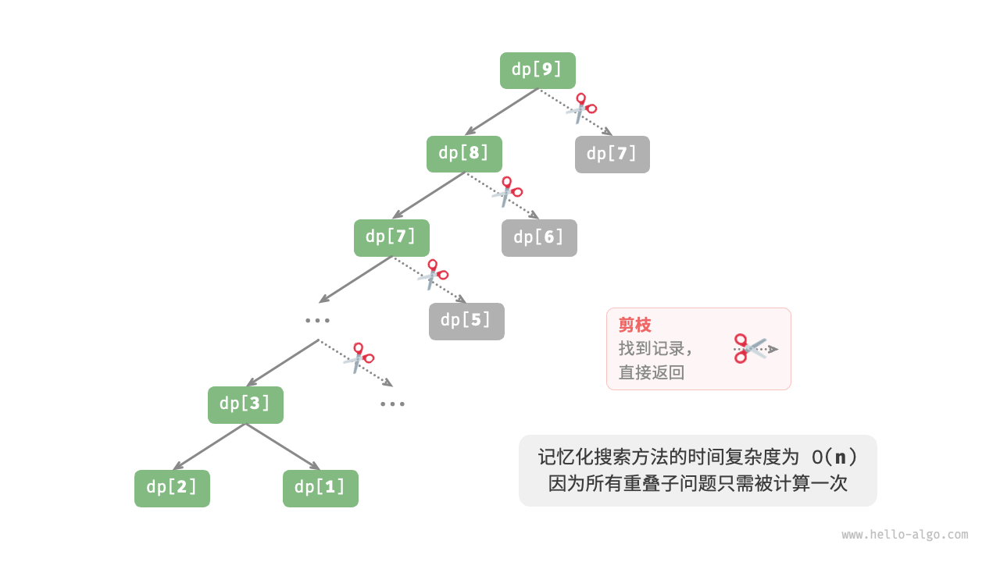
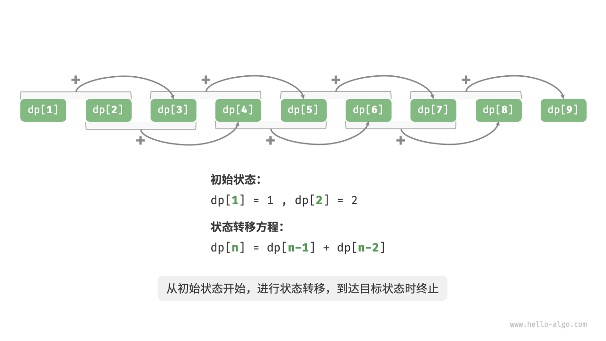
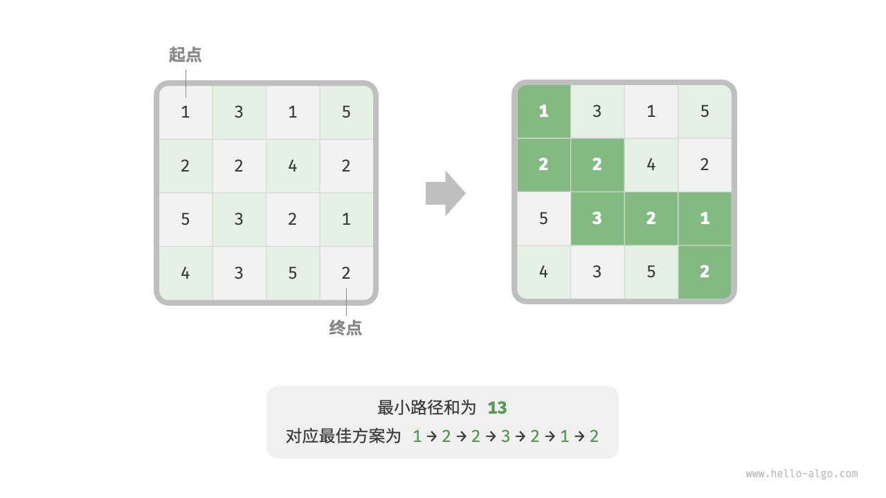

# 动态规划

- [动态规划](#动态规划)
  - [引言](#引言)
    - [方法一：暴力搜索](#方法一暴力搜索)
    - [方法二：记忆化搜索](#方法二记忆化搜索)
    - [方法三：动态规划](#方法三动态规划)
    - [空间优化](#空间优化)
  - [动态规划问题特性](#动态规划问题特性)
    - [最优子结构](#最优子结构)
    - [无后效性](#无后效性)
  - [动态规划解题思路](#动态规划解题思路)
    - [问题判断](#问题判断)
    - [问题求解步骤](#问题求解步骤)
      - [(1) 暴力搜索](#1-暴力搜索)
      - [(2)  记忆化搜索](#2--记忆化搜索)
      - [(3) 动态规划](#3-动态规划)
      - [(4) 空间优化](#4-空间优化)
  - [0-1 背包问题](#0-1-背包问题)
  - [编辑距离问题](#编辑距离问题)
    - [动态规划思路](#动态规划思路)
  - [总结](#总结)
  - [参考](#参考)

2024-11-07⭐
@author Jiawei Mao
***

## 引言

动态规划（dynamic programming）是一种将一个问题分解为更小的子问题，并通过存储子问题的解来避免重复计算，从而提高效率的算法。

下面从一个经典问题入手，先给出它的暴力回溯解法，观察其中包含的重叠子问题，再逐步导出更高效的动态规划解法。

**问：** 一个楼梯有 n 阶，每步可以上 1 阶或者 2 阶，请问到楼顶有多少种方案？

如图 14-1 所示，对于一个 3 阶楼梯，共有 3 种方案可以爬到楼顶。


> 图14-1 爬到第 3 阶的方案数量

本题的目标是求解方案数量，**可以通过回溯来穷举所有可能性**。具体来说，将爬楼梯想象为一个多轮选择的过程：从地面出发，每轮选择上 1 阶或 2 阶，每当到达楼梯顶部时就将方案数量加 1 ，当越过楼梯顶部时就将其剪枝。代码如下所示：

```java
/* 回溯 */
void backtrack(List<Integer> choices, int state, int n, List<Integer> res) {
    // 当爬到第 n 阶时，方案数量加 1
    if (state == n)
        res.set(0, res.get(0) + 1);
    // 遍历所有选择
    for (Integer choice : choices) {
        // 剪枝：不允许越过第 n 阶
        if (state + choice > n)
            continue;
        // 尝试：做出选择，更新状态
        backtrack(choices, state + choice, n, res);
        // 回退
    }
}

/* 爬楼梯：回溯 */
int climbingStairsBacktrack(int n) {
    List<Integer> choices = Arrays.asList(1, 2); // 可选择向上爬 1 阶或 2 阶
    int state = 0; // 从第 0 阶开始爬
    List<Integer> res = new ArrayList<>();
    res.add(0); // 使用 res[0] 记录方案数量
    backtrack(choices, state, n, res);
    return res.get(0);
}
```

### 方法一：暴力搜索

回溯算法通常并拆解问题，而是将求解问题看作一系列决策步骤，通过试探和剪枝，搜索所有可能的解。从问题分解的角度分析这道题。设爬到第 $i$ 阶共有 $dp[i]$ 种方案，那么 $dp[i]$ 就是原问题，其子问题包括：

$$
dp[i-1],dp[i-2],\cdots,dp[2],dp[1]
$$
由于每轮只能上 1 阶或 2 阶，因此当我们站在第 $i$ 阶楼梯上时，上一轮只可能站在第 $i−1$ 阶或第 $i−2$ 阶上。换句话说，我们只能从第 $i−1$ 阶或第 $i−2$ 阶迈向第 $i$ 阶。

由此便可得出一个重要推论：**爬到第 $i−1$ 阶的方案数加上爬到第 $i−2$ 阶的方案数就等于爬到第 i 阶的方案数**。公式如下：
$$
dp[i]=dp[i-1]+dp[i-2]
$$
这意味着在爬楼梯问题中，各个子问题之间存在递推关系，**原问题的解可以由子问题的解构建得来**。图 14-2 展示了该递推关系。


> 图 14-2 方案数量的递推关系

我们可以根据递推公式得到暴力搜索解法。以 $dp[n]$ 为起始点，**递归地将一个较大问题拆解为两个较小问题的和**，直至到达最小子问题 $dp[1]$ 和 $dp[2]$ 时返回。其中，最小子问题的解是已知的，即 $dp[1]=1$、$dp[2]=2$ ，表示爬到第 1、2 阶分别有 1、2 种方案。

观察以下代码，它和标准回溯代码都属于深度优先搜索，但更加简洁：

```java
/* 搜索 */
int dfs(int i) {
    // 已知 dp[1] 和 dp[2] ，返回之
    if (i == 1 || i == 2)
        return i;
    // dp[i] = dp[i-1] + dp[i-2]
    int count = dfs(i - 1) + dfs(i - 2);
    return count;
}

/* 爬楼梯：搜索 */
int climbingStairsDFS(int n) {
    return dfs(n);
}
```

图 14-3 展示了暴力搜索形成的递归树。对于问题 `dp[n]` ，其递归树的深度为 n ，时间复杂度为 $O(2^n)$ 。指数阶属于爆炸式增长，如果我们输入一个比较大的 n ，则会陷入漫长的等待之中。


> 图 14-3 爬楼梯对应递归树

观察图 14-3 ，**指数阶的时间复杂度是“重叠子问题”导致的**。例如 `dp[9]` 被分解为 `dp[8]` 和 `dp[7]` ，`dp[8]` 被分解为 `dp[7]` 和 `dp[6]` ，两者都包含子问题 `dp[7]` 。

以此类推，子问题中包含更小的重叠子问题，绝大部分计算资源都浪费在这些重叠的子问题上。

### 方法二：记忆化搜索

为了提升算法效率，**我们希望所有的重叠子问题都只被计算一次**。为此，我们声明一个数组 `mem` 来记录每个子问题的解，并在搜索过程中将重叠子问题剪枝。

1. 当首次计算 dp[i] 时，将其记录至 `mem[i]` ，以便之后使用。
2. 当再次需要计算 dp[i] 时，直接从 `mem[i]` 中获取结果，从而避免重复计算该子问题。

代码如下所示：

```java
/* 记忆化搜索 */
int dfs(int i, int[] mem) {
    // 已知 dp[1] 和 dp[2] ，返回之
    if (i == 1 || i == 2)
        return i;
    // 若存在记录 dp[i] ，则直接返回之
    if (mem[i] != -1)
        return mem[i];
    // dp[i] = dp[i-1] + dp[i-2]
    int count = dfs(i - 1, mem) + dfs(i - 2, mem);
    // 记录 dp[i]
    mem[i] = count;
    return count;
}

/* 爬楼梯：记忆化搜索 */
int climbingStairsDFSMem(int n) {
    // mem[i] 记录爬到第 i 阶的方案总数，-1 代表无记录
    int[] mem = new int[n + 1];
    Arrays.fill(mem, -1);
    return dfs(n, mem);
}
```

观察图 14-4 ，**经过记忆化处理后，所有重叠子问题都只需计算一次，时间复杂度优化至 O(n)** ，这是一个巨大的飞跃。



> 图 14-4  记忆化搜索对应递归树

### 方法三：动态规划

**记忆化搜索是一种“从顶至底”的方法**：我们从原问题（根节点）开始，递归地将较大子问题分解为较小子问题，直至解已知的最小子问题（叶节点）。之后，通过回溯逐层收集子问题的解，构建出原问题的解。

与之相反，**动态规划是一种“从底至顶”的方法**：从最小子问题的解开始，迭代地构建更大子问题的解，直至得到原问题的解。

由于动态规划不包含回溯过程，因此只需使用循环迭代实现，无须使用递归。在以下代码中，我们初始化一个数组 `dp` 来存储子问题的解，它起到了与记忆化搜索中数组 `mem` 相同的记录作用：

```java
/* 爬楼梯：动态规划 */
int climbingStairsDP(int n) {
    if (n == 1 || n == 2)
        return n;
    // 初始化 dp 表，用于存储子问题的解
    int[] dp = new int[n + 1];
    // 初始状态：预设最小子问题的解
    dp[1] = 1;
    dp[2] = 2;
    // 状态转移：从较小子问题逐步求解较大子问题
    for (int i = 3; i <= n; i++) {
        dp[i] = dp[i - 1] + dp[i - 2];
    }
    return dp[n];
}
```

下图模拟了以上代码执行过程。



> 图 14-5  爬楼梯的动态规划过程

与回溯算法一样，动态规划也使用“状态”概念来表示问题求解的特定阶段，每个状态都对应一个子问题以及相应的局部最优解。例如，爬楼梯问题的状态定义为当前所在楼梯阶数 i 。

根据以上内容，可以总结出动态规划的常用术语。

- 将数组 `dp` 称为 **dp 表**，`dp[i]` 表示状态 i 对应子问题的解。
- 将最小子问题对应的状态（第 1 阶和第 2 阶楼梯）称为**初始状态**。
- 将递推公式 dp[i]=dp[i−1]+dp[i−2] 称为**状态转移方程**。

### 空间优化

**由于 dp[i] 只与 dp[i−1] 和 dp[i−2] 有关，因此无须使用一个数组 `dp` 来存储所有子问题的解**，而只需两个变量滚动前进即可。代码如下所示：

```java
/* 爬楼梯：空间优化后的动态规划 */
int climbingStairsDPComp(int n) {
    if (n == 1 || n == 2)
        return n;
    int a = 1, b = 2;
    for (int i = 3; i <= n; i++) {
        int tmp = b;
        b = a + b;
        a = tmp;
    }
    return b;
}
```

观察以上代码，由于省去了数组 `dp` 占用的空间，因此空间复杂度从 O(n) 降至 O(1) 。

在动态规划问题中，当前状态往往仅与前面有限个状态有关，这时我们可以只保留必要的状态，通过“降维”来节省内存空间。**这种空间优化技巧被称为“滚动变量”或“滚动数组”**。

## 动态规划问题特性

上面介绍了动态规划是如何通过子问题分解来求解原问题。实际上，子问题分解是一种通用的算法思路，在分治、动态规划、回溯中的侧重点不同。

- 分治算法递归地将原问题划分为多个相互独立的子问题，直至最小子问题，并在回溯中合并子问题的解，最终得到原问题的解。
- 动态规划也对问题进行递归分解，但与分治算法的主要区别是，**动态规划中的子问题是相互依赖**的，在分解过程中会出现许多重叠子问题。
- 回溯算法在尝试和回退中穷举所有可能的解，并通过剪枝避免不必要的搜索分支。原问题的解由一系列决策步骤构成，我们可以将每个决策步骤之前的子序列看作一个子问题。

实际上，动态规划常用来求解最优化问题，它们不仅包含重叠子问题，还具有另外两大特性：最优子结构、无后效性。

### 最优子结构

我们对爬楼梯问题稍作改动，使之更加适合展示最优子结构概念。

**问题：** 爬楼梯最小代价

给定一个楼梯，每步可以上 1 阶或者 2 阶，每一阶楼梯上都贴有一个非负整数，表示在该台阶所需要付出的代价。给定一个非负整数数组 `cost` ，其中 `cost[i]` 表示在第 i 个台阶需要付出的代价，`cost[0]` 为地面（起始点）。请计算最少需要付出多少代价才能到达顶部？

如图 14-6 所示，若第 1、2、3 阶的代价分别为 1、10、1 ，则从地面爬到第 3 阶的最小代价为 2 。


> 图 14-6  爬到第 3 阶的最小代价

设 `dp[i]` 为爬到第 i 阶累计付出的代价，由于第 i 阶只可能从 i−1 阶或 i−2 阶走来，因此 `dp[i]` 只可能等于 `dp[i−1]+cost[i]` 或 `dp[i−2]+cost[i]` 。为了尽可能减少代价，我们应该选择两者中较小的那一个：
$$
dp[i]=min(dp[i-1],dp[i-2])+cost[i]
$$
这便可以引出最优子结构的含义：**原问题的最优解是从子问题的最优解构建得来的**。

本题显然具有最优子结构：从两个子问题最优解 `dp[i−1]` 和 `dp[i−2]` 中挑选出较优的那一个，并用它构建出原问题 `dp[i]` 的最优解。

那么，上一节的爬楼梯题目有没有最优子结构呢？它的目标是求解方案数量，看似是一个计数问题，但如果换一种问法：“求解最大方案数量”。我们意外地发现，**虽然题目修改前后是等价的，但最优子结构浮现出来了**：第 n 阶最大方案数量等于第 n−1 阶和第 n−2 阶最大方案数量之和。所以说，最优子结构的解释方式比较灵活，在不同问题中会有不同的含义。

根据状态转移方程，以及初始状态 `dp[1]=cost[1]` 和 `dp[2]=cost[2]` ，我们就可以得到动态规划代码：

```java
/* 爬楼梯最小代价：动态规划 */
int minCostClimbingStairsDP(int[] cost) {
    int n = cost.length - 1;
    if (n == 1 || n == 2)
        return cost[n];
    // 初始化 dp 表，用于存储子问题的解
    int[] dp = new int[n + 1];
    // 初始状态：预设最小子问题的解
    dp[1] = cost[1];
    dp[2] = cost[2];
    // 状态转移：从较小子问题逐步求解较大子问题
    for (int i = 3; i <= n; i++) {
        dp[i] = Math.min(dp[i - 1], dp[i - 2]) + cost[i];
    }
    return dp[n];
}
```


> 图 14-7  爬楼梯最小代价的动态规划过程

本题也可以进行空间优化，将一维压缩至零维，使得空间复杂度从 O(n) 降至 O(1) ：

```java
/* 爬楼梯最小代价：空间优化后的动态规划 */
int minCostClimbingStairsDPComp(int[] cost) {
    int n = cost.length - 1;
    if (n == 1 || n == 2)
        return cost[n];
    int a = cost[1], b = cost[2];
    for (int i = 3; i <= n; i++) {
        int tmp = b;
        b = Math.min(a, tmp) + cost[i];
        a = tmp;
    }
    return b;
}
```

### 无后效性

无后效性是动态规划能够有效解决问题的重要特性之一，其定义为：**给定一个确定的状态，它的未来发展只与当前状态有关，而与过去经历的所有状态无关**。

以爬楼梯问题为例，给定状态 i ，它会发展出状态 i+1 和状态 i+2 ，分别对应跳 1 步和跳 2 步。在做出这两种选择时，我们无须考虑状态 i 之前的状态，它们对状态 i 的未来没有影响。

然而，如果我们给爬楼梯问题添加一个约束，情况就不一样了。

**问题：** 带约束爬楼梯

一个共有 n 阶的楼梯，每步可以上 1 阶或者 2 阶，**但不能连续两轮跳 1 阶**，请问有多少种方案可以爬到楼顶？

如图 14-8 所示，爬上第 3 阶仅剩 2 种可行方案，其中连续三次跳 1 阶的方案不满足约束条件，因此被舍弃。


> 图 14-8  带约束爬到第 3 阶的方案数量

在该问题中，如果上一轮是跳 1 阶上来的，那么下一轮就必须跳 2 阶。这意味着，**下一步选择不能由当前状态（当前所在楼梯阶数）独立决定，还和前一个状态（上一轮所在楼梯阶数）有关**。

不难发现，此问题已不满足无后效性，状态转移方程 `dp[i]=dp[i−1]+dp[i−2]` 也失效了，因为 dp[i−1] 代表本轮跳 1 阶，但其中包含了许多“上一轮是跳 1 阶上来的”方案，而为了满足约束，我们就不能将 dp[i−1] 直接计入 dp[i] 中。

为此，需要扩展状态定义：**状态 [i,j] 表示处在第 i 阶并且上一轮跳了 j 阶**，其中 j∈{1,2} 。此状态定义有效地区分了上一轮跳了 1 阶还是 2 阶，可以据此判断当前状态是从何而来的。

- 当上一轮跳了 1 阶时，上上一轮只能选择跳 2 阶，即 dp[i,1] 只能从 dp[i−1,2] 转移过来。
- 当上一轮跳了 2 阶时，上上一轮可选择跳 1 阶或跳 2 阶，即 dp[i,2] 可以从 dp[i−2,1] 或 dp[i−2,2] 转移过来。

如图 14-9 所示，在该定义下，dp[i,j] 表示状态 [i,j] 对应的方案数。此时状态转移方程为：
$$
dp[i,1]=dp[i-1,2]\\
dp[i,2]=dp[i-2,1]+dp[i-2,2]
$$


> 图 14-9  考虑约束下的递推关系

最终，返回 dp[n,1]+dp[n,2] 即可，两者之和代表爬到第 n 阶的方案总数：

```java
/* 带约束爬楼梯：动态规划 */
int climbingStairsConstraintDP(int n) {
    if (n == 1 || n == 2) {
        return 1;
    }
    // 初始化 dp 表，用于存储子问题的解
    int[][] dp = new int[n + 1][3];
    // 初始状态：预设最小子问题的解
    dp[1][1] = 1;
    dp[1][2] = 0;
    dp[2][1] = 0;
    dp[2][2] = 1;
    // 状态转移：从较小子问题逐步求解较大子问题
    for (int i = 3; i <= n; i++) {
        dp[i][1] = dp[i - 1][2];
        dp[i][2] = dp[i - 2][1] + dp[i - 2][2];
    }
    return dp[n][1] + dp[n][2];
}
```

在上面的案例中，由于仅需多考虑前面一个状态，因此我们仍然可以通过扩展状态定义，使得问题重新满足无后效性。然而，某些问题具有非常严重的“有后效性”。

**问题：** 爬楼梯与障碍生成

一个楼梯共有 n 阶，每步可以上 1 阶或者 2 阶。**规定当爬到第 i 阶时，系统自动会在第 2i 阶上放上障碍物，之后所有轮都不允许跳到第 2i 阶上**。例如，前两轮分别跳到了第 2、3 阶上，则之后就不能跳到第 4、6 阶上。请问有多少种方案可以爬到楼顶？

在这个问题中，下次跳跃依赖过去所有的状态，因为每一次跳跃都会在更高的阶梯上设置障碍，并影响未来的跳跃。对于这类问题，动态规划往往难以解决。

实际上，许多复杂的组合优化问题（例如旅行商问题）不满足无后效性。对于这类问题，我们通常会选择使用其他方法，例如启发式搜索、遗传算法、强化学习等，从而在有限时间内得到可用的局部最优解。

## 动态规划解题思路

上面介绍了动态规划问题的主要特征，接下来探究两个更加实用的问题。

1. 如何判断一个问题是不是动态规划问题？
2. 求解动态规划问题该从何处入手，完整步骤是什么？

### 问题判断

总的来说，如果一个问题包含重叠子问题、最优子结构，并满足无后效性，那么它通常适合用动态规划求解。然而，我们很难从问题描述中直接提取出这些特性。因此我们通常会放宽条件，**先观察问题是否适合使用回溯（穷举）解决**。

**适合用回溯解决的问题通常满足“决策树模型”**，这种问题可以使用树形结构来描述，其中每一个节点代表一个决策，每一条路径代表一个决策序列。

换句话说，如果问题包含明确的决策概念，并且解是通过一系列决策产生的，那么它就满足决策树模型，通常可以使用回溯来解决。

在此基础上，动态规划问题还有一些判断的“加分项”。

- 问题包含最大（小）或最多（少）等最优化描述。
- 问题的状态能够使用一个列表、多维矩阵或树来表示，并且一个状态与其周围的状态存在递推关系。

相应地，也存在一些“减分项”。

- 问题的目标是找出所有可能的解决方案，而不是找出最优解。
- 问题描述中有明显的排列组合的特征，需要返回具体的多个方案。

如果一个问题满足决策树模型，并具有较为明显的“加分项”，我们就可以假设它是一个动态规划问题，并在求解过程中验证它。

### 问题求解步骤

动态规划的解题流程会因问题的性质和难度而有所不同，但通常遵循以下步骤：描述决策，定义状态，建立 dp 表，推导状态转移方程，确定边界条件等。

为了更形象地展示解题步骤，我们使用一个经典问题“最小路径和”来举例。

**问题：**最小路径和

给定一个 n×m 的二维网格 `grid` ，网格中的每个单元格包含一个非负整数，表示该单元格的代价。机器人以左上角单元格为起始点，每次只能向下或者向右移动一步，直至到达右下角单元格。请返回从左上角到右下角的最小路径和。

下图展示给定网格的最小路径和为 13.



> 图 14-10  最小路径和示例数据

**第一步：思考每轮的决策，定义状态，从而得到 dp 表**

本题的每一轮的决策就是从当前格子向下或向右走一步。设当前格子的行列索引为 `[i,j]` ，则向下或向右走一步后，索引变为 `[i+1,j]` 或 `[i,j+1]` 。因此，状态应包含行索引和列索引两个变量，记为 `[i,j]` 。

状态 `[i,j]` 对应的子问题为：从起始点 [0,0] 走到 [i,j] 的最小路径和，解记为 `dp[i,j]`。

至此，我们就得到了图 14-11 所示的二维 dp 矩阵，其尺寸与输入网格 grid 相同。


> 图 14-11  状态定义与 dp 表

> [!NOTE]
>
> 动态规划和回溯过程可以描述为一个决策序列，而状态由所有决策变量构成。它应当包含描述解题进度的所有变量，其包含了足够的信息，能够用来推导出下一个状态。
>
> 每个状态都对应一个子问题，定义一个 dp 表来存储所有子问题的解，状态的每个独立变量都是 dp 表的一个维度。从本质上看，dp 表是状态和子问题的解之间的映射。

**第二步：找出最优子结构，进而推导出状态转移方程**

对于状态 [i,j] ，它只能从上边格子 [i−1,j] 和左边格子 [i,j−1] 转移而来。因此最优子结构为：到达 [i,j] 的最小路径和由 [i,j−1] 的最小路径和与 [i−1,j] 的最小路径和中较小的那一个决定。

根据以上分析，可推出图 14-12 所示的状态转移方程：
$$
dp[i,j]=min(dp[i-1,j],dp[i,j-1])+grid[i,j]
$$


> 图 14-12  最优子结构与状态转移方程

**第三步：确定边界条件和状态转移顺序**

在本题中，处在首行的状态只能从其左边的状态得来，处在首列的状态只能从其上边的状态得来，因此首行 i=0 和首列 j=0 是边界条件。

如图 14-13 所示，由于每个格子是由其左方格子和上方格子转移而来，因此使用循环来遍历矩阵，外循环遍历各行，内循环遍历各列。


> 图 14-13  边界条件与状态转移顺序

根据以上分析，已经可以写出动态规划代码。然而子问题分解是一种从顶至底的思想，因此按照“暴力搜索 → 记忆化搜索 → 动态规划”的顺序实现更加符合思维习惯。

#### (1) 暴力搜索

从状态 [i,j] 开始搜索，不断分解为更小的状态 [i−1,j] 和 [i,j−1] ，递归函数包括以下要素。

- **递归参数**：状态 [i,j] 。
- **返回值**：从 [0,0] 到 [i,j] 的最小路径和 dp[i,j] 。
- **终止条件**：当 i=0 且 j=0 时，返回代价 grid[0,0] 。
- **剪枝**：当 i<0 时或 j<0 时索引越界，此时返回代价 +∞ ，代表不可行。

实现代码如下：

```java
/* 最小路径和：暴力搜索 */
int minPathSumDFS(int[][] grid, int i, int j) {
    // 若为左上角单元格，则终止搜索
    if (i == 0 && j == 0) {
        return grid[0][0];
    }
    // 若行列索引越界，则返回 +∞ 代价
    if (i < 0 || j < 0) {
        return Integer.MAX_VALUE;
    }
    // 计算从左上角到 (i-1, j) 和 (i, j-1) 的最小路径代价
    int up = minPathSumDFS(grid, i - 1, j);
    int left = minPathSumDFS(grid, i, j - 1);
    // 返回从左上角到 (i, j) 的最小路径代价
    return Math.min(left, up) + grid[i][j];
}
```

图 14-14 给出了以 dp[2,1] 为根节点的递归树，其中包含一些重叠子问题，其数量会随着网格 `grid` 的尺寸变大而急剧增多。

从本质上看，造成重叠子问题的原因为：**存在多条路径可以从左上角到达某一单元格**。


> 图 14-14  暴力搜索递归树

每个状态都有向下和向右两种选择，从左上角走到右下角总共需要 m+n−2 步，所以最差时间复杂度为 $O(2^{m+n})$ 。请注意，这种计算方式未考虑临近网格边界的情况，当到达网络边界时只剩下一种选择，因此实际的路径数量会少一些。

#### (2)  记忆化搜索

我们引入一个和网格 `grid` 相同尺寸的记忆列表 `mem` ，用于记录各个子问题的解，并将重叠子问题进行剪枝：

```java
/* 最小路径和：记忆化搜索 */
int minPathSumDFSMem(int[][] grid, int[][] mem, int i, int j) {
    // 若为左上角单元格，则终止搜索
    if (i == 0 && j == 0) {
        return grid[0][0];
    }
    // 若行列索引越界，则返回 +∞ 代价
    if (i < 0 || j < 0) {
        return Integer.MAX_VALUE;
    }
    // 若已有记录，则直接返回
    if (mem[i][j] != -1) {
        return mem[i][j];
    }
    // 左边和上边单元格的最小路径代价
    int up = minPathSumDFSMem(grid, mem, i - 1, j);
    int left = minPathSumDFSMem(grid, mem, i, j - 1);
    // 记录并返回左上角到 (i, j) 的最小路径代价
    mem[i][j] = Math.min(left, up) + grid[i][j];
    return mem[i][j];
}
```

如图 14-15 所示，在引入记忆化后，所有子问题的解只需计算一次，因此时间复杂度取决于状态总数，即网格尺寸 $O(nm)$ 。


> 图 14-15  记忆化搜索递归树

#### (3) 动态规划

基于迭代实现动态规划解法，代码如下所示：

```java
/* 最小路径和：动态规划 */
int minPathSumDP(int[][] grid) {
    int n = grid.length, m = grid[0].length;
    // 初始化 dp 表
    int[][] dp = new int[n][m];
    dp[0][0] = grid[0][0];
    // 状态转移：首行
    for (int j = 1; j < m; j++) {
        dp[0][j] = dp[0][j - 1] + grid[0][j];
    }
    // 状态转移：首列
    for (int i = 1; i < n; i++) {
        dp[i][0] = dp[i - 1][0] + grid[i][0];
    }
    // 状态转移：其余行和列
    for (int i = 1; i < n; i++) {
        for (int j = 1; j < m; j++) {
            dp[i][j] = Math.min(dp[i][j - 1], dp[i - 1][j]) + grid[i][j];
        }
    }
    return dp[n - 1][m - 1];
}
```

图 14-16 展示了最小路径和的状态转移过程，其遍历了整个网格，**因此时间复杂度为 O(nm)** 。

数组 `dp` 大小为 n×m ，**因此空间复杂度为 O(nm)** 。

#### (4) 空间优化

由于每个格子只与其左边和上边的格子有关，因此我们可以只用一个单行数组来实现 dp 表。

请注意，因为数组 `dp` 只能表示一行的状态，所以我们无法提前初始化首列状态，而是在遍历每行时更新它：

```java
/* 最小路径和：空间优化后的动态规划 */
int minPathSumDPComp(int[][] grid) {
    int n = grid.length, m = grid[0].length;
    // 初始化 dp 表
    int[] dp = new int[m];
    // 状态转移：首行
    dp[0] = grid[0][0];
    for (int j = 1; j < m; j++) {
        dp[j] = dp[j - 1] + grid[0][j];
    }
    // 状态转移：其余行
    for (int i = 1; i < n; i++) {
        // 状态转移：首列
        dp[0] = dp[0] + grid[i][0];
        // 状态转移：其余列
        for (int j = 1; j < m; j++) {
            dp[j] = Math.min(dp[j - 1], dp[j]) + grid[i][j];
        }
    }
    return dp[m - 1];
}
```

## 0-1 背包问题

背包问题是一个非常好的动态规划入门题目，是动态规划中最常见的问题形式。其具有很多变种，例如 0-1 背包问题、完全背包问题、多重背包问题等。

在本节中，我们先来求解最常见的 0-1 背包问题。

**问题：** 给定 n 个物品，第 i 个物品的重量为 `wgt[i−1]`、价值为 `val[i−1]` ，和一个容量为 cap 的背包。每个物品只能选择一次，问在限定背包容量下能放入物品的最大价值。

观察图 14-17 ，由于物品编号 i 从 1 开始计数，数组索引从 0 开始计数，因此物品 i 对应重量 wgt[i−1] 和价值 val[i−1] 。


> 图 14-17  0-1 背包的示例数据

我们可以将 0-1 背包问题看作一个由 n 轮决策组成的过程，对于每个物体都有不放入和放入两种决策，因此该问题满足决策树模型。

该问题的目标是求解“在限定背包容量下能放入物品的最大价值”，因此较大概率是一个动态规划问题。

**第一步：思考每轮的决策，定义状态，从而得到 dp 表**

对于每个物品来说，不放入背包，背包容量不变；放入背包，背包容量减小。由此可得状态定义：当前物品编号 i 和背包容量 c ，记为 `[i,c]` 。

状态 `[i,c]` 对应的子问题为：**前 i 个物品在容量为 c 的背包中的最大价值**，记为 `dp[i,c]` 。

待求解的是 `dp[n,cap]` ，因此需要一个尺寸为 $(n+1)×(cap+1)$ 的二维 dp 表。

## 编辑距离问题

编辑距离，也称 Levenshtein 距离，指两个字符串之间互相转换的最少修改次数，通常用于在信息检索和自然语言处理中度量两个序列的相似度。

**问题：** 输入两个字符串 $s$ 和 $t$ ，返回将 s 转换为 t 所需的最少编辑步数。

你可以在一个字符串中进行三种编辑操作：插入一个字符、删除一个字符、将字符替换为任意一个字符。

如图 14-27 所示，将 `kitten` 转换为 `sitting` 需要编辑 3 步，包括 2 次替换操作与 1 次添加操作；将 `hello` 转换为 `algo` 需要 3 步，包括 2 次替换操作和 1 次删除操作。


> 图 14-27  编辑距离的示例数据

**编辑距离问题可以很自然地用决策树模型来解释**。字符串对应树节点，一轮决策（一次编辑操作）对应树的一条边。

如图 14-28 所示，在不限制操作的情况下，每个节点都可以派生出许多条边，每条边对应一种操作，这意味着从 `hello` 转换到 `algo` 有许多种可能的路径。

从决策树的角度看，本题的目标是求解节点 `hello` 和节点 `algo` 之间的最短路径。


> 图 14-28  基于决策树模型表示编辑距离问题

### 动态规划思路

**第一步：思考每轮的决策，定义状态，从而得到 dp 表**

每一轮的决策是对字符串 s 进行一次编辑操作。

我们希望在编辑操作的过程中，问题的规模逐渐缩小，这样才能构建子问题。设字符串 s 和 t 的长度分别为 n 和 m ，我们先考虑两字符串尾部的字符 s[n−1] 和 t[m−1] 。

- 若 s[n−1] 和 t[m−1] 相同，可以跳过它们，直接考虑 s[n−2] 和 t[m−2] 。
- 若 s[n−1] 和 t[m−1] 不同，需要对 s 进行一次编辑（插入、删除、替换），使得两字符串尾部的字符相同，然后考虑规模更小的问题。

也就是说，在字符串 s 中进行的每一轮决策（编辑操作），都会使得 s 和 t 中剩余的待匹配字符发生变化。因此，状态为当前在 s 和 t 中考虑的第 i 和第 j 个字符，记为 [i,j] 。

状态 [i,j] 对应的子问题：**将 s 的前 i 个字符更改为 t 的前 j 个字符所需的最少编辑步数**。

至此，得到一个尺寸为 (i+1)×(j+1) 的二维 dp 表。

**第二步：找出最优子结构，进而推导出状态转移方程**

考虑子问题 dp[i,j] ，其对应的两个字符串的尾部字符为 s[i−1] 和 t[j−1] ，可根据不同编辑操作分为图 14-29 所示的三种情况。

1. 在 s[i−1] 之后添加 t[j−1] ，则剩余子问题 dp[i,j−1] 。
2. 删除 s[i−1] ，则剩余子问题 dp[i−1,j] 。
3. 将 s[i−1] 替换为 t[j−1] ，则剩余子问题 dp[i−1,j−1] 。


> 图 14-29  编辑距离的状态转移

## 总结

- 动态规划对问题进行分解，并通过存储子问题的解来规避重复计算，提高计算效率。
- 不考虑时间的前提下，所有动态规划问题都可以用回溯（暴力搜索）进行求解，但递归树中存在大量的重叠子问题，效率极低。通过引入记忆化列表，可以存储所有计算过的子问题的解，从而保证重叠子问题只被计算一次。
- 记忆化搜索是一种从顶至底的递归式解法，而与之对应的动态规划是一种从底至顶的递推式解法，如同“填写表格”一样。由于当前状态仅依赖某些局部状态，因此可以消除 `dp` 表的一个维度，从而降低空间复杂度。
- 子问题分解是一种通用的算法思路，在分治、动态规划、回溯中具有不同的性质。
- 动态规划问题有三大特性：重叠子问题、最优子结构、无后效性。
- 如果原问题的最优解可以从子问题的最优解构建得来，则它就具有最优子结构。
- 无后效性指对于一个状态，其未来发展只与该状态有关，而与过去经历的所有状态无关。许多组合优化问题不具有无后效性，无法使用动态规划快速求解。

**背包问题**

- 背包问题是最典型的动态规划问题之一，具有 0-1 背包、完全背包、多重背包等变种。
- 0-1 背包的状态定义为前 i 个物品在容量为 c 的背包中的最大价值。根据不放入背包和放入背包两种决策，可得到最优子结构，并构建出状态转移方程。在空间优化中，由于每个状态依赖正上方和左上方的状态，因此需要倒序遍历列表，避免左上方状态被覆盖。
- 完全背包问题的每种物品的选取数量无限制，因此选择放入物品的状态转移与 0-1 背包问题不同。由于状态依赖正上方和正左方的状态，因此在空间优化中应当正序遍历。
- 零钱兑换问题是完全背包问题的一个变种。它从求“最大”价值变为求“最小”硬币数量，因此状态转移方程中的 max() 应改为 min() 。从追求“不超过”背包容量到追求“恰好”凑出目标金额，因此使用 amt+1 来表示“无法凑出目标金额”的无效解。
- 零钱兑换问题 II 从求“最少硬币数量”改为求“硬币组合数量”，状态转移方程相应地从 min() 改为求和运算符。

**编辑距离问题**

- 编辑距离（Levenshtein 距离）用于衡量两个字符串之间的相似度，其定义为从一个字符串到另一个字符串的最少编辑步数，编辑操作包括添加、删除、替换。
- 编辑距离问题的状态定义为将 s 的前 i 个字符更改为 t 的前 j 个字符所需的最少编辑步数。当 s[i]≠t[j] 时，具有三种决策：添加、删除、替换，它们都有相应的剩余子问题。据此便可以找出最优子结构与构建状态转移方程。而当 s[i]=t[j] 时，无须编辑当前字符。
- 在编辑距离中，状态依赖其正上方、正左方、左上方的状态，因此空间优化后正序或倒序遍历都无法正确地进行状态转移。为此，我们利用一个变量暂存左上方状态，从而转化到与完全背包问题等价的情况，可以在空间优化后进行正序遍历。


## 参考

- https://www.hello-algo.com/chapter_paperbook
- https://github.com/williamfiset/Algorithms/tree/master?tab=readme-ov-file