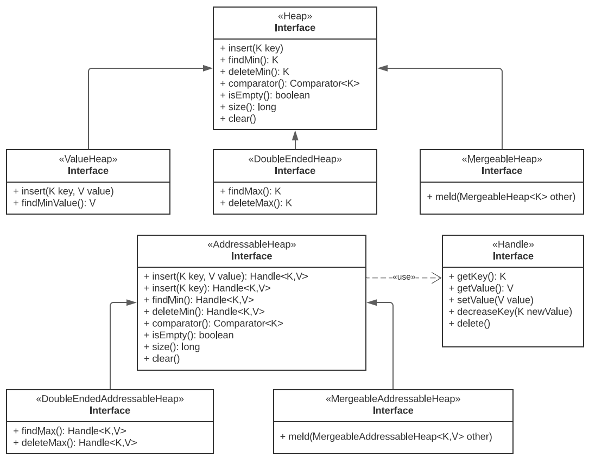
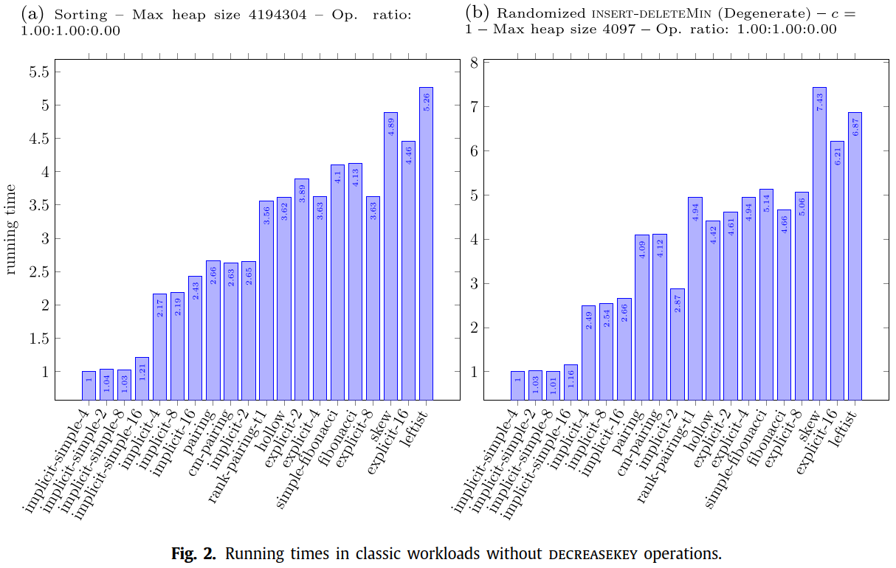

# JHeaps

Michail, D. 2021. JHeaps: An open-source library of priority queues. SoftwareX IF=3.4, 16: 100869.

## 简介

JHeaps 包含大量最新 heap 实现。heap 是能够高效查找（可能包括删除）最小值的数据结构。通常支持以下操作：

- `make-heap`: 创建一个空 heap
- `findMin (H)`: 返回 `H` 的最小值，如果 heap 为空，返回 `null`
- `insert (H,x,k)`: 插入 key 为 `k` 的 item x，返回指针 x̄
- `deleteMin (H)`: 从 H 删除 key 最小的 item
- `decreaseKey (H,x̄,k)`: 将 x̄ 的 key 减小到 k
- `delete (H,x̄)`: 从 H 删除 x̄
- `meld (H1,H2)`: 将 heap H2 的所有 items 添加到 H1，H2 标记为不可用管

## 接口设计

对优先队列，Java 提供了一个基本的 `PriorityQueue` 类，其 `insert` 和 `deleteMin` 为 $O(\log n)$，但没有提供 `decreaseKey`、 `delete` (线性搜索除外) 或 `meld` 功能。JHeaps 库将不同的 heap 实现合并到几个定义良好的接口。主要有以下三个级别的功能：

1. 基本 heap 操作，如 `findMin`, `deleteMin`, `insert`, `size`, `isEmpty`
2. 可寻址 heap 操作（addressable），如 `decreaseKey` 和 `delete`
3. 融合 heap 操作（meld）

如下图所示：



> **Fig.1** `AddressableHeap` 为包含 key 和关联值的可寻址 heap。`Heap` 为不可寻址 heap，只包含 keys。`ValueHeap` 用于支持关联值。

### Heap 和可寻址 heap

heaps 之间的主要区别在于它们是否可寻址。因此包含 `Heap` 和 `AddressableHeap` 这两个主要接口。下面以更通用的可寻址 heap 为例。定义如下：

```java
import java.util.Comparator;

public interface AddressableHeap<K, V> {
    
    interface Handle<K, V> {
        K getKey();
        V getValue();
        void setValue(V value);
        void decreaseKey(K newKey);
        void delete();
    }

    Comparator<? super K> comparator();

    AddressableHeap.Handle<K, V> insert(K key, V value);
    AddressableHeap.Handle<K, V> insert(K key);

    AddressableHeap.Handle<K, V> findMin();
    AddressableHeap.Handle<K, V> deleteMin();

    boolean isEmpty();
    long size();
    void clear();
}
```

`Heap` 和 `AddressableHeap` 接口的主要区别在于 `insert()`, `findMin()` 和 `deleteMin()` 返回 handles。通过 handle 用户可以 read key, read-write value，以及 `decreaseKey` 和 `delete`。

### double-ended heap

double-ended 优先队列可以同时查找和为主最小和最大元素。因此，这类 heap 的接口还包含对称操作 `findMax`, `deleteMax`, 和 `increaseKey`。`increaseKey` 操作通过 double-ended heap 返回的 handle 实现。

```java
import java.util.NoSuchElementException;

public interface DoubleEndedHeap<K> extends Heap<K> {
    K findMax();
    K deleteMax();
}
```

### 可融合 heap

可容易 heap 支持额外的融合操作：

```java
public interface MergeableHeap<K> extends Heap<K> {
    void meld(MergeableHeap<K> other);
}
```

仅基础类型相同的 heap 之间才能融合。此外，两个 heaps 必须使用相同的 `Comparator` 进行初始化。融合需要特殊算法支持，才能在少于线性时间内实现。

## JHeaps 库

JHeaps 实现了大量堆数据结构，代表了技术所有的设计技术。下表包含所有可用实现的列表。

| Class (heap name)                                           | Type                   | Addressable | Meldable | Doubleended | Monotone |
| :---------------------------------------------------------- | :--------------------- | :---------- | :------- | :---------- | :------- |
| `BinaryArrayHeap` (*implicit-simple-2*)                     | array                  | ✗           | ✗        | ✗           | ✗        |
| `BinaryArrayIntegerValueHeap` (*implicit-simple-2*)         | array                  | ✗           | ✗        | ✗           | ✗        |
| `BinaryArrayAddressableHeap`(*implicit-2*)                  | array                  | ✓           | ✗        | ✗           | ✗        |
| `BinaryArrayWeakHeap` (*implicit-weak-2*)                   | array                  | ✗           | ✗        | ✗           | ✗        |
| `BinaryArrayBulkInsertWeakHeap` (*implicit-bulkins-weak-2*) | array                  | ✗           | ✗        | ✗           | ✗        |
| `MinMaxBinaryArrayDoubleEndedHeap` (*minmax-implicit-2*)    | array                  | ✗           | ✗        | ✓           | ✗        |
| `DaryArrayHeap` (*implicit-simple-d*)                       | array                  | ✗           | ✗        | ✗           | ✗        |
| `DaryArrayAddressableHeap` (*implicit-d*)                   | array                  | ✓           | ✗        | ✗           | ✗        |
| `FibonacciHeap` (*fibonacci*)                               | tree                   | ✓           | ✓        | ✗           | ✗        |
| `SimpleFibonacciHeap` (*simple-fibonacci*)                  | tree                   | ✓           | ✓        | ✗           | ✗        |
| `PairingHeap` (*pairing*)                                   | tree                   | ✓           | ✓        | ✗           | ✗        |
| `RankPairingHeap` (*rank-pairing-t1*)                       | tree                   | ✓           | ✓        | ✗           | ✗        |
| `CostlessMeldPairingHeap` (*cm-pairing*)                    | tree                   | ✓           | ✓        | ✗           | ✗        |
| `BinaryTreeAddressableHeap` (*explicit-2*)                  | tree                   | ✓           | ✗        | ✗           | ✗        |
| `DaryTreeAddressableHeap` (*explicit-d*)                    | tree                   | ✓           | ✗        | ✗           | ✗        |
| `LeftistHeap` (*leftist*)                                   | tree                   | ✓           | ✓        | ✗           | ✗        |
| `SkewHeap` (*skew*)                                         | tree                   | ✓           | ✓        | ✗           | ✗        |
| `BinaryTreeSoftHeap` (*explicit-soft-simple-2*)             | tree                   | ✗           | ✓        | ✗           | ✗        |
| `BinaryTreeSoftAddressableHeap` (*explicit-soft-2*)         | tree                   | ✓           | ✓        | ✗           | ✗        |
| `ReflectedPairingHeap` (*reflected-pairing*)                | tree                   | ✓           | ✓        | ✓           | ✗        |
| `ReflectedFibonacciHeap` (*reflected-fibonacci*)            | tree                   | ✓           | ✓        | ✓           | ✗        |
| `HollowHeap` (*hollow*)                                     | directed acyclic graph | ✓           | ✓        | ✗           | ✗        |
| `IntegerRadixHeap` (*radix-simple*)                         | bucket                 | ✗           | ✗        | ✗           | ✓        |
| `LongRadixHeap` (*radix-simple*)                            | bucket                 | ✗           | ✗        | ✗           | ✓        |
| `DoubleRadixHeap` (*radix-simple*)                          | bucket                 | ✗           | ✗        | ✗           | ✓        |
| `BigIntegerRadixHeap` (*radix-simple*)                      | bucket                 | ✗           | ✗        | ✗           | ✓        |
| `IntegerAddressableRadixHeap` (*radix*)                     | bucket                 | ✓           | ✗        | ✗           | ✓        |
| `LongAddressableRadixHeap` (*radix*)                        | bucket                 | ✓           | ✗        | ✗           | ✓        |
| `DoubleAddressableRadixHeap` (*radix*)                      | bucket                 | ✓           | ✗        | ✗           | ✓        |
| `BigIntegerAddressableRadixHeap` (*radix*)                  | bucket                 | ✓           | ✗        | ✗           | ✓        |

JHeaps 通过泛型来支持不同的数据类型，通过自定义 `Comparator` 支持以不同的方式比较 keys。

在初始化时 JHeaps 尝试区别自然 comparator 和自定义 comparator，从而避免在 for 循环中进行不必要的比较。

JHeaps 试图在不牺牲性能的前提下尽可能减少内存消耗。对基于数组的 heap 实现，在初始化时应提供适当的 capacity 以足够存储所有元素。

库中许多 heap 支持合并操作。JHeaps 库通过为每个 heap 和每个 handle 维护一个 owner 引用来支持该操作。对 handle，owner 引用为 `heap`，即指向最初创建该 handle 的 `heap`，但在该 heap 与另一个 heap 合并后，该值可能改变。类似的，heap 的 owner 引用称为 `otther`，最初指向自己，在合并后可能指向另一个 heap。handles 的 owner 引用使 handles 的从一个 heap 迁移到另一个 heap，无需迭代。例如，使用 `h1.meld(h2)` 合并 `h1` 和 `h2`，其实现会首先合并就结构，然后执行 `h2.other=h1`。`meld` 操作不会触碰 `h2` 的任何 handle，稍后使用 `owner` 引用自然能确定归属。为了避免维护完整的联合查找数据结构，JHeaps 不允许一个 heap 被合并多次。

## 实验

对比不同工作负载上的不同堆实现的性能。

首先使用参考 heap 实现执行工作负载，并用一个文件记录所有操作，该文件称为 trace-file。然后用不同 drivers 执行 trace-file，每个 heap 一次；同时用 dummy-driver 执行，dummy-driver 只解析 trace-file，但不执行任何 heap 操作，dummy-driver 用于归一化结果，即从每个 heap-driver 的结果时间 dummy-driver 的时间。

最终统计数据以最小值的倍数呈现，因此对每个数据，最小值的 driver 结果为 1。下表提供了每个实验的运行时间，包括 dummy，最佳和最差结果，毫秒。

| Experiment                      | Dummy | Best  |                     | Worst |               |
| :------------------------------ | :---- | :---- | :------------------ | ----- | ------------- |
| **Sorting**                     |       |       |                     |       |               |
| Sorting                         | 10033 | 18462 | (implicit-simple-4) | 54341 | (leftist)     |
| **Randomized insert-deleteMin** |       |       |                     |       |               |
| Degenerate                      | 9239  | 13311 | (implicit-simple-4) | 39477 | (skew)        |
| **Randomized decreaseKey**      |       |       |                     |       |               |
| Middle, c=1,k=1                 | 6709  | 12529 | (implicit-8)        | 21419 | (skew)        |
| Min, c=1,k=1                    | 6496  | 10203 | (cm-pairing)        | 18411 | (explicit-16) |
| Middle, c=1,k=1024              | 14530 | 15749 | (implicit-2)        | 17395 | (hollow)      |
| Min, c=1,k=1024                 | 22875 | 25702 | (implicit-4)        | 28550 | (hollow)      |
| **Dijkstra**                    |       |       |                     |       |               |
| USA road map (CAL)              | 12876 | 15478 | (implicit-2)        | 20511 | (explicit-16) |
| acyc pos                        | 2984  | 3464  | (pairing)           | 3925  | (hollow)      |
| grid slong                      | 4169  | 4570  | (implicit-2)        | 5033  | (explicit-16) |
| grid phard                      | 6823  | 7292  | (pairing)           | 7782  | (implicit-16) |
| grid ssquare                    | 8195  | 9542  | (implicit-2)        | 11169 | (explicit-16) |
| grid ssquare_s                  | 12053 | 13816 | (pairing)           | 17657 | (skew)        |

操作格式：insert:deleteMin:decreaseKey。

### Sorting

最经典的工作负载是均匀分布的随机 keys `n insert` 操作+ `n deleteMin` 操作。该情况有利于不可寻址的 implicit d-ary heaps (Fig.2a)。



### Randomized ins-dmn

n 次随机 `insert` 操作，然后执行 `cn` 次：一个随机 `insert` + 一个 `deleteMin`。Fig.2b 为 `c=1` 时的结果。

该工作负载