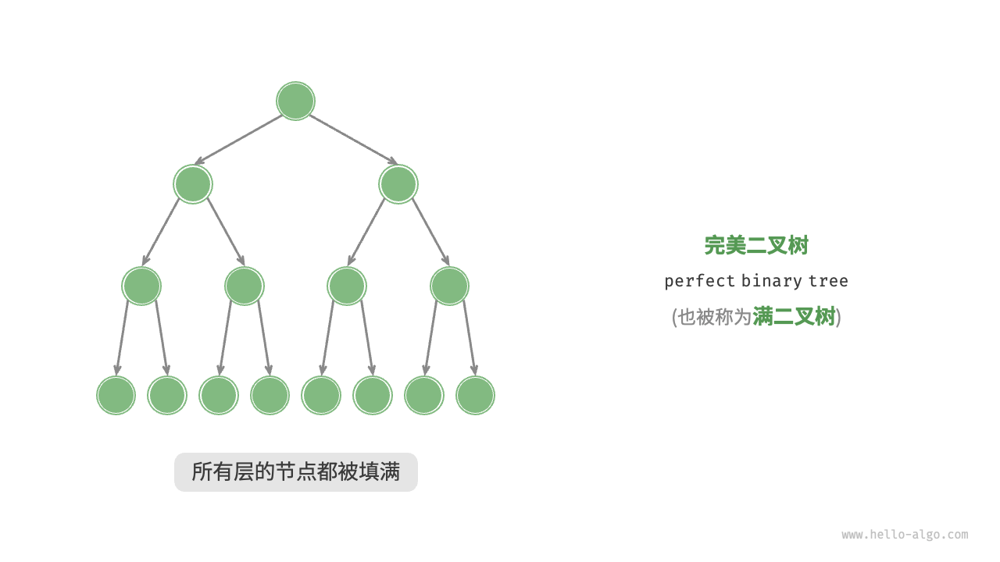
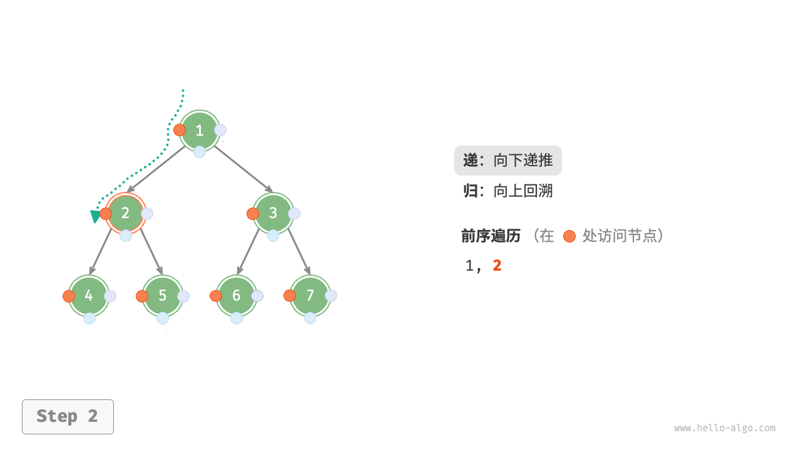
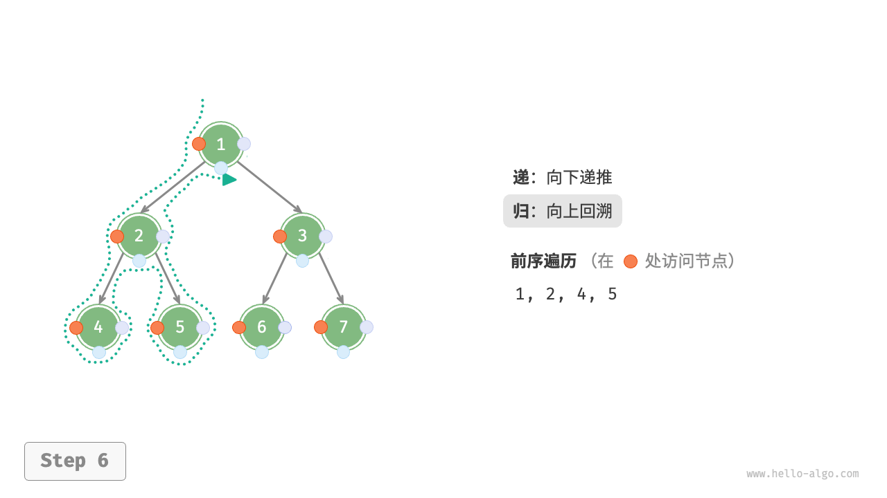

# 树

## 1. 二叉树

**二叉树**（binary tree）是一种非线性数据结构，代表“祖先”与“后代”之间的派生关系，体现了“一分为二”的分治逻辑。与链表类似，二叉树的基本单元是节点，每个节点包含值、左子节点引用和右子节点引用。

```java
/* 二叉树节点类 */
class TreeNode {
    int val;         // 节点值
    TreeNode left;   // 左子节点引用
    TreeNode right;  // 右子节点引用
    TreeNode(int x) { val = x; }
}
```

每个节点都有两个引用（指针），分别指向左子节点（left-child node）和右子节点（right-child node），该节点被称为这两个子节点的**父节点**（parent node）。当给定一个二叉树的节点时，我们将该节点的左子节点及其以下节点形成的树称为该节点的**左子树**（left subtree），同理可得**右子树**（right subtree）。

**在二叉树中，除叶节点外，其他所有节点都包含子节点和非空子树**。如图 7-1 所示，如果将“节点 2”视为父节点，则其左子节点和右子节点分别是“节点 4”和“节点 5”，左子树是“节点 4 及其以下节点形成的树”，右子树是“节点 5 及其以下节点形成的树”。


> 图 7-1 父节点、子节点、子树

### 二叉树常用术语

二叉树的常用术语如图 7-2 所示。

- 根节点（root node）：位于二叉树顶层的节点，没有父节点。
- 叶节点（leaf node）：没有子节点的节点，其两个指针均指向 `None` 。
- 边（edge）：连接两个节点的线段，即节点引用（指针）。
- 节点所在的层（level）：从顶至底递增，根节点所在层为 1 。
- 节点的度（degree）：节点的子节点的数量。在二叉树中，度的取值范围是 0、1、2 。
- 二叉树的高度（height）：从根节点到最远叶节点所经过的边的数量。
- 节点的深度（depth）：从根节点到该节点所经过的边的数量。
- 节点的高度（height）：从距离该节点最远的叶节点到该节点所经过的边的数量。


> 图 7-2 二叉树常用术语

> [!TIP]
>
> 请注意，我们通常将“高度”和“深度”定义为“经过边的数量”，但有些题目或教材可能会将其定义为“经过的节点的数量”。在这种情况下，高度和深度都需要加 1 。

### 二叉树基本操作

#### 初始化二叉树

与链表类似，首先初始化节点，然后构建引用（指针）。

```java
// 初始化节点
TreeNode n1 = new TreeNode(1);
TreeNode n2 = new TreeNode(2);
TreeNode n3 = new TreeNode(3);
TreeNode n4 = new TreeNode(4);
TreeNode n5 = new TreeNode(5);
// 构建节点之间的引用（指针）
n1.left = n2;
n1.right = n3;
n2.left = n4;
n2.right = n5;
```

#### 插入与删除节点

与链表类似，在二叉树中插入与删除节点可以通过修改指针来实现。图 7-3 给出了一个示例。


> 图 7-3 在二叉树中插入与删除节点

```java
TreeNode P = new TreeNode(0);
// 在 n1 -> n2 中间插入节点 P
n1.left = P;
P.left = n2;
// 删除节点 P
n1.left = n2;
```

> [!TIP]
>
> 需要注意的是，插入节点可能会改变二叉树的原有逻辑结构，而删除节点通常意味着删除该节点及其所有子树。因此，在二叉树中，插入与删除通常是由一套操作配合完成的，以实现有实际意义的操作。

### 常见二叉树类型

#### 完美二叉树

如图 7-4 所示，完美二叉树（perfect binary tree）所有层的节点都被完全填满。在完美二叉树中，叶节点的度为 0 ，其余所有节点的度都为 2 ；若树的高度为 h ，则节点总数为 $2^{h+1}-1$ ，呈现标准的指数级关系，反映了自然界中常见的细胞分裂现象。



> 图 7-4 完美二叉树

> [!TIP]
>
> 在中文社区中，完美二叉树常被称为满二叉树。

#### 完全二叉树

如图 7-5 所示，完全二叉树（complete binary tree）只有最底层的节点未被填满，且最底层节点尽量靠左填充。请注意，完美二叉树也是一棵完全二叉树。


> 图 7-5 完全二叉树

#### 平衡二叉树

如图 7-7 所示，平衡二叉树（balanced binary tree）中任意节点的左子树和右子树的高度之差的绝对值不超过 1 。


> 图 7-7 平衡二叉树

### 二叉树的退化

图 7-8 展示了二叉树的理想结构与退化结构。当二叉树的每层节点都被填满时，达到“完美二叉树”；而当所有节点都偏向一侧时，二叉树退化为“链表”。

- 完美二叉树是理想情况，可以充分发挥二叉树“分治”的优势。
- 链表则是另一个极端，各项操作都变为线性操作，时间复杂度退化至 O(n) 。


> 图 7-8  二叉树的最佳结构与最差结构

如表 7-1 所示，在最佳结构和最差结构下，二叉树的叶节点数量、节点总数、高度等达到极大值或极小值。

表 7-1 二叉树的最佳结构与最差结构

|                             | 完美二叉树      | 链表  |
| --------------------------- | --------------- | ----- |
| 第 $i$ 层的节点数量         | $2^{i-1}$       | 1     |
| 高度为 $h$ 的树的叶节点数量 | $2^h$           | 1     |
| 高度为 $h$ 的树的节点总数   | $2^{h+1}-1$     | $h+1$ |
| 节点总数为 $n$ 的树的高度   | $\log_2(n+1)-1$ | $n-1$ |

## 2. 二叉树遍历

从物理结构的角度来看，树是一种基于链表的数据结构，因此其遍历方式是通过指针逐个访问节点。然而，树是一种非线性数据结构，这使得遍历树比遍历链表更加复杂，需要借助搜索算法来实现。

二叉树常见的遍历方式包括层序遍历、前序遍历、中序遍历和后序遍历等。

### 层序遍历

如图 7-9 所示，**层序遍历**（level-order traversal）从顶部到底部逐层遍历二叉树，并在每一层按照从左到右的顺序访问节点。

层序遍历本质上属于**广度优先遍历**（breadth-first traversal），也称广度优先搜索（breadth-first search, BFS），它体现了一种“一圈一圈向外扩展”的逐层遍历方式。


#### 代码实现

**广度优先遍历**通常借助“队列”来实现。队列遵循“先进先出”的规则，而广度优先遍历则遵循“逐层推进”的规则，两者背后的思想是一致的。实现代码如下：

```java
/* 层序遍历 */
List<Integer> levelOrder(TreeNode root) {
    // 初始化队列，加入根节点
    Queue<TreeNode> queue = new LinkedList<>();
    queue.add(root);
    // 初始化一个列表，用于保存遍历序列
    List<Integer> list = new ArrayList<>();
    while (!queue.isEmpty()) {
        TreeNode node = queue.poll(); // 队列出队
        list.add(node.val);           // 保存节点值
        if (node.left != null)
            queue.offer(node.left);   // 左子节点入队
        if (node.right != null)
            queue.offer(node.right);  // 右子节点入队
    }
    return list;
}
```

#### 复杂度分析

- **时间复杂度为 O(n)** ：所有节点被访问一次，使用 $O(n)$ 时间，其中 $n$ 为节点数量。
- **空间复杂度为 O(n)** ：在最差情况下，即满二叉树时，遍历到最底层之前，队列中最多同时存在 $(n+1)/2$ 个节点，占用 $O(n)$ 空间。

### 前序、中序、后序遍历

前序、中序和后序遍历都属于**深度优先遍历**（depth-first traversal），也称深度优先搜索（depth-first search, DFS），它体现了一种“先走到尽头，再回溯继续”的遍历方式。

图 7-10 展示了对二叉树进行深度优先遍历的工作原理。**深度优先遍历就像是绕着整棵二叉树的外围“走”一圈**，在每个节点都会遇到三个位置，分别对应前序遍历、中序遍历和后序遍历。


#### 代码实现

深度优先搜索通常基于递归实现：

```java
/* 前序遍历 */
void preOrder(TreeNode root) {
    if (root == null)
        return;
    // 访问优先级：根节点 -> 左子树 -> 右子树
    list.add(root.val);
    preOrder(root.left);
    preOrder(root.right);
}

/* 中序遍历 */
void inOrder(TreeNode root) {
    if (root == null)
        return;
    // 访问优先级：左子树 -> 根节点 -> 右子树
    inOrder(root.left);
    list.add(root.val);
    inOrder(root.right);
}

/* 后序遍历 */
void postOrder(TreeNode root) {
    if (root == null)
        return;
    // 访问优先级：左子树 -> 右子树 -> 根节点
    postOrder(root.left);
    postOrder(root.right);
    list.add(root.val);
}
```

> [!TIP]
>
> 深度优先搜索也可以基于迭代实现，有兴趣的读者可以自行研究。

图 7-11 展示了前序遍历二叉树的递归过程，其可分为“递”和“归”两个逆向的部分。

1. “递”表示开启新方法，程序在此过程中访问下一个节点。
2. “归”表示函数返回，代表当前节点已经访问完毕。








> 图 7-11  前序遍历的递归过程

#### 复杂度分析

- **时间复杂度为 O(n)** ：所有节点被访问一次，使用 O(n) 时间。
- **空间复杂度为 O(n)** ：在最差情况下，即树退化为链表时，递归深度达到 n ，系统占用 O(n) 栈帧空间。

## 参考

- https://www.hello-algo.com/chapter_tree/

