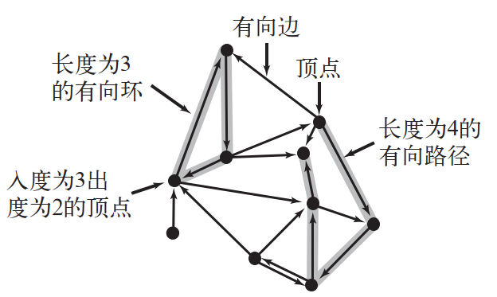

# 有向图

## 简介

有向图中，edge 是单向的。

> [!NOTE]
>
> **定义**：有向图（directed graph, digraph）是一组 vertices 和有向边的集合。

digraph 中 vertex 的出度（outdegree）就是从它出发的 edge 数；入度（indegree）就是指向它的 edge 数。

有向 edge 的第一个 vertex 称为 head，第二个称为 tail。有向边从 head 指向 tail。

在 digraph 中，两个 vertices 的连接情况有 4 种：

1. no edge
2. v->w
3. w->v
4. v->w + w->v

> [!NOTE]
>
> **定义**
>
> **有向路径**（directed path）指 digraph 中一组由有向边连接的 vertices 序列。
>
> directed-cycle，至少包含一个首尾 vertices 相同的 edge 的 directed-path。
>
> simple-cycle，除了起点和终点相同，没有其它重复的 edges 或 vertices。
>
> length，path 中 edge 数。

图示：

## 环和DAG

### 拓扑排序

给定一个有向图，将所有顶点排序，

