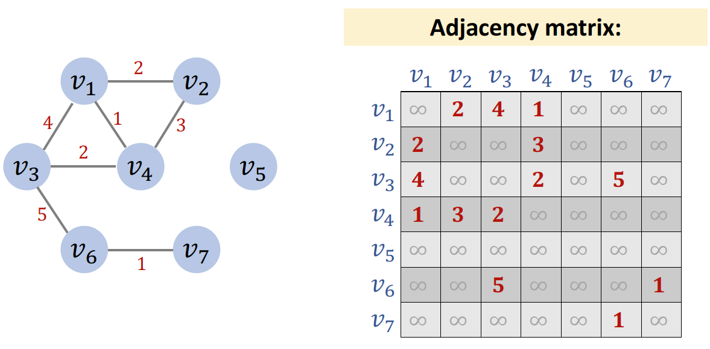

# 图的基本概念

- [图的基本概念](#图的基本概念)
  - [无向图](#无向图)
  - [Directed Unweighted Graph](#directed-unweighted-graph)
  - [Undirected Weighted Graph](#undirected-weighted-graph)
  - [Directed Weighted Graph](#directed-weighted-graph)

2024-08-19
***

## 无向图

用**邻接表**来表示无向无权 graph：

**邻接矩阵**（adjacency matrix）

> 有边则 weight 为 1，每边则 weight 为 0.
>
> 无向图，实则可以理解为双向图，所以图中矩阵的每对节点，都有两个权重值（相同）。无向图的邻接矩阵都是对称的。

## Directed Unweighted Graph

要点：

- 边单向
- 边的权重都是 1

用临接矩阵表示：

要点：

- 有向图的邻接矩阵通常不对称

## Undirected Weighted Graph

无向有权图的要点：

- 每条边有两个方向。
- 每条边对应矩阵的两个元素，矩阵对称
- 边的权重不同

可以将 graph 理解为网络理解，权重对应带宽，0 表示没有网络连接。

如果用无穷表示没有连接，权重则可以理解为网络延迟：

## Directed Weighted Graph

有向有权图，要点：

- 临接矩阵不对称