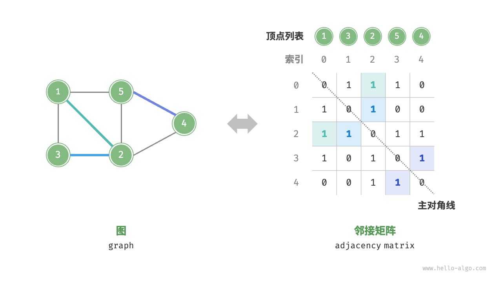

# 图的基本概念

- [图的基本概念](#图的基本概念)
  - [1. 简介](#1-简介)
  - [2. 图的类型](#2-图的类型)
    - [无向图和有向图](#无向图和有向图)
    - [连通图和非连通图](#连通图和非连通图)
    - [无权图和有权图](#无权图和有权图)
  - [3. 图的表示](#3-图的表示)
    - [邻接矩阵](#邻接矩阵)
    - [邻接表](#邻接表)
  - [4. 示例图](#4-示例图)
    - [无向无权图](#无向无权图)
    - [有向无权图](#有向无权图)
    - [无向有权图](#无向有权图)
    - [有向有权图](#有向有权图)
  - [5. 图的常见应用](#5-图的常见应用)

2024-11-22 添加强连通图概念，推荐邻接表
2024-08-19⭐
@author Jiawei Mao
***

## 1. 简介

图（graph）是一种非线性数据结构，由顶点（vertex）和边（edge）组成。可以将图 $G$ 理解为一组顶点 $V$ 和一组边 $E$ 组成的集合。例如：
$$
\begin{aligned}
&V=\{1,2,3,4,5\}\\
&E=\{(1,2),(1,3),(1,5),(2,3),(2,4),(2,5),(4,5)\}\\
&G=\{V,E\}
\end{aligned}
$$

如果将顶点看作节点，将边看作连接各个节点的引用（指针），就可以将图看作一种从链表拓展而来的数据结构。如图 9-1 所示，**相较于线性关系（链表）和分治关系（树），网络关系（图）的自由度更高**，因而更为复杂。

> 图 9-1  链表、树、图之间的关系

## 2. 图的类型

graph 大致可以分为：

- 无向图 (undirected graph)
- 有向图（directed graph, digraph）
- 有权无向图
- 有权有向图

### 无向图和有向图

根据边是否具有方向，可分为**无向图**（undirected graph）和**有向图**（directed graph），如图 9-2 所示。

- 在无向图中，边表示两顶点之间的“双向”连接关系，如微信或 QQ 中的“好友关系”。
- 在有向图中，边具有方向性，即 A→B 和 A←B 两个方向的边是相互独立的，例如微博或抖音上的“关注”与“被关注”关系。有向图又称为 digraph。

> 图 9-2  有向图与无向图

### 连通图和非连通图

根据**所有顶点是否连通**，可分为**连通图**（connected graph）和非连通图（disconnected graph），如图 9-3 所示。

- 连通图，无向图中从每个顶点到其它顶点都有一条路径；具有该属性的有向图称为**强连通**（strongly connected）；对非强连接有向图，对应的无向图是连通的，就称为**弱连通**（weakly connected）
- 非连通图，从某个顶点出发，至少有一个顶点无法到达

> 图 9-3  连通图与非连通图

**完全图**（complete graph）是一种特殊的无向图，其任意两点之间都有边直接连接。

包含 $n$ 个节点的 complete-graph 记为 $K_n$，包含 $\binom{n}{2}=n(n-1)/2$ 条无向边，其中 $\binom{n}{k}$ 为二项系数。在一些早期文献中，complete-graph 又称为 universal-graph。

### 无权图和有权图

为边添加“权重” 得到如图 9-4 所示的**有权图**（weighted graph）。例如在《王者荣耀》等手游中，系统会根据共同游戏时间来计算玩家之间的“亲密度”，这种亲密度网络就可以用有权图来表示。

> 图 9-4  有权图与无权图

图数据结构包含以下常用术语。

- **邻接**（adjacency）：当两顶点之间存在边相连时，称这两顶点“邻接”。在图 9-4 中，顶点 1 的邻接顶点为顶点 2、3、5。
- **路径**（path）：从顶点 A 到顶点 B 经过的边构成的序列被称为从 A 到 B 的“路径”。在图 9-4 中，边序列 1-5-2-4 是顶点 1 到顶点 4 的一条路径。
  - loop, 路径包含指向自身的 edge, 如 (v,v)
  - **简单路径**（simple-path）是所有顶点都不同的路径（第一个和最后一个顶点可以相同）
  - cycle，对有向图，要求path 长度至少为 1，且 $v_1=v_N$；对无向图，则要求所有 edge 不同，例如，(u,v,u) 在无向图中就不属于 cycle，因为 (u,v) 和 (v,u) 属于同一个 edge；在有向图中则属于 cycle。
  - 有向无环图，简称 DAG
- 度（degree）：一个顶点拥有的边数。对于有向图，**入度**（in-degree）表示有多少条边指向该顶点，**出度**（out-degree）表示有多少条边从该顶点指出。

## 3. 图的表示

图的常用表示方式包括“邻接矩阵”和“邻接表”。以下使用无向图进行举例。

| 数据结构  | 空间  | 添加 edge | 检查相邻节点 | 迭代相邻节点       |
| --------- | ----- | --------- | ------------ | ------------------ |
| edge list | $E$   | 1         | $E$          | $E$                |
| 邻接矩阵  | $V^2$ | 1         | 1            | $V$                |
| 邻接表    | $E+V$ | 1         | degree(v)    | degree(v)          |
| 邻接set   | $E+V$ | $\log V$  | $\log V$     | $\log V+degree(v)$ |

### 邻接矩阵

设图的顶点数量为 n ，**邻接矩阵**（adjacency matrix）使用一个 $n×n$ 矩阵来表示图，每一行（列）代表一个顶点，矩阵元素代表边，用 1 或 0 表示两个顶点之间是否存在边。

如图 9-5 所示，设邻接矩阵为 M、顶点列表为 V ，那么矩阵元素 $M[i,j]=1$ 表示顶点 $V[i]$ 到顶点 $V[j]$ 之间存在边，反之 $M[i,j]=0$ 表示两顶点之间没有边。

> 图 9-5  图的邻接矩阵表示

邻接矩阵具有以下特性：

- 顶点不能与自身相连，因此邻接矩阵主对角线元素没有意义。
- 对于无向图，两个方向的边等价，此时邻接矩阵关于主对角线对称。
- 将邻接矩阵的元素从 1 和 0 替换为权重，则可表示**有权图**。

使用邻接矩阵表示图时，可以直接访问矩阵元素获取边，因此增删查改操作的效率很高，时间复杂度均为 $O(1)$ 。然而，矩阵的空间复杂度为 $O(n^2)$ ，内存占用较多。

邻接矩阵适合稠密 graph，但对大多数应用，我们应对的都是稀疏 graph。

### 邻接表

**邻接表**（adjacency list）使用 $n$ 个链表来表示图，链表节点表示顶点。第 $i$ 个链表存储顶点 $i$ 的所有邻接顶点（与该顶点相连的顶点）。图 9-6 展示了一个使用邻接表存储的图的示例。

> 图 9-6  图的邻接表表示

邻接表仅存储实际存在的边，而边的总数通常远小于 $n^2$ ，因此它更加节省空间。然而，在邻接表中需要通过遍历链表来查找边，因此其时间效率不如邻接矩阵。

观察图 9-6 ，**邻接表结构与哈希表中的“链式地址”非常相似，因此我们也可以采用类似的方法来优化效率**。比如当链表较长时，可以将链表转化为 AVL 树或红黑树，从而将时间效率从 $O(n)$ 优化至 $O(\log⁡n)$ ；还可以把链表转换为哈希表，从而将时间复杂度降至 $O(1)$ 。

> [!NOTE]
>
> 邻接表是表示 graph 的标准方法。对无向图，每条边 (u,v) 保存在两个 list 中，因此空间加倍。

java 中可以用任何类型的 `List` 维护邻接表，如 `ArrayList` 和 `LinkedList`，不过对稀疏 graph，在创建 `ArrayList` 时可能需要以小于默认值的容量创建，否则可能浪费大量空间。

邻接表优点：

- 节省空间
- 很容易查看某个顶点的相邻顶点

邻接表缺点：

- 判断两个节点是否相邻没有邻接矩阵快

快速获取任意顶点的相邻顶点非常重要，有两个选择：

1. 使用 map，其中 key 是 vertices，值为邻接表
2. 将每个邻接表作为 `Vertex` 的数据成员进行维护

第一个实现更简单，第二个则可能更快，因为避免了在 map 中重复查找。

## 4. 示例图

### 无向无权图

### 有向无权图

特点：

- 单向边
- 边的权重都是 1
- 有向图的邻接矩阵通常不对称

**邻接表表示**

**临接矩阵表示**

### 无向有权图

特点：

- 每条边都是双向
- 每条边对应矩阵的两个元素，临接矩阵对称
- 边的权重不同

**临接矩阵表示**

以网络来理解：

- 权重对应带宽，0 表示没有网络连接；
- 权重对应网络延迟，无穷表示没有连接。

### 有向有权图

特点：

- 临接矩阵不对称

## 5. 图的常见应用

如表 9-1 所示，许多现实系统可以用图来建模，相应的问题也可以约化为图计算问题。

表 9-1  现实生活中常见的图

|          | 顶点 | 边                   | 图计算问题   |
| :------- | :--- | :------------------- | :----------- |
| 社交网络 | 用户 | 好友关系             | 潜在好友推荐 |
| 地铁线路 | 站点 | 站点间的连通性       | 最短路线推荐 |
| 太阳系   | 星体 | 星体间的万有引力作用 | 行星轨道计算 |