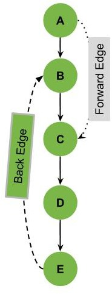
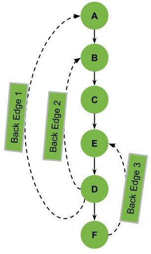
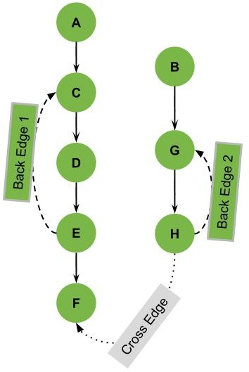
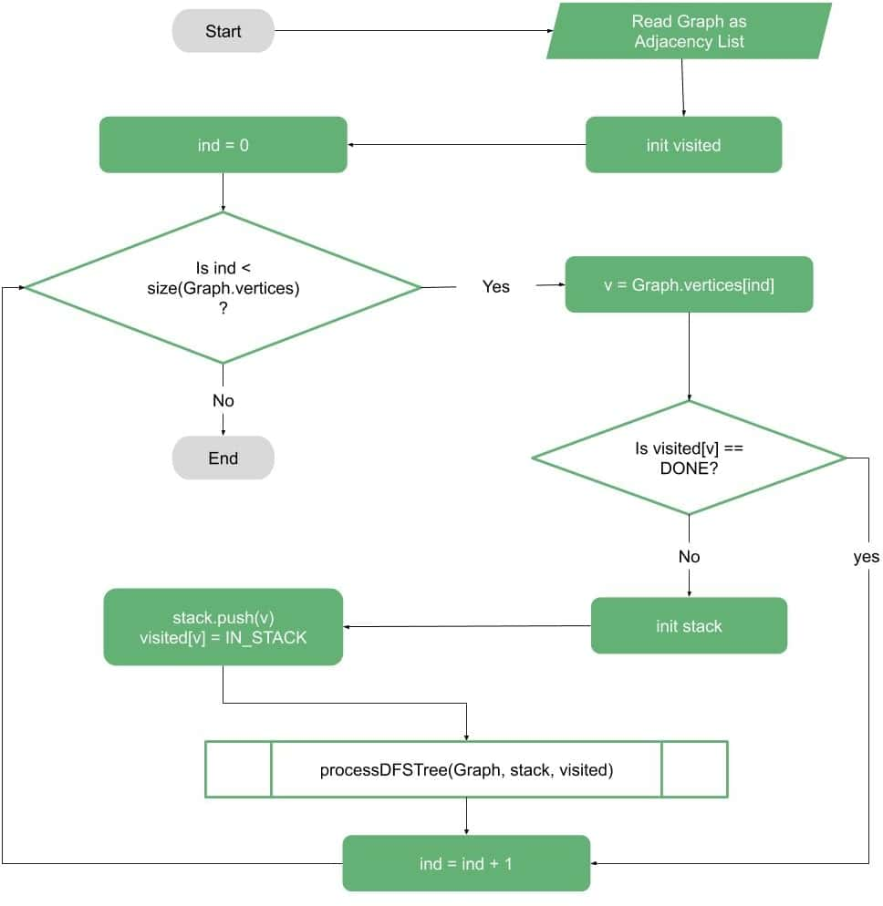
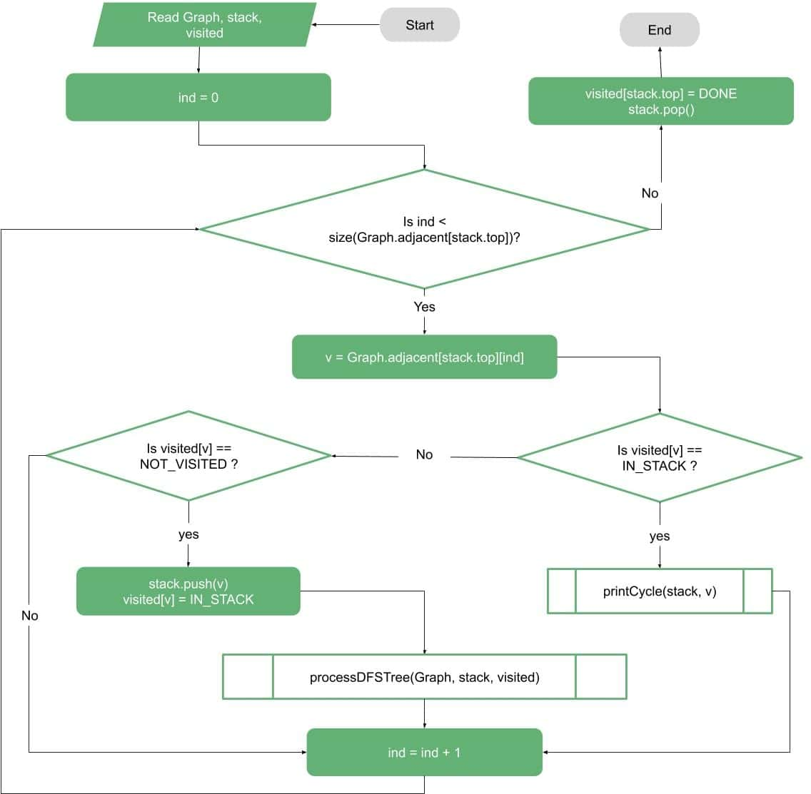

# Graph 问题集锦

## 检测 digraph 是否包含 cycle

检测 digraph 中的 cycle，有两种方法：

1. DFS
2. Kahan 算法（BFS）

### DFS 检测 cycle

#### 思想

通过 DFS 遍历 graph，得到 DFS tree。DFS tree 主要是对 graph 的 node 和 edge 的重新排序，构建 DFS tree 后，可以将 edge 分为：

- tree edge
- forward edge
- back edge
- cross edge

如下图所示：



图中 E->B 标为 back-edge，back-edge 在 DFS-tree 中将一个 node 连接到其 parent-node。

A->C 标记 forward-edge，forward-edge 在 DFS-tree 中连接 parent-node 和非直接子 node。

图中其它实线为正常 tree-edge。

下图包含多个 back-edges：



对每个 back-edge，都可以发现一个 cycle。因此，如果移除 graph 中的 back-edge，就可以得到一个 DAG。

再来看一个更复杂的图：



这个 graph 多了一个 cross-edge：如果从 A 开始 DFS，可以访问 node  A,C,D,E,F，但看不到 node B,G,H。此时需要在第一次运行之后，从未访问过的不同点（如 B）重新启动 DFS。经过多次 DFS，将得到多棵 DFS-tree。

#### 算法流程

为每个 unvisited node 执行 DFS：



其中核心是 DFS 部分。在这一部分要访问 stack 内容，以便能够检查 back-edge。如果发现一个 node 与 stack 中的某个 node 相连，就找到一个 cycle：



#### 伪代码

输入为 directed-graph，假设使用邻接表表示。

```java
algorithm findCycles(Graph):
    // INPUT
    //   Graph = a graph
    // OUTPUT
    //   Print all cycles in the graph
	// 保存 node 是否访问过
    visited <- array of NOT_VISITED for each vertex in Graph
    for each vertex v in Graph.vertices:
		// 找到新的 unvisited node
        if visited[v] == NOT_VISITED:
            stack <- empty stack
            stack.push(v)
            visited[v] <- IN_STACK
            detectedCycles <- empty list
            processDFSTree(Graph, stack, visited, detectedCycles)
```

`processDFSTree` 是一个递归函数，它包含三个输入：graph, visited 和 stack。该函数主要执行 DFS，但它会将首次找到的 node 标记为 `IN_STACK`：

```java
algorithm processDFSTree(Graph, Stack, visited, detectedCycles):
    // INPUT
    //   Graph = a graph
    //   Stack = current path
    //   visited = a visited set
    //   detectedCycles = a collection of already processed cycles
    // OUTPUT
    //   Print all cycles in the current DFS Tree

    for each vertex v in Graph.adjacent[Stack.top]:
        if visited[v] == IN_STACK:
            printCycle(Stack, v, detectedCycles)
        else if visited[v] == NOT_VISITED:
            Stack.push(v)
            visited[v] <- IN_STACK
            processDFSTree(Graph, Stack, visited, detectedCycles)

    visited[Stack.top] <- NOT_VISITED
    Stack.pop()
```

处理完 node 后，将其标记为 DONE。若发现 `IN_STACK` node，表示发现一个 back-edge，对应一个 cycle。

打印 cycle:

```java
algorithm printCycle(Stack, v, detectedCycles):
    // INPUT
    //   Stack = current path
    //   v = current node
    //   detectedCycles = a collection of already processed cycles
    // OUTPUT
    //   Print the cycle that lives in the stack starting from vertex v

    cycle <- empty list
    cycle.push(Stack.top)
    Stack.pop()
    while cycle.top != v:
        cycle.push(Stack.top)
        Stack.pop()

    if cycle not in detectedCycles:
        detectedCycles.push(cycle)
        print(cycle)
```

打印函数主要需要 stack 和具有 back-edge 的 node。该函数从 stack 弹出元素并打印。

该算法的时间复杂度为 O(V!)，空间复杂度为 O(V!)，之所以这么差，是因为上面试图找到所有 cycle 并打印。

如果不需要找到所有 cycle，可以简化：

```java
algorithm containsCycle(Graph, Stack, visited):
    // INPUT
    //   Graph = a graph
    //   Stack = current path
    //   visited = a visited set
    // OUTPUT
    //   Checks if a given graph contains cycles

    for each vertex v in Graph.adjacent[Stack.top]:
        if visited[v] == IN_STACK:
            return True
        else if visited[v] == NOT_VISITED:
            Stack.push(v)
            detectedCycles <- empty list
            visited[v] <- IN_STACK
            if processDFSTree(Graph, Stack, visited, detectedCycles):
                return True

    visited[Stack.top] <- NOT_VISITED
    Stack.pop()
    return False
```

这个版本的时间复杂度为 O(V+E)，空间复杂度为 O(V)

步骤：

1. 创建递归函数，初始化当前 index 或 node，visited 和递归 stack
2. 将当前 node 标记为 visited，并在递归 stack 中标记 index
3. 找到所有与当前 node 相邻且未访问的 nodes，对这些 node 调用递归函数，如果递归函数返回 true，则返回 true
4. 如果相邻 node 已经在递归 stack 中标记，则返回 true
5. 创建一个包装类，对所有 node 调用递归好桉树，如果任何函数返回 true，则返回 true；如果所有函数返回 false，则返回 false

## 参考

- https://www.baeldung.com/cs/detecting-cycles-in-directed-graph
- https://leetcode.com/discuss/interview-question/1409034/6-cycle-in-directed-graph