# 图的遍历

- [图的遍历](#图的遍历)
  - [1. 简介](#1-简介)
  - [2. 广度优先遍历](#2-广度优先遍历)
    - [BFS 实现](#bfs-实现)
    - [BFS 复杂度](#bfs-复杂度)
  - [3. 深度优先遍历](#3-深度优先遍历)
    - [DFS 实现](#dfs-实现)
    - [DFS 复杂度](#dfs-复杂度)

2024-08-20
***

## 1. 简介

图的遍历方式分为两种：

- 广度优先遍历
- 深度优先遍历

## 2. 广度优先遍历

广度优先搜索是最简单的图搜索算法之一，也是许多重要的图算法的原性。Prim 的最小生成树算法和 Dijkstra 的单源最短路径算法都使用了类似广度优先搜索的思想。

**广度优先遍历是一种由近及远的遍历方式，从某个节点出发，始终优先访问距离最近的顶点，并一层层向外扩张**。如图 9-9 所示，从左上角顶点出发，首先遍历该顶点的所有邻接顶点，然后遍历下一个顶点的所有邻接顶点，以此类推，直至所有顶点访问完毕。

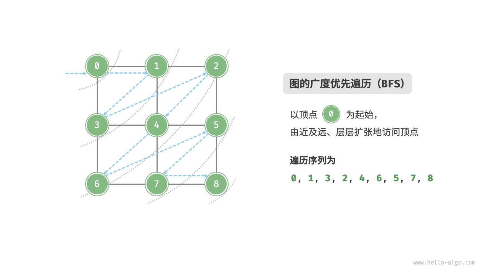

> 图 9-9  图的广度优先遍历

### BFS 实现

BFS 通常借助队列来实现，代码如下所示。队列具有“先入先出”的性质，这与 BFS 的“由近及远”的思想异曲同工。

1. 将遍历起始顶点 `startVet` 加入队列，并开启循环。
2. 在循环的每轮迭代中，弹出队首顶点并记录访问，然后将该顶点的所有邻接顶点加入到队列尾部。
3. 循环步骤 `2.` ，直到所有顶点被访问完毕后结束。

为了防止重复遍历顶点，我们需要借助一个哈希集合 `visited` 来记录哪些节点已被访问。

> [!TIP]
>
> 哈希集合可以看作一个只存储 `key` 而不存储 `value` 的哈希表，它可以在 O(1) 时间复杂度下进行 `key` 的增删查改操作。根据 `key` 的唯一性，哈希集合通常用于数据去重等场景。

```java
/* 广度优先遍历 */
// 使用邻接表来表示图，以便获取指定顶点的所有邻接顶点
List<Vertex> graphBFS(GraphAdjList graph, Vertex startVet) {
    // 顶点遍历序列
    List<Vertex> res = new ArrayList<>();
    // 哈希集合，用于记录已被访问过的顶点
    Set<Vertex> visited = new HashSet<>();
    visited.add(startVet);
    // 队列用于实现 BFS
    Queue<Vertex> que = new LinkedList<>();
    que.offer(startVet);
    // 以顶点 vet 为起点，循环直至访问完所有顶点
    while (!que.isEmpty()) {
        Vertex vet = que.poll(); // 队首顶点出队
        res.add(vet);            // 记录访问顶点
        // 遍历该顶点的所有邻接顶点
        for (Vertex adjVet : graph.adjList.get(vet)) {
            if (visited.contains(adjVet))
                continue;        // 跳过已被访问的顶点
            que.offer(adjVet);   // 只入队未访问的顶点
            visited.add(adjVet); // 标记该顶点已被访问
        }
    }
    // 返回顶点遍历序列
    return res;
}
```

代码相对抽象，建议对照图 9-10 来加深理解。

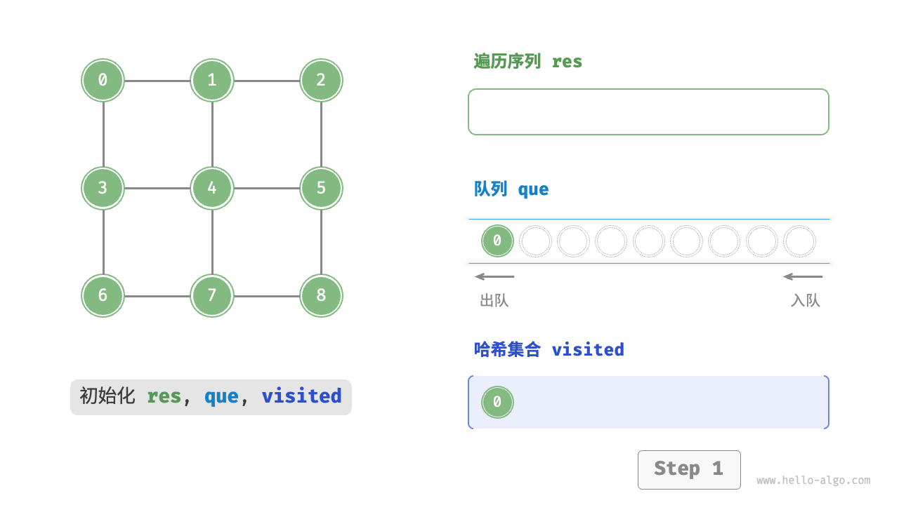

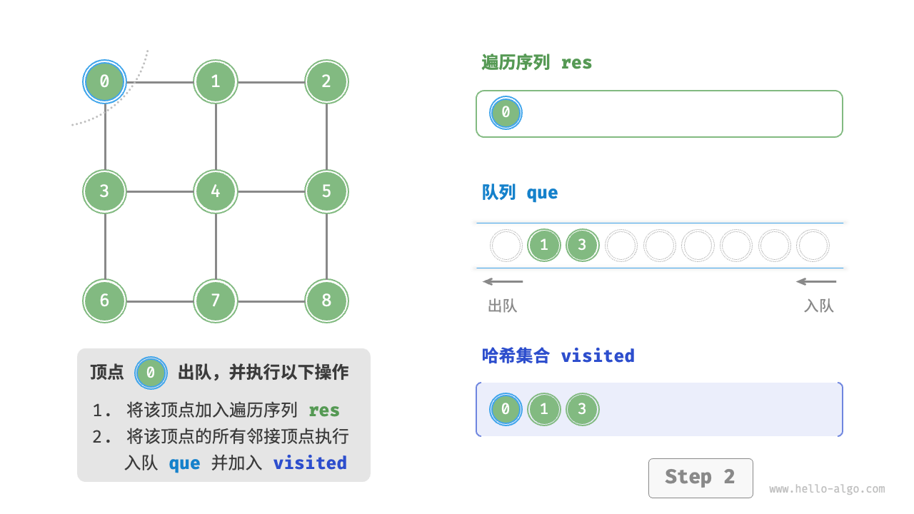

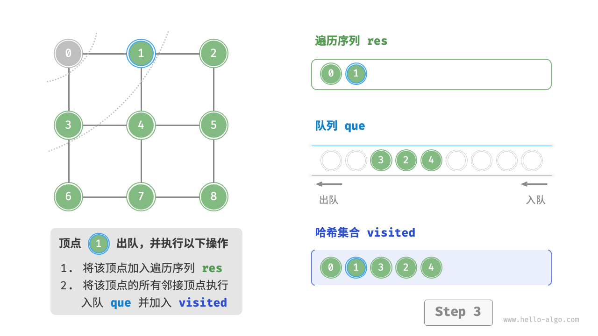

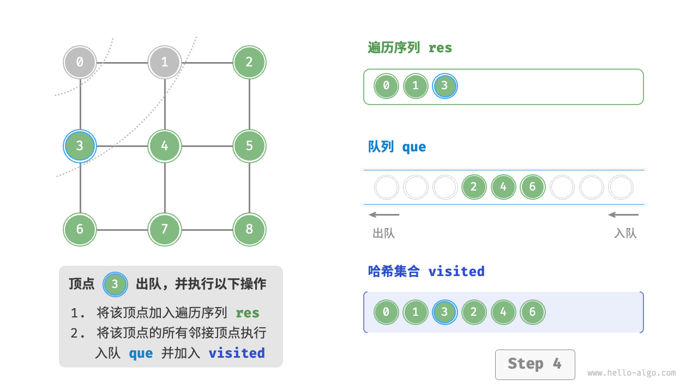

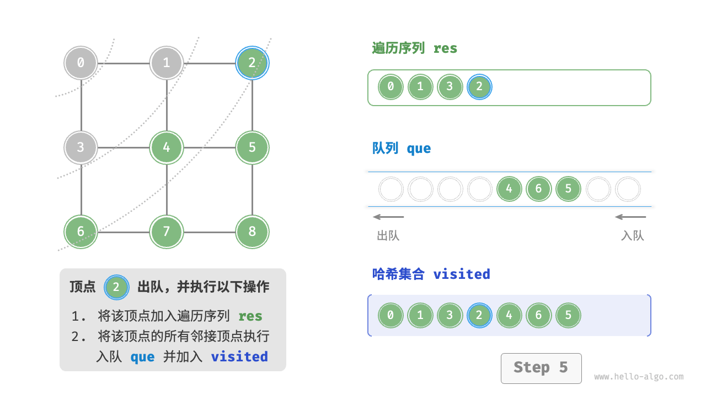

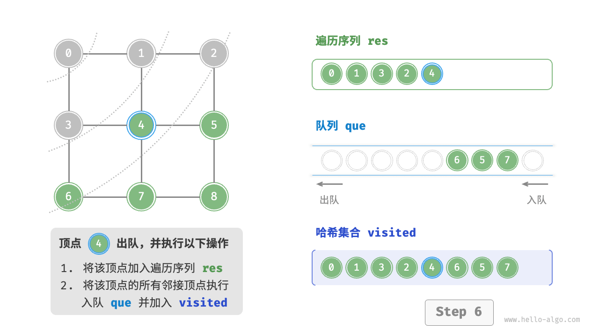

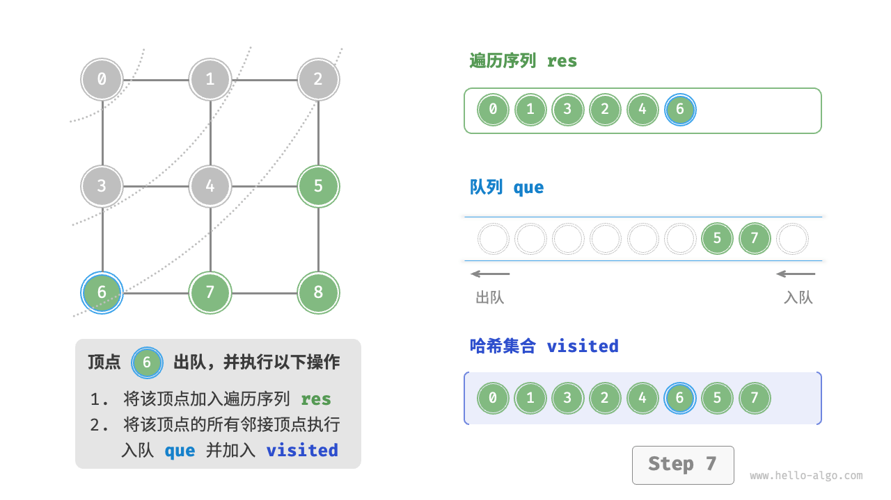

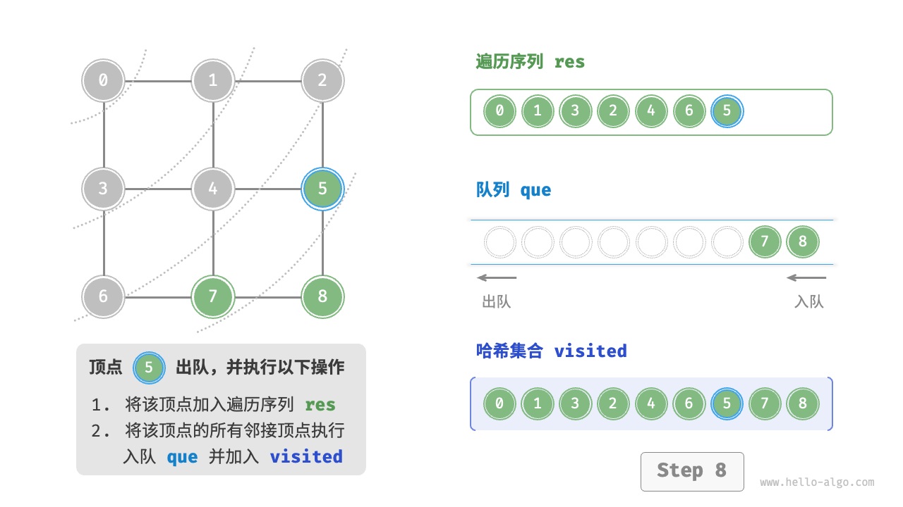

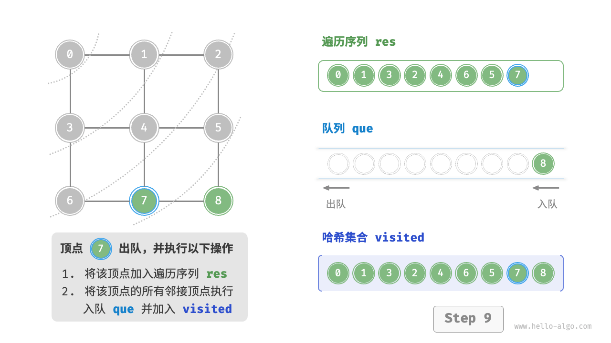

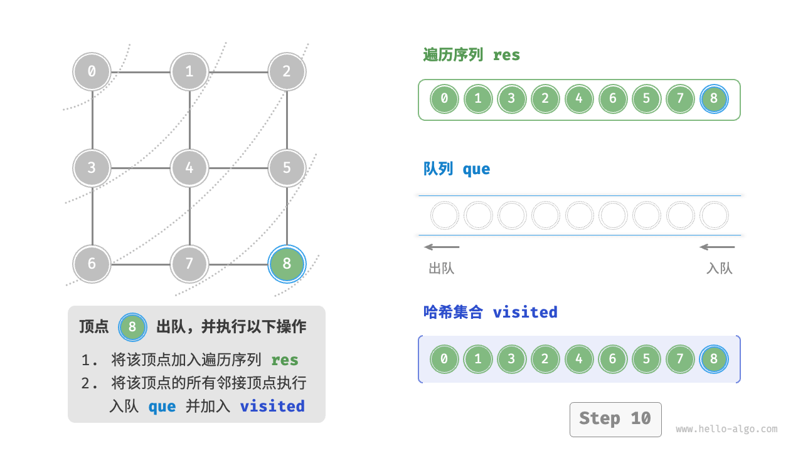

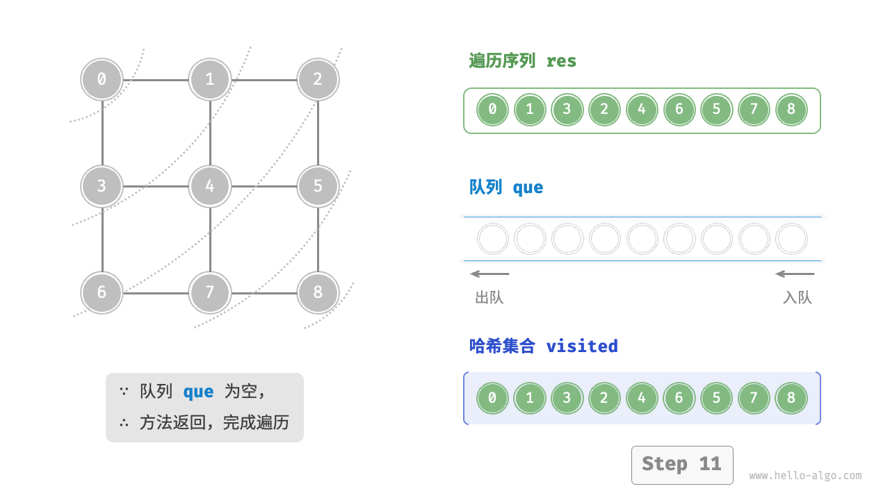

> 图 9-10  图的广度优先遍历步骤

> [!NOTE]
>
> **广度优先遍历的序列不唯一**。广度优先遍历只要求按“由近及远”的顺序遍历，**而多个相同距离的顶点的遍历顺序允许被任意打乱**。以图 9-10 为例，顶点 1、3 的访问顺序可以交换，顶点 2、4、6 的访问顺序也可以任意交换。

### BFS 复杂度

**时间复杂度**：所有顶点都会入队并出队一次，使用 $O(|V|)$ 时间；在遍历邻接顶点的过程中，由于是无向图，因此所有边都会被访问 2 次，使用 $O(2|E|)$ 时间；总体使用 $O(|V|+|E|)$ 时间。

**空间复杂度**：列表 `res` ，哈希集合 `visited` ，队列 `que` 中的顶点数量最多为 $|V|$ ，使用 $O(|V|)$ 空间。

## 3. 深度优先遍历

**深度优先遍历是一种优先走到底、无路可走再回头的遍历方式**。如图 9-11 所示，从左上角顶点出发，访问当前顶点的某个邻接顶点，直到走到尽头时返回，再继续走到尽头并返回，以此类推，直至所有顶点遍历完成。

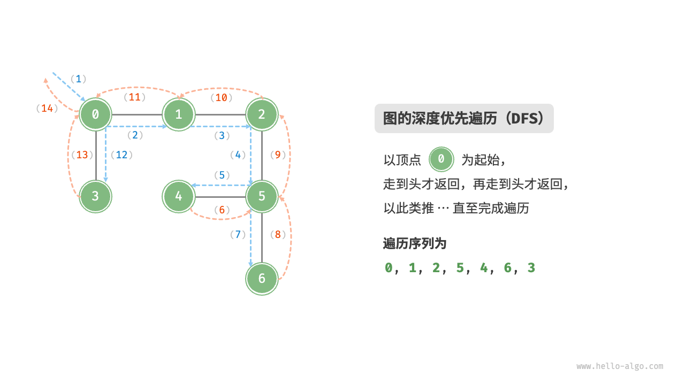

> 图 9-11  图的深度优先遍历

### DFS 实现

这种“走到尽头再返回”的算法范式通常基于递归来实现。与广度优先遍历类似，在深度优先遍历中，我们也需要借助一个哈希集合 `visited` 来记录已被访问的顶点，以避免重复访问顶点

```java
/* 深度优先遍历辅助函数 */
void dfs(GraphAdjList graph, Set<Vertex> visited, List<Vertex> res, Vertex vet) {
    res.add(vet);     // 记录访问顶点
    visited.add(vet); // 标记该顶点已被访问
    // 遍历该顶点的所有邻接顶点
    for (Vertex adjVet : graph.adjList.get(vet)) {
        if (visited.contains(adjVet))
            continue; // 跳过已被访问的顶点
        // 递归访问邻接顶点
        dfs(graph, visited, res, adjVet);
    }
}

/* 深度优先遍历 */
// 使用邻接表来表示图，以便获取指定顶点的所有邻接顶点
List<Vertex> graphDFS(GraphAdjList graph, Vertex startVet) {
    // 顶点遍历序列
    List<Vertex> res = new ArrayList<>();
    // 哈希集合，用于记录已被访问过的顶点
    Set<Vertex> visited = new HashSet<>();
    dfs(graph, visited, res, startVet);
    return res;
}
```

深度优先遍历的算法流程如图 9-12 所示。

- **直虚线代表向下递推**，表示开启了一个新的递归方法来访问新顶点。
- **曲虚线代表向上回溯**，表示此递归方法已经返回，回溯到了开启此方法的位置。

为了加深理解，建议将图 9-12 与代码结合起来，在脑中模拟（或者用笔画下来）整个 DFS 过程，包括每个递归方法何时开启、何时返回。


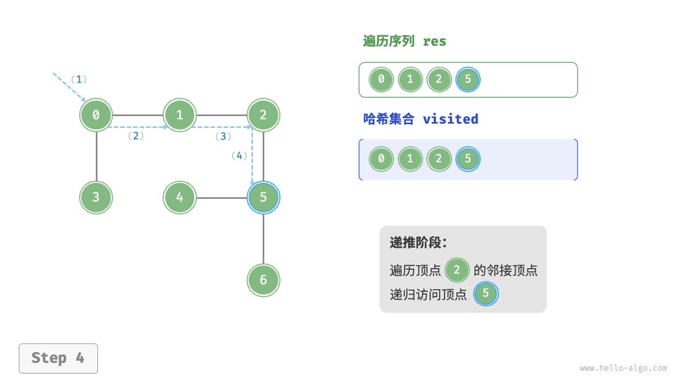

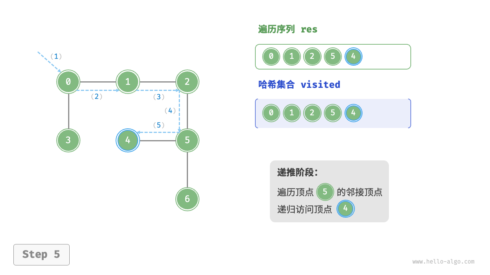

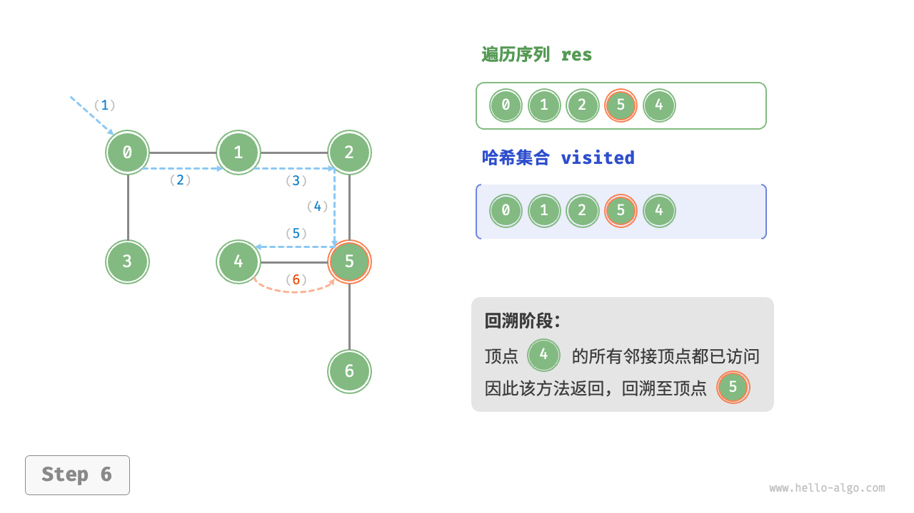


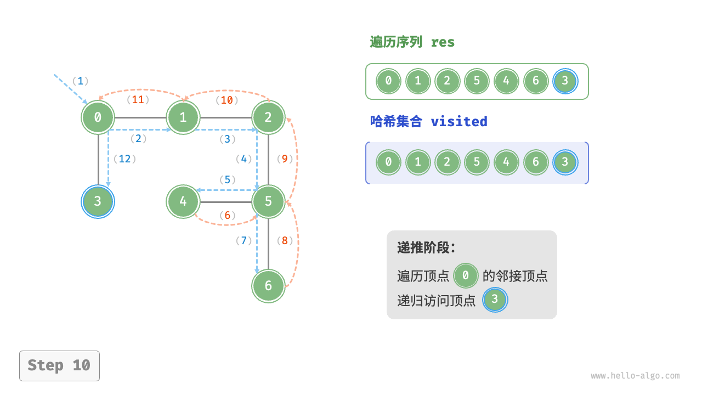

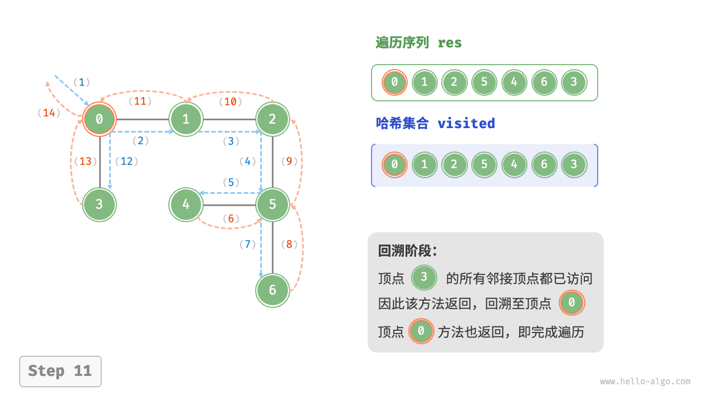

> 图 9-12  图的深度优先遍历步骤

> [!NOTE]
>
> 深度优先遍历的序列是否唯一？
>
> 与广度优先遍历类似，深度优先遍历序列的顺序也不是唯一的。给定某顶点，先往哪个方向探索都可以，即邻接顶点的顺序可以任意打乱，都是深度优先遍历。
>
> 以树的遍历为例，“根 → 左 → 右”“左 → 根 → 右”“左 → 右 → 根”分别对应前序、中序、后序遍历，它们展示了三种遍历优先级，然而这三者都属于深度优先遍历。

### DFS 复杂度

**时间复杂度**：所有顶点都会被访问 1 次，使用 $O(|V|$) 时间；所有边都会被访问 2 次，使用 $O(2|E|)$ 时间；总体使用 $O(|V|+|E|)$ 时间。

**空间复杂度**：列表 `res` ，哈希集合 `visited` 顶点数量最多为 $|V|$ ，递归深度最大为 $|V|$ ，因此使用 $O(|V|)$ 空间。
