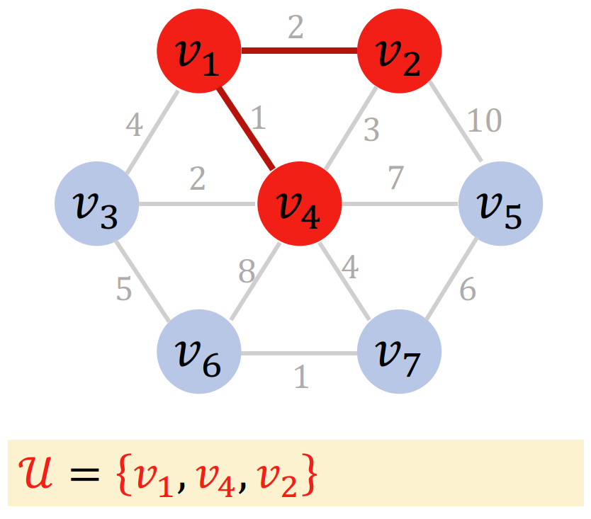
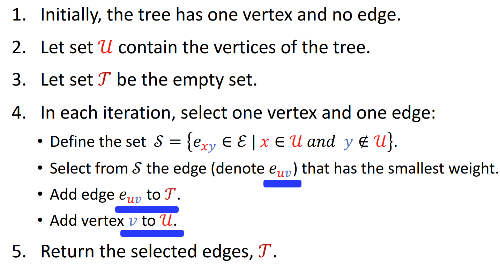

# 最小生成树

- [最小生成树](#最小生成树)
  - [1. 简介](#1-简介)
  - [2. 生成树（spanning tree）](#2-生成树spanning-tree)
  - [3. Prim 算法](#3-prim-算法)
  - [4. Kruskal 算法](#4-kruskal-算法)
    - [如何维护 forest](#如何维护-forest)

2024-08-19
***

## 1. 简介

这是一棵树，也是一个**无向图**。树是一类特殊的无向图，但无向图未必是树。例如：

这是一个无向图，但不是树，因为**树不允许有回路**。

> [!NOTE]
>
> 回路（cycle）：从一个节点出发，沿着某条路径走一圈，还是回到起点。

tree 必须是**连通图**，即任意两个节点之间都有路径。例如：

这个 graph 可以分为两部分，两部分不连通，所以不是 tree。

> [!TIP]
>
> tree 的定义：**连通**（connected）**无环**（acyclic）**无向**（undirected）的 graph。

tree 是一类特殊的图，其 vertices 和 edges 有**特殊关系**：如果 tree 有 n 个 vertices，那么必然有 $n-1$ 个 edges。

- 如果少于 $n-1$ 个 edges，那么就不具有连通性；
- 如果大于 $n-1$ 个 edges，那么就包含 cycles。

## 2. 生成树（spanning tree）

- 输入：包含 n 个 vertices 的 connected undirected graph
- 任务，查找子图（subgraph）:
  - 包含所有 n 个 vertices
  - 保留 $n-1$ 个 edges
  - 该 subgraph 为 connected
  - 没有环
- 得到的 subgraph 就是生成树。

例如：

- graph 包含 7 个节点和 12 条边
- 需要保留 7 个节点，从 12 条边选出 6 条边保留
- 得到一个 connected-undirected-graph 就是生成树。

从同一个 graph 可以得到多棵生成树。而**最小生成树**（minimum-spanning-tree, MST）指权重加和最小的那棵。

> [!NOTE]
>
> 并非所有 graph 都有生成树，只有 connected-graph 才有生成树。

MST 的应用：

- 城市有很多土路
- 现在要修路，限制条件：
  1. 每两家之间都有一条水泥路
  2. 铺路成本最低

把城市看作一个无向图，房子看作节点，土路看作边，选择一部分边铺设水泥路。

铺路要保证连通性。选择最小生成树，能够让道路的总长度最短。

或者跟房屋布线，也是一个最小生成树问题。

**总结：**

- tree 是无向图，但无向图未必是 tree
- tree 的任意两个 vertices 只有一条 path
- tree 没有 cycles
- 如果 tree 有 n 个 vertices，那么它必然有 $n-1$ 个 edges

**spanning tree**：

输入：a connected undirected graph

- 保留所有 $n$ 个 vertices
- 保留 $n-1$ 个 edges
- subgraph 必须 **connected** and **acyclic**

输出：得到的子图称为生成树。

最小生成树（minimum spanning tree）：权重加和最小的 spanning-tree。

## 3. Prim 算法

Prism 算法能找到无向图中的最小生成树。

基本概念：生长

- 初始，tree 只有一个 vertex，没有 edge
- 每次迭代，添加一个 vertex 和一个 edge 到 tree
- 迭代过程保证：
  - tree 的连通性
  - 没有 cycle
- 循环次数为节点数 $|V|$

**初始状态：** 连通的无向图，有无权重都可以。

**第一次迭代**：

- 从 graph 中任选一个 vertex，如 v1
- 将 v1 加入 U

**第二次迭代：**

- 连接 U 的边有：e12,e13,e14
- e14 权重最小，为 1，将对应节点 v4 加入 U

**第三次迭代：**

- 连接 U 的边有：
  - e12, e13
  - e42, e43, e45, e46, e47
- 其中 e12 最小，为 2，将对应节点 v2 加入 U

**第四次迭代：**

- 连接 U 的边有
  - e13
  - e43, e45, e46, e47
  - e25
- 其中 e43 最小，为 2，将对应节点 v3 加入 U

**第五次迭代：**

- 连接 U 的边有：
  - e45, e46, e47
  - e25
  - e36
- 其中 e47 最小，为 4，将对应节点 v7 加入 U

**第六次迭代：**

- 连接 U 的边有：
  - e45, e46
  - e25
  - e36
  - e75, e76
- e76 最小，为 1，将对应节点 v7 加入 U

**第七次循环：**

- 连接 U 的边有：
  - e45
  - e25
  - e75
- e75 最小，为 6，将 v5 加入 U

此时所有节点都加入了 U，结束程序。

返回红色的 7 个节点 6 条边，对应最小生成树。

Prim 算法总结：

Prim 算法和 Dijkstra 算法的思路基本一样，甚至更简单一点。

不采用 heaps，时间复杂度为 $O(|V|^2)$，适合 dense-graph；采用 binary-heap，时间复杂度为 $O(|E|\log|V|)$，适合 sparse-graph。

## 4. Kruskal 算法

Kruskal 是另一种查找最小生成树的算法。

基本思想：维护一个 forest，即 tree 的集合。

- 初始有 n 个 tree，即每个 vertex 一个 tree；
- 每次循环检查一个 edge，如果选择该 edge，就将对应两个 tree 合并；
- 当只有一个 tree 时，终止循环。
- 最多迭代 $|E|$ 次，即循环次数不超过边的数量。

**准备**

对 graph 的所有边，按照权重降序排列：

用 $T$ 表示被选中的边，初始为空集。

**第一次循环：**

- dequeue 第一个 edge (1,4)
- v1 和 v4 不在同一个 tree
  - 接受 edge (1,4)
  - 将 (1,4) 放入 $T$

**第二次循环：**

- dequeue 得到 edge (6,7)
- v6 和 v7 不在同一个 tree
  - 接受 edge (6,7)
  - 将 (6,7) 加入 $T$

**第三次循环：**

- dequeue 得到 edge (1,2)
- v1 和 v2 不在同一个 tree
  - 接受 edge (1,2)
  - 将 (1,2) 加入 $T$

**第四次循环：**

- dequeue 得到 edge (3,4)
- v3 和 v4 不在同一个 tree
  - 接受 edge (3,4)
  - 将 (3,4) 添加到 $T$

**第五次循环：**

- dequeue 得到 edge (2,4)
- v2 和 v4 在同一个 tree
  - 拒绝 edge (2,4): 接受这个 edge 会导致 tree 中出现回路

**第六次循环：**

- dequeue 得到 edge (1, 3)
- v1 和 v3 在同一个 tree
  - 拒绝 edge (1, 3)

**第七次循环：**

- dequeue 得到 edge (4,7)
- v4 和 v7 不在同一个 tree
  - 接受 edge (4,7)
  - 将 (4,7) 添加到 $T$

**第八次循环：**

- dequeue 得到 edge (3,6)
- v3 和 v6 在同一个 tree
  - 拒绝 edge (3,6)

**第九次循环：**

- dequeue 得到 edge (5,7)
- v5 和 v7 不在同一个 tree
  - 接受 edge (5,7)
  - 将 (5,7) 添加到 $T$

**结束循环：**

- 此时所有的节点都是连通的，任意两个节点之间都有路径
- 终止程序，返回 $T$
- 如何知道所有节点连通：共有 7 个节点，$T$ 已经包含 6 条边。

总结：

### 如何维护 forest

Kruskal 包含很多 trees，每次循环都要判断两个节点是否属于相同的 trees，还需要合并 trees。

1. 如何判断两个 vertices 是否在同一个 tree？

推荐使用 set 操作，将相同 tree 的所有 vertices 放在同一个 set，这样就差集操作，很容易判断两个 vertices 是否属于同一个 set。时间复杂度 $O(1)$。

2. 如何合并两个 trees？

取两个集合的并集。

时间复杂度 $O(1)$。

Kruskal 总的时间复杂度：$O(m\cdot \log m)$，$m$ 为边数

- edge 排序的时间复杂度：$O(m\cdot\log m)$
- 最多 $m$ 次循环
- 每次循环的时间复杂度接近 $O(1)$
  - 判断两个 vertices 是否属于同一个 tree $O(1)$
  - 合并两个 trees: $O(1)$
- 总的时间复杂度为：$O(m\cdot\log m)+m\cdot O(1)=O(m\cdot\log m)$
