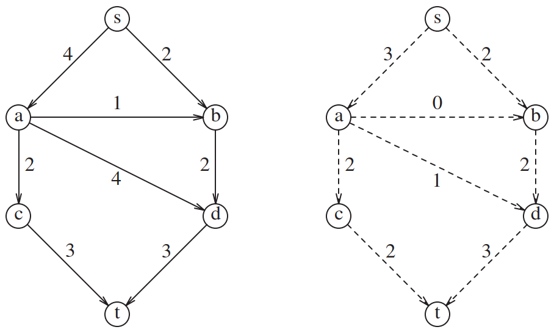

# 最大流问题

## 简介

假设有一个有向图 $G=(V,E)$，edge 容量为 $c_{v,w}$。edge 容量可以表示通过管道的水量或路上的车流量。有两个 nodes: s 为 source, t 为 sink。通过任何一条边，最多容纳 $c_{v,w}$ 流量。对不是 s 或 t 的 node v，输入和输出流量必须相等。最大流问题就是确定从 s 到 t 允许的最大流量。如下图所示：

从 s 到 t 的最大流为 5。虽然此图是无环图，但这不是必须的；即使图中有环，算法依然有效。

## 算法实现

