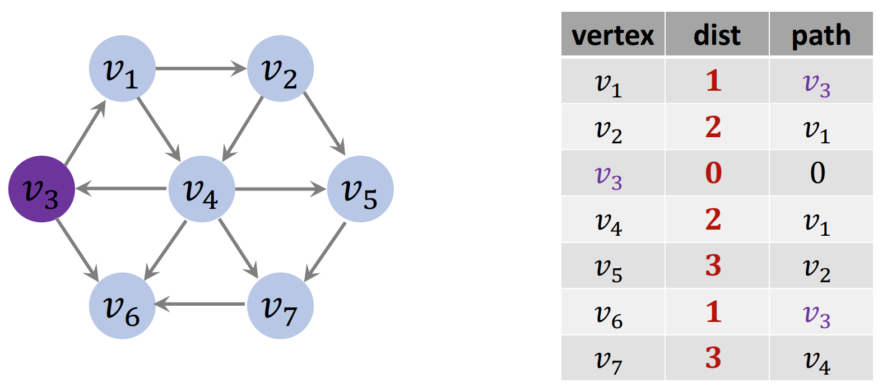
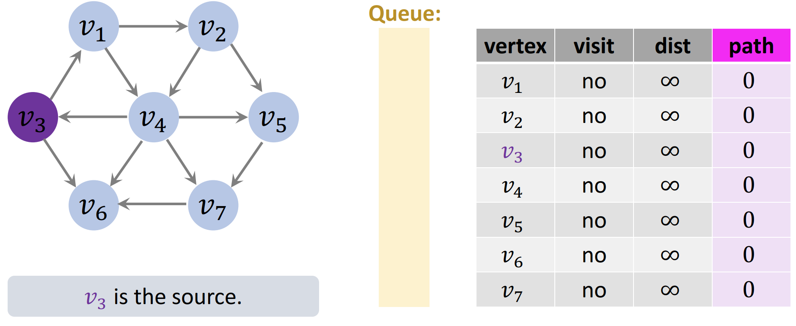
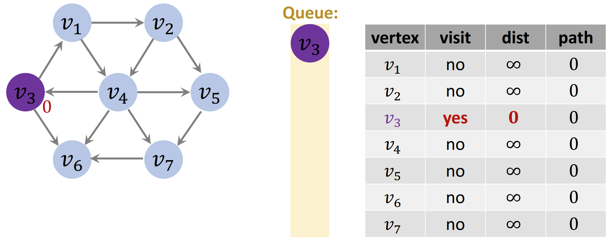
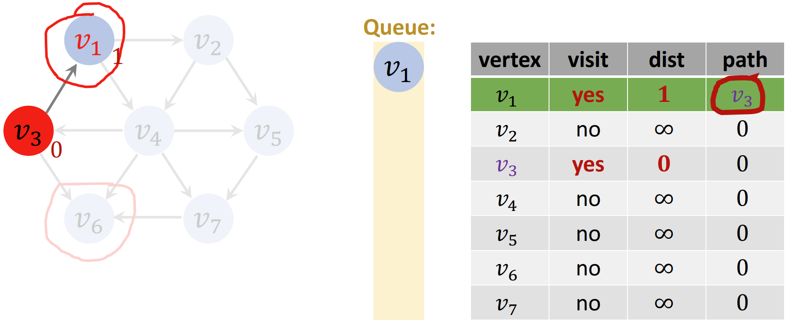
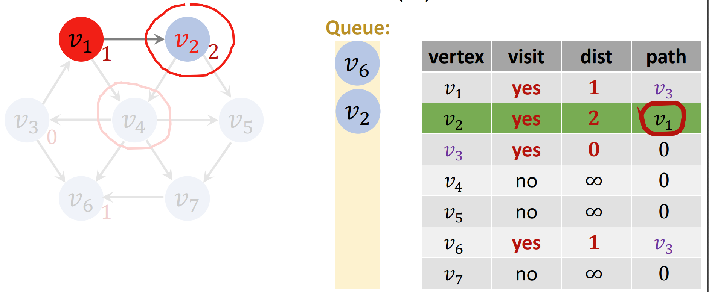
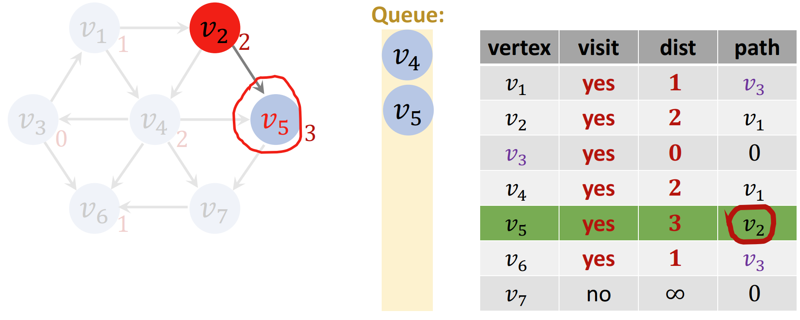
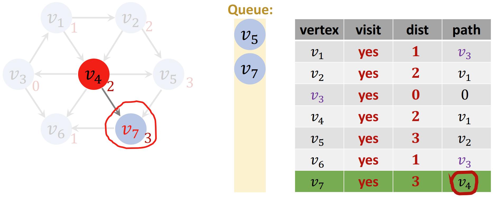
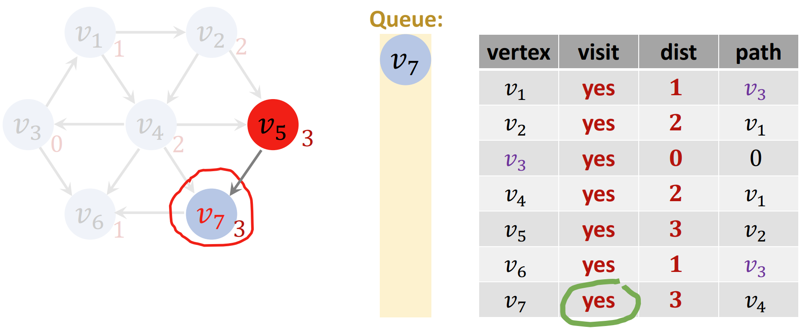
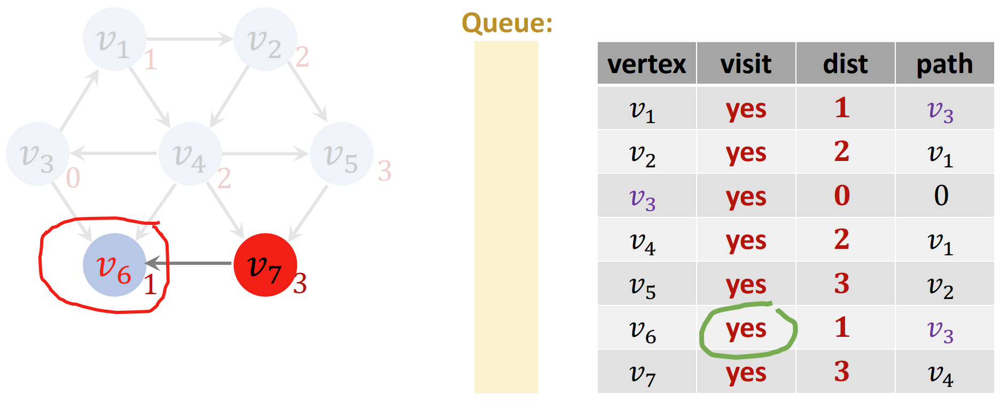
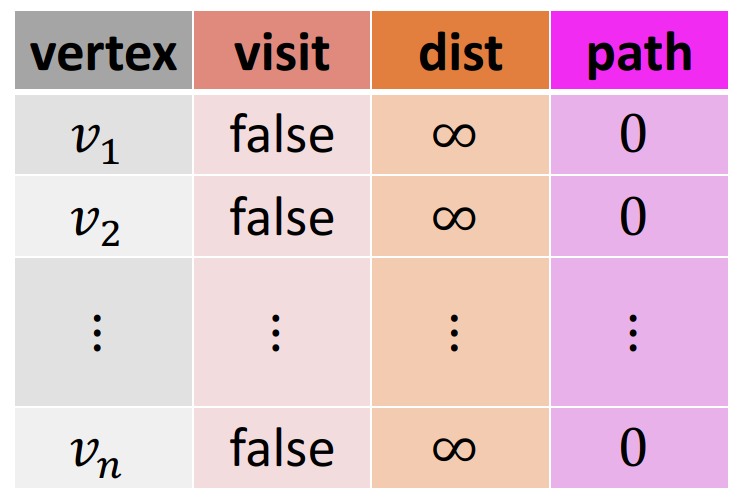

# 无权图的最短路径问题

- [无权图的最短路径问题](#无权图的最短路径问题)
  - [简介](#简介)
  - [算法](#算法)
  - [总结](#总结)

2024-08-19
***

## 简介

无权图特点：

- 所有 edge 的权重为 1；
- 不存在的 edge 的权重为 ∞；
- 无权图的最短路径问题相对简单。

单源最短路径问题，输入是一个 graph 和一个起点：

 

目标是得到右侧的表格。

这里以有向图为例，对应算法也适用于无向图（无向图就是双向图）。

## 算法

该算法只适用于无权图，即所有 edge 的权重为 1.

初始设置：

- queue
- 矩阵，并初始化

循环前：

- v3 为 source
- v3 标记为 visited
- v3 的 distance 设为 0
- 把 v3 插入 queue

如下图：

**第一次循环**：

- 从 queue 取出一个 vertex，这里是 v3
- 找到 v3 为起点的边，为 v1 和 v6，先处理 v1
  - 其 visit 为 no（yes 则跳过）
    - 把 v1 插入 queue
    - v1 的 dist 记为 1
    - v1 的 path 为 v3
    - 完成 v1 的处理

- 再来处理 v6
  - v6 的 visit 为 no，以相同方式更新第 6 行
    - visit[6] = true
    - dist[6] = dist[3] + 1 = 1
    - path[6] = v3
  - 将 v6 插入 queue 末尾

**第二次循环：**

从 queue 取出第一个，即 v1:

- v1 <- dequeue()
- 找到 v1 的相邻节点：v2 和 v4
- has v2 been visited?no，更新表格第二行
  - enqueue(v2)
  - visit[2] = true
  - dist[2] = dist[1]+1=2
  - path[2] = v1

- has v4 been visited? no
  - enqueue(v4)
  - visit[4] = true
  - dist[4] = dist[1]+1=2
  - path[4] = v1

**第三次循环：**

- v6 <- dequeue()
- v6 has no adjacent vertex
- ignore v6（v6 不会称为任何路径的中间节点）

**第四次循环：**

- v2 <- dequeue()
- 找到 v2 的相邻节点：v4 和 v5
- has v4 been visited? yes，跳过 v4
  - 因为之前已经找到过 v4，如果再经过 v2 到 v4，等于多了个步骤，只会增加步骤，因此忽略
- has v5 been visited? no
  - enqueue(v5)
  - visit[5] = true
  - dist[5] = dist[2]+1=3
  - path[5] = v2

**第五次循环：**

- v4 <- dequeue()
- 找到 v4 的相邻节点：v3, v5, v6, v7
- has v3 been visited? yes, ignore
- has v5 been visited? yes, ignore
- has v6 been visited? yes, ignore
- has v7 been visited? no
  - enqueue(v7)
  - visit[7] = true
  - dist[7] = dist[4] + 1=3
  - path[7] = v4

**第六次循环：**

- v5 <- dequeue()
- 找到 v5 的相邻节点：v7
- has v7 been visited? yes, ignore

**第七次循环：**

- v7 <- dequeue()
- 找到 v7 的相邻节点：v6
- has v6 been visited? yes, ignore

**结束：**

- queue 空了
- 终止程序，返回上表：
  - 该表记录所有以 v3 为起点的最短路径和长度
  - 7 个节点，循环 7 次，循环次数等于节点数量

## 总结

算法输入：vertices $V$, edges $E$, 以及 source vertex $S$。

1. 初始化一个空的 queue
2. 对每个 vertex $v\in V$
   1. 设置 `visit[v]=false`
   2. `dis[v]=∞`
   3. `path[v]=0`

3. enqueue(s)
4. 设置 `visit[s]=true`, `dist[s]=0`
5. while the queue is not empty:
   1. v <- dequeue()
   2. S <- {u | $e_{vu}\in E$, `visit[u]=true`} // 找到 v 的所有相邻节点，只保留没有被访问过的
   3. For each $u\in S$：// 内循环
      1. enqueue (u) // 把 u 插入 queue
      2. `visit[u]=true`
      3. `dist[u]=dist[v]+1`
      4. `path[u]=v`

queue 清空时终止程序，输出 `dist[v]` 和 `path[v]` 这两个数组：dist 数组为所有最短路径的长度，path 数组包含所有路径。

时间复杂度：
$$
O(|V|+|E|)
$$

- 初始化的时间复杂度为 $O(|V|)$
- queue 操作的时间复杂度为 $O(|V|)$
  - 每个 vertex 的 enqueue 和 dequeue 一次
  - enqueue 和 dequeue 操作的时间复杂度为常量
- 每条边只被访问一次，时间复杂度为 $O(|E|)$

