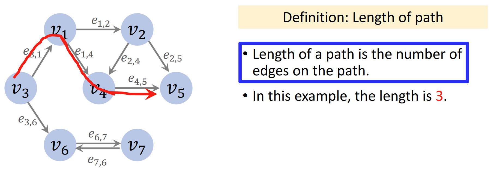

# 最短路径

- [最短路径](#最短路径)
  - [1. 无向无权图的路径](#1-无向无权图的路径)
  - [2. 有向无权图的路径](#2-有向无权图的路径)
  - [3. 有权图的路径](#3-有权图的路径)
  - [4. 最短路径问题](#4-最短路径问题)

2024-08-19
***

## 1. 无向无权图的路径

路径定义：

路径长度定义：

如果是有权图，则需要考虑边的权重。

**简单路径（simple-path）**

简单路径：路径上没有重复节点。

上图不是一个简单路径（路径中 v4 出现两次）。

两个节点之间未必存在路径，如 v1 到 v5 不存在路径。

## 2. 有向无权图的路径

有向图的路径只有一个方向。

从 v3 可以到 v5，但是从 v5 无法返回 v3。

有向无权图的路径长度：路径包含**边**的个数。

## 3. 有权图的路径

有权图对路径长度的定义有所不同：

有向图的路径更容易不存在。

## 4. 最短路径问题

最短路径问题：在 graph 中找到从起点到终点的最短路径。

**单源最短路径问题**（single-source）

上图：找到从 v3 出发到所有其它节点的最短路径。

单源最短路径的目标是获得下表：

表中包含从 v3 出发到其它节点的最短路径：

- vertex 表示路径终点
- dist 为最短路径长度
- path 为路径

例如，查看从 v3 到 v2 的最短路径：

- 看表中第二行，path 为 v1；
- 表示 v2 的前一个节点是 v1；
- 查看如何从起点到 v1，查看第一行，path 为 v3，表示 v1 的前一个节点是 v3；
- 这样就获得从 v3 到 v3 的最短路径为 v3->v1->v2。
