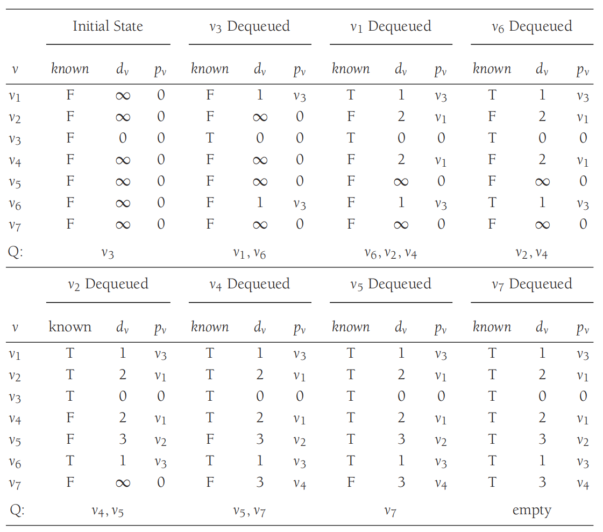

# 最短路径

- [最短路径](#最短路径)
  - [简介](#简介)
  - [无向无权图的路径](#无向无权图的路径)
  - [有向无权图的路径](#有向无权图的路径)
  - [加权图的路径（Dijkstra）](#加权图的路径dijkstra)
  - [包含 negative-cost edge](#包含-negative-cost-edge)
  - [无环 graph](#无环-graph)

2024-08-19

## 简介

对 weighted-graph，每条边 $(v_i, v_j)$ 对应成本 $c_{i,j}$。路径 $v_1v_2\cdots v_N$ 的成本为 $\sum_{i=1}^{N-1}c_{i,i+1}$，称为 **weighted-path-length**。对 unweighted-path-length 就是 path 包含的 edges 数，即 $N-1$。如下所示，从 v3 到 v5 的最短加强路径长度为 7：


最短路径问题：在 graph 中找到从起点到终点的最短路径。

**单源最短路径问题**（single-source）


上图：找到从 v3 出发到所有其它节点的最短路径。

单源最短路径的目标是获得下表：


表中包含从 v3 出发到其它节点的最短路径：

- vertex 表示路径终点
- dist 为最短路径长度
- path 为路径

例如，查看从 v3 到 v2 的最短路径：

- 看表中第二行，path 为 v1；
- 表示 v2 的前一个节点是 v1；
- 查看如何从起点到 v1，查看第一行，path 为 v3，表示 v1 的前一个节点是 v3；
- 这样就获得从 v3 到 v3 的最短路径为 v3->v1->v2。

如果 edge 的 cost 为负数，例如：


从 v5 到 v4 的 cost 为 1，但是如果沿着 v4,v4,v2,v5,v4 循环一次，cost 为-5，继续循环，cost 会一直降低，因此，从 v5 到 v4 的最短加权路径是不确定的，这个循环称为**负成本循环（negative-cost cycle）**。当 graph 中存在负成本循环，就无法确定最短路径。下面讨论没有负成本循环的情况。

最短路径问题有许多应用场景，如 vertex 代表计算机，edge 代表计算机之间的链接，cost 代表通信成本或延迟等，那么就可以使用最短路径算法找到从一台计算机发送信息到另一个计算机的最便宜的方法。

下面介绍最短路径的四个版本：

1. unweight-graph 的最短路径，最佳算法 $O(|E|+|V|)$
2. weighted-graph 的最短路径，假设没有负边，使用合理的数据结构，该算法能达到 $O(|E|\log|V|)$
3. 如果有负边，提供一个简单解决方案，但其时间复杂度很差，为 $O(|E|\cdot |V|)$
4. 最后，为无环 weighted-graph 提供一个线性时间解决方案

### 边的松弛

在最短路径算法中，边的松弛是对 node 的路径和边的更新。如下图所示，v->w 的松弛指检查从 s 到 w 的最短路径是否先从 s 到 v，然后再由 v 到 w。如果是，则更新到 w 的路径和权重：

- 左侧 distTo[v]+weight(v->w) > distTo[w]，这种情况成为边失效，不更新 w 的数据；
- 右侧 distTo[v]+weight(v->w) < distTo[w]，此时会更新 edgeTo[w] 和 distTo[w]。

松弛这个词用橡皮筋笔记，沿着两根 node 的路径展开，松弛一条边类似于将橡皮筋转移到一条更短的路径，从而缓解了橡皮筋的用阿里。


### node 松弛

在算法实现中，会放松从一个顶点指向的所有边。例如：

```java
private void relax(EdgeWeightedDigraph G, int v){ 
   for (DirectedEdge e : G.adj(v)) { 
      int w = e.to(); 
      if (distTo[w] > distTo[v] + e.weight()){ 
         distTo[w] = distTo[v] + e.weight(); 
         edgeTo[w] = e; 
     } 
   } 
}
```

### 理论基础

边的松弛是一项非常容易实现的重要操作，也是实现最短路径算法的基础。

**最短路径的最优性**

令 G 为加权有向图，顶点 s 是 G 的起点，distTo[] 是一个顶点索引数组，保存 G 中路径的长度。对于从 s 可达的所有顶点 v，distTo[v] 的值是从 s 到 v 的某条路径的长度，对于从 s 到 v 不可达的所有顶点 v，该值无穷大。当且仅当从 v 到 w 的任意一条边 e，这些值都满足 distTo[w]<=distTo[v]+e.weight() 时，它们是最短路径的长度。

***

## 无向无权图的路径

路径定义：相邻顶点的序列。


路径长度定义：


如果是有权图，则需要考虑边的权重。

**简单路径（simple-path）**


简单路径（simple path）：路径上没有重复节点。

上图不是一个简单路径（路径中 v4 出现两次）。


两个节点之间未必存在路径，如 v1 到 v5 不存在路径。

cycle: 第一个和最后一个顶点相同的 path。

simple cycle: 除了第一个和最后一个节点，不包含重复顶点或边的 cycle。

## 有向无权图的路径

有向无权图的特点：

- 所有 edge 的权重为 1
- 不存在的 edge 权重为 ∞

单源最短路径问题：输入为 graph 和起点。

解决方案：BFS。


有向图的路径只有一个方向。从 v3 可以到 v5，但是从 v5 无法返回 v3。

**有向无权图**的路径长度：路径包含**边**的个数。上图中从 v3 到 v5 的路径长度为 3.

有向无权图的单源最短路径问题，是加权最短路径问题的一个特例，因为我们可以为边分配权重 1.

现在，假设我们只对最短路径的长度感兴趣。以下图为例：


v3 设为起点 s，从 s 到 v3 的最短路径长度为 0。然后查找所有距离 s 为 1 的顶点，可以通过查看与 s 相邻的顶点来查找这些顶点。采用该方式，可以发现 v1 和 v6 和 s 的距离为 1。如下图：


然后查找与 v1 和 v6 相邻但未确定距离的顶点，它们的距离为 2。得到 v2 和 v4 的距离为 2：


最后检查 v2 和 v4 的相邻顶点，得到 v5 和 v7 的最短路径长度为 3。到此，所有顶点计算完毕。结果如下：


这种搜索图的策略称为**广度优先搜索**（breadth-first search, BFS）。它分层处理顶点：最接近起点的顶点先处理，最远的顶点最后处理。这与树的分层遍历非常相似。

广度优先搜索的代码实现，首先初始化配置：

| v    | known | dv   | pv   |
| ---- | ----- | ---- | ---- |
| v1   | F     | ∞    | 0    |
| v2   | F     | ∞    | 0    |
| v3   | F     | 0    | 0    |
| v4   | F     | ∞    | 0    |
| v5   | F     | ∞    | 0    |
| v6   | F     | ∞    | 0    |
| v7   | F     | ∞    | 0    |

对每个顶点，跟踪上面三条信息。$d_v$ 是顶点距离 s 的距离，$p_v$ 记录上一个顶点，处理完的顶点 known 标记为 true。当一个顶点标记为 known，可以保证不会找到更便宜的路径，因此对该顶点的处理基本结束。

基本算法如下：

```java
void unweighted( Vertex s ){
    for each Vertex v{
        v.dist = INFINITY;
        v.known = false;
    }
    s.dist = 0;
    
    for( int currDist = 0; currDist < NUM_VERTICES; currDist++ )
        for each Vertex v
            if( !v.known && v.dist == currDist){
                v.known = true;
                for each Vertex w adjacent to v
                if( w.dist == INFINITY){
                    w.dist = currDist + 1;
                    w.path = v;
        		} 
    		} 
}
```

该算法分别将距离 $d=0$, $d=1$, $d=2$ 的顶点标记为 known，并将所有相邻且 $d_w=\infty$ 的节点 $w$ 的距离记为 $d_w=d+1$。通过追溯 $p_v$ 可以得到实际路径。

由于嵌套 for 循环，该算法的运行时间为 $O(|V|^2)$。即使所有顶点已知，外部 for 循环还会持续到 `NUM_VERTICES`。虽然可以进行额外测试来避免该情况，但不影响最坏运行时间。可以采用与拓扑排序类似的方法消除该低效率。

采用队列保存 `currDist` 和 `currDist+1` 节点。如下所示：

```java
void unweighted(Vertex s){
    Queue<Vertex> q = new Queue<Vertex>( );
    for each Vertex v
    	v.dist = INFINITY;
    
    s.dist = 0;
    q.enqueue(s);
    
    while(!q.isEmpty()){
        Vertex v = q.dequeue( );
        for each Vertex w adjacent to v
            if(w.dist == INFINITY){
                w.dist = v.dist + 1;
                w.path = v;
                q.enqueue(w);
        	} 
    }
}
```

这里起点为参数 `s`。此外，如果有些顶点无法从起点 `s` 到达，队列会过早清空，此时将报告这些节点的距离为无穷大，也合理。最后，不需要使用 `known` 字段，处理过的节点从队列移除，也不会再进入队列。下图是该算法的图表示意：



使用邻接表表示，该算法的时间复杂度为 $O(|E|+|V|)$。

JGraphT 实现：

```java
SimpleDirectedGraph<String, DefaultEdge> graph = new SimpleDirectedGraph<>(DefaultEdge.class);
String v1 = "v1";
String v2 = "v2";
String v3 = "v3";
String v4 = "v4";
String v5 = "v5";
String v6 = "v6";
String v7 = "v7";
graph.addVertex(v1);
graph.addVertex(v2);
graph.addVertex(v3);
graph.addVertex(v4);
graph.addVertex(v5);
graph.addVertex(v6);
graph.addVertex(v7);

graph.addEdge(v1, v2);
graph.addEdge(v1, v4);
graph.addEdge(v2, v4);
graph.addEdge(v2, v5);
graph.addEdge(v3, v1);
graph.addEdge(v3, v6);
graph.addEdge(v4, v3);
graph.addEdge(v4, v5);
graph.addEdge(v4, v6);
graph.addEdge(v4, v7);
graph.addEdge(v5, v7);
graph.addEdge(v7, v6);

List<String> values = new ArrayList<>();
BreadthFirstIterator<String, DefaultEdge> it = new BreadthFirstIterator<>(graph, v3);
while (it.hasNext()) {
    String node = it.next();
    values.add(node);
}
assertIterableEquals(Arrays.asList(v3, v1, v6, v2, v4, v5, v7), values);
assertEquals(0, it.getDepth(v3));
assertEquals(1, it.getDepth(v1));
assertEquals(1, it.getDepth(v6));
assertEquals(2, it.getDepth(v2));
assertEquals(2, it.getDepth(v4));
assertEquals(3, it.getDepth(v5));
assertEquals(3, it.getDepth(v7));

assertEquals(v3, it.getParent(v1));
assertEquals(v3, it.getParent(v6));
assertEquals(v1, it.getParent(v2));
assertEquals(v1, it.getParent(v4));
assertEquals(v2, it.getParent(v5));
assertEquals(v4, it.getParent(v7));
```

## 加权图的路径（Dijkstra）

Dijkstra 算法解决**加权有向图**的**单源最短路径**问题，该算法要求所有边的权重为**非负**数。

加权图对路径长度的定义有所不同：


加权图的最短路径问题更复杂，不过思路与 BFS 类似。记录每个顶点的距离 $d_v$ 和上一个顶点 $p_v$。

解决单源最短路径问题的经典方法称为 **Dijkstra 算法**。这个已有三十年历史的解决方案是**贪婪算法**的一个典型例子。贪婪算法分步解决问题，每一步采用这个阶段看起来最好的做法。

Dijkstra 算法分步进行，和 BFS 算法一样，每一步 Dijkstra 都会选择一个顶点 `v`，该顶点在所有未知顶点中具有最小 $d_v$，并声明从 s 到 v 的路径已知，然后更新 $d_w$。对无权图，如果 $d_w=\infty$，则设置 $d_w=d_v+1$，对加权图，$d_w=d_v+c_{v,w}$。

下面是一个加权图：


Dijkstra 算法的初始设置：


初始节点 s 设为 v1，因此 v1 长度为 0，并标记为 known。然后更新 v1 的相邻节点，即 v2 和 v4：


然后，选择 v4 并标记为 known，其相邻节点包括 v3, v5, v6, v7，调整它们的路径长度：


然后选择 v2。其相邻节点 v4, v5，其中 v4 已为 known，跳过。对 v5，经过 v2 的 cost 为 2+10=12，v5 已有一个更短路径长度为 3，无需更新，如下：


接下来选择 v5，其 cost 为 3，有一个相邻节点 v7，因为 3+6>5，所以不需要更新。然后选择 v3，其相邻节点 v6 更新为 3+5=8。然后选择 v7，v6 更新为 5+1=6，最后选择 v6，没有相邻节点，结束。最后表格如下：


这个过程就是 **Dijkstra 算法**。

Dijkstra 算法的伪代码实现：

```ja
class Vertex{
    public List adj; // Adjacency list
    public boolean known;
    public DistType dist; // DistType is probably int
    public Vertex path;
    // Other fields and methods as needed
}
```

```java
/** 
*Print shortest path to v after dijkstra has run.
* Assume that the path exists.
*/
void printPath( Vertex v ){
    if( v.path != null){
        printPath(v.path);
        System.out.print(" to ");
    }
    System.out.print( v );
}
```

```java
void dijkstra(Vertex s){
    for each Vertex v{
        v.dist = INFINITY;
        v.known = false;
    }
    s.dist = 0;
    while(there is an unknown distance vertex){
        Vertex v = smallest unknown distance vertex;
        v.known = true;
        
        for each Vertex w adjacent to v
            if(!w.known ){
                DistType cvw = cost of edge from v to w;
                if( v.dist + cvw < w.dist ){
                    // Update w
                    decrease( w.dist to v.dist + cvw );
                    w.path = v;
                } 
            } 
    } 
}
```

其实就是采用贪婪规则填充表格的 for 循环。

只要没有 negative-cost 的边，该算法就有效。如果包含 negative-cost 边，可能得到错误结果。运行时间取决于节点的操作方式，如果按顺序扫描顶点找最小 $d_v$，每次需要 $O(|V|)$ 时间找到最小值，因此整个算法过程将花费 $O(|V|^2)$  时间来找最小值。更新 $d_w$ 的时间为常数，每条边最多更新一次，总共 $O(|E|)$。因此，总的运行时间为 $O(|E|+|V|^2)=O(|V|^2)$。

对稠密图，$|E|=O(|V|^2)$，该算法不仅简单，而是是最优的，因此其运行时间与边数成正比。

对稀疏图，$|E|=|V|$，则此算法太慢。此时，应该将距离保存在优先队列中。实现方式有两种类似的方式，顶点 v 的选择是一个 `deleteMin` 操作，更新 w 距离的方式有两种：

1. 将更新视为 `decreaseKey` 操作。查找最小值和更新的时间都是 $O(\log|V|)$，对应运行时间为 $O(|E|\log|V|+|V|\log|V|)=O(|E|\log|V|)$，有所改进。由于优先队列不支持有效地查找操作，因此每当优先队列中的 $d_i$ 发生变化，都需要维护和更新优先队列中每个 $d_i$ 值的位置。如果使用二叉堆实现优先队列，则性能很差，如果使用 pairing-heap，则效果还可以。
2. 另一种方法是每当 w 的距离发生变化，将 w 和新的 $d_w$ 插入优先队列。因此一个顶点可能在优先队列中出现多次。当 `deleteMin` 从队列中删除最小顶点时，必须检查它以确保它是否已知，如果是，则忽略并执行下一个 `deleteMin`。虽然这种方法从软件角度看更优越，并且更容易编码，但优先级队列的大小可能会变得与 $|E|$ 一样大。这不会影响渐近时间界，因为 $|E|\le |V|^2$，说明 $\log |E|\le 2\log|V|$，时间复杂度依然为 $O(|E|\log |V|)$。但是，内存需求增加了，对部分应用可能影响很大。另外，该方法需要 $|E|$ 此 `delteMin` 操作而不是 $|V|$ 次，因此实践中可能更慢。

在典型应用中，大多数情况都是稀疏图，因此使用优先队列来实现很重要。

JGraphT 实现：

```java
SimpleDirectedWeightedGraph<String, DefaultWeightedEdge> graph =
        new SimpleDirectedWeightedGraph<>(DefaultWeightedEdge.class);
String v1 = "v1";
String v2 = "v2";
String v3 = "v3";
String v4 = "v4";
String v5 = "v5";
String v6 = "v6";
String v7 = "v7";
graph.addVertex(v1);
graph.addVertex(v2);
graph.addVertex(v3);
graph.addVertex(v4);
graph.addVertex(v5);
graph.addVertex(v6);
graph.addVertex(v7);

graph.setEdgeWeight(graph.addEdge(v1, v2), 2);
graph.setEdgeWeight(graph.addEdge(v1, v4), 1);
graph.setEdgeWeight(graph.addEdge(v2, v4), 3);
graph.setEdgeWeight(graph.addEdge(v2, v5), 10);
graph.setEdgeWeight(graph.addEdge(v3, v1), 4);
graph.setEdgeWeight(graph.addEdge(v3, v6), 5);
graph.setEdgeWeight(graph.addEdge(v4, v3), 2);
graph.setEdgeWeight(graph.addEdge(v4, v5), 2);
graph.setEdgeWeight(graph.addEdge(v4, v6), 8);
graph.setEdgeWeight(graph.addEdge(v4, v7), 4);
graph.setEdgeWeight(graph.addEdge(v5, v7), 6);
graph.setEdgeWeight(graph.addEdge(v7, v6), 1);

DijkstraShortestPath<String, DefaultWeightedEdge> path = new DijkstraShortestPath<>(graph);
ShortestPathAlgorithm.SingleSourcePaths<String, DefaultWeightedEdge> paths = path.getPaths(v1);
assertEquals(0, paths.getWeight(v1));
assertEquals(2, paths.getWeight(v2));
assertEquals(3, paths.getWeight(v3));
assertEquals(1, paths.getWeight(v4));
assertEquals(3, paths.getWeight(v5));
assertEquals(6, paths.getWeight(v6));
assertEquals(5, paths.getWeight(v7));
```

## 包含 negative-cost edge

如果 graph 包含 negative-cost edge，则 Dijkstra 算法不起作用。

一个直观的解决方案是给每条边的 cost 增加一个常数，从而删除 negative-cost 边，然后在新 graph 上计算最短路径，然后将该结果应用于原始 graph。这种简单的策略行不通，因为这会导致边多的路径比边少的路径增加的权重更多。

组合加权和非加权算法可以解决该问题，但会增加运行时间。

首先将 $s$ 放入队列，然后在每一步， dequeue 节点 v，查找所有与 v 相邻的节点 w，如果 $d_w>d_v+c_{v,w}$，更新 $d_w$ 和 $p_w$，如果未处理过 w，将其放入 queue。重复该过程，直到 queue 为空。伪代码实现：

```java
void weightedNegative(Vertex s){
    Queue<Vertex> q = new Queue<Vertex>();
    for each Vertex v
	    v.dist = INFINITY;
    s.dist = 0;
    q.enqueue(s);
    
    while(!q.isEmpty( )){
        Vertex v = q.dequeue();
        for each Vertex w adjacent to v
            if( v.dist + cvw < w.dist){
                // Update w
                w.dist = v.dist + cvw;
                w.path = v;
                if( w is not already in q)
                	q.enqueue( w );
            } 
    }
}
```

如果没有 negative-cost 循环，该算法能工作，但内部 for 循环不再是每条边执行一次。每个顶点最多出队 $|V|$ 次，因此如果使用邻接表，运行时间为 $O(|E|\cdot|V|)$，这比 Dijkstra 算法慢许多。幸运的是，在实践中基本没有 negative-cost edge。

如果存在 negative-cost-cycle，该算法会无限循环。通过在任何顶点出队 $|V|+1$ 次后停止算法，可以确保终止。

## 无环 graph

算法特点：

- 线性时间内解决单点最短路径问题
- 能处理负权重的边
- 能解决相关问题，如最长路径

基本思路：顶点松弛和拓扑排序结合。

如果已知 graph 无环，那可以通过改变声明顶点为 known 的顺序改进 Dijkstra 算法。即按照拓扑排序选择节点。该算法可以迭代一次完成，因为在拓扑排序时可以同时选择和更新节点。

该算法有效，是因为当选择顶点 $v$ 时，它的距离 $d_v$ 不可能再降低，因为根据拓扑排序规则，它没有来自未知节点的输入边。使用该规则不需要优先度列，运行时间为 $O(|E|+|V|)$，因为选择时间为常数。

无环图可以模拟下坡滑雪问题，我们想从 a 点到 b 点，但只能下坡，所以显然没有循环。另外还可能用于不可逆化学反应的建模。让每个顶点代表实验的特定状态，边表示从一个状态到另一个状态的转换，权重可能表示释放的能量。如果只允许从较高能量状态转换到较低能量状态，则该图是无环的。

无环图的一个重要应用是**关键路径分析**（critical path analysis）。如下图所示：


每个 node 代表必须执行的一项活动，以及完成该活动所需时间。因此，该图又称为 activity-node graph。边表示优先关系：edge (v,w) 表示活动 v 必须在活动 w 之前完成。当然，这意味着该 graph 必须是无环的。另外，假设任何不依赖彼此的活动都可以由不同服务器并行完成。

这种类型的 graph 可以并且经常用于建模建筑项目。用于回答：

- 该项目最快多久完成：可以看到，沿着 A-C-F-H 需要 10
- 哪些活动可以延迟，以及延迟多长时间，而不会影响最短完成时间：例如，延迟 A-C-F-H 任意一个都会使完成时间超过 10。另外，活动 B 不重要，最多延迟 2 也不会影响最终完成时间

为了执行这些计算，将 activity-node graph 转换为 **event-node graph**。每个 event 对应一项活动及其依赖活动的完成。在 event-node graph 中从节点 $v$ 可到达的时间，要等时间 $v$ 完成才会开始。此 graph 可以自动或手动创建。当一个活动依赖于其它几个活动时，可能需要插入虚拟边和 node。这是为了避免引入虚假依赖关系（或虚假非依赖关系）。下图是上图对应的 event-node graph：


> [!TIP]
>
> 从 activity-node graph 转换为 event-node graph，对包含多个输入 edges 的 node，需要引入一个虚拟 node。

要找到项目的**最早完成时间**，只需要找到从一个事件到最后一个事件的**最长路径的长度**。对一般 graph，最长路径问题通常没有意义，因为可能存在正成本循环，这些循环相当于最短路径问题中的负成本循环。由于 event-node graph 是无环的，无须担心循环。此时采用最短路径算法来计算图中所有节点的最早完成时间。如果 $EC_i$ 是 node i 的最早完成时间，则规则为：
$$
EC_1=0\\
EC_w=\underset{(v,w)\in E}{\text{max}}(EC_v+c_{v,w})
$$
下图是每个 event 的最早完成时间：


> [!TIP]
>
> 最长路径，即在拓扑排序中，对每个 node 的所有输入 nodes，取 cost 最大的路径。

还可以计算每个事件在不影响最终完成时间的情况下完成的最晚时间 $LC_i$。计算公式：
$$
LC_n=EC_n\\
LC_v=\underset{(v,w)\in E}{\text{min}}(LC_w-c_{v,w})
$$
为每个 node 维护一个相邻 node-list 和前一个 node-list，就可以在线性时间完成上述计算。最早完成时间通过拓扑顺序完成，**最晚完成时间**则按拓扑排序逆序计算。最晚完成时间如下图所示：


> [!TIP]
>
> 最晚完成时间，先用拓扑排序获取每个 node 最早完成时间 $LC_n$。然后按照拓扑排序的逆序，使用  $LC_v=\underset{(v,w)\in E}{\text{min}}(LC_w-c_{v,w})$ 从后向前更新每个 node 的最晚完成时间。

event-node graph 中 edge 的**松弛时间**（slack time）表示在不延迟整体完成的情况下，相应活动的完成可以延迟的时间。计算方法：
$$
\text{Slack}_{(v,w)}=LC_w-EC_v-c_{v,w}
$$
如下图所示：


每条边的最后一项就是松弛时间。对每个 node，上面是最早完成时间，下面是最晚完成时间。

有些任务没有松弛时间，这些是关键任务，必须按时完成。完成由 0 松弛边组成的路径，称为**关键路径**（critical path）。

## 所有节点之间的最短路径

有时需要找到所有节点之间的最短路径。虽然我们可以运行单源最短算法 $|V|$ 次，但一次性计算所有结果，可能获得更快的解决方案，尤其在 dense-graph。

后面会介绍一个 $O(|V|^3)$ 算法解决 weighted-graph 的这个问题。对 dense-graph，这与运行简单 Dijkstra 算法 |V| 次的界限相同，但循环更紧密，因此专门的 all-pairs 算法在实践中更快。在**稀疏图**上，运行 $|V|$ 次使用优先队列实现的 Dijkstra 算法更快。

## Bellman-Ford 算法

Bellman-Ford 是通用最短路径算法，支持环和负权重边。

时间复杂度：O(EV), 空间复杂度：O(V)


## 最短路径示例

下面以单词阶梯为例。在单词阶梯中，一个单词通过每次更改一个字符，逐渐形成另一个单词。例如，通过一系列单字符替换可以将 zero 转换为 five: zero hero here hire fire five。

这是一个 unweighted 最短路径问题，每个单词对应一个 node，如果两个 node 之间可以通过一个字符替换相互转换，则它们之间存在边。

## 总结

- 权重非负的最短路径问题（允许环）：Dijkstra
- DAG 图，快速算法，允许负数权重：拓扑排序+
- 可以含有环，边的权重可以是负数：Bellman-Ford
