# 有权图的最短路径问题

- [有权图的最短路径问题](#有权图的最短路径问题)
  - [1. 简介](#1-简介)
  - [2. Dijkstra 算法](#2-dijkstra-算法)
    - [算法总结](#算法总结)
    - [时间复杂度](#时间复杂度)

2024-08-19
***

## 1. 简介

有权图的每条边有一个权重，如下图：

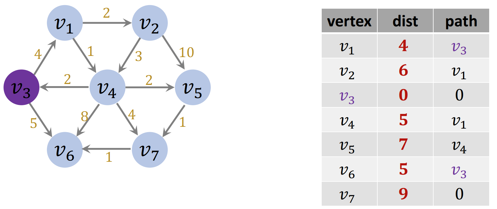

这里依然是研究单源最短路径问题：即给定起点，算出它到所有其它节点的最短路径。

上图中，v3 为起点，目标是得到右边的表。

## 2. Dijkstra 算法

Dijkstra 可以找到有权图中的最短路径问题。基于 BFS 搜索。

算法输入为一个加权有向图，起点定为 v3.

**初始化**：

Dijkstra 需要用优先队列，而不是原来的 FIFO 队列。距离短的优先级高。

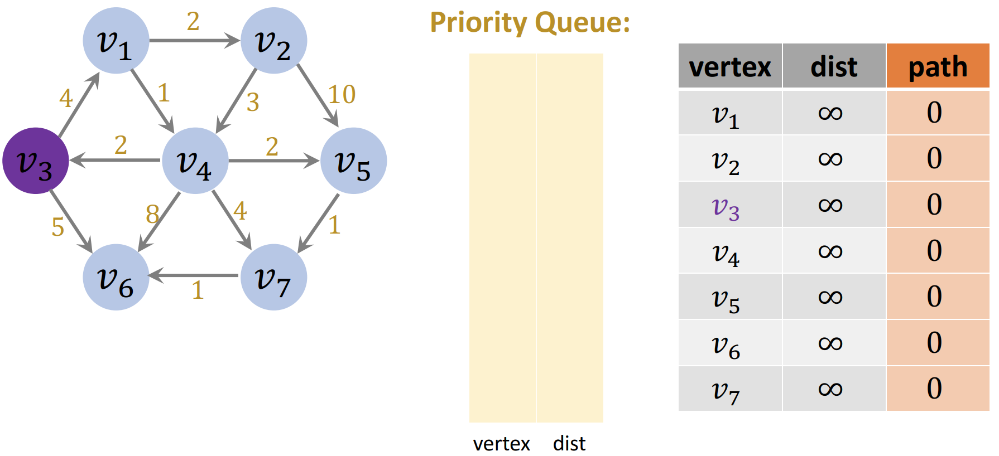

**处理起点 v3:**

- dist[v3]=0
- enqueue(v3)

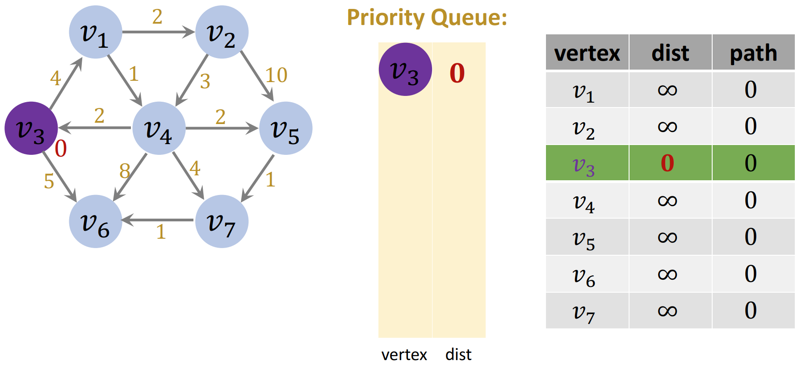

**第一次循环**：

- v3 <- dequeue()
- 找邻居：v1, v6
- 更新 v1
  - v3->v1 的距离 4，小于原距离 ∞，因此
    - 更新 v1 距离：`dist[v1]=dist[v3]+4=4`
    - 更新 v1 path: `path[v1]=v3`
    - 只要找到更短的距离，就将节点插入 `PriorityQueue`: `enqueue(v1)`

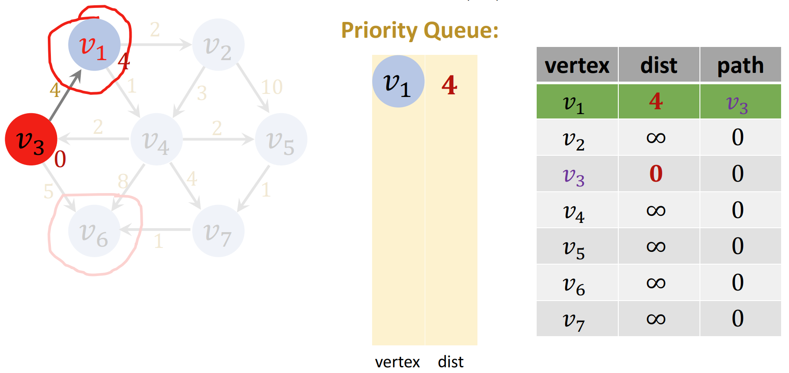

> [!NOTE]
>
> 从起点到达 v1 的路径改变了，这会影响途径 v1 的路径，v1 下游的节点会受到影响，所以要把 v1 插入队列，之后再处理 v1 下游的节点。

- 更新 v6
  - v3->v6 的距离 5，小于原距离 ∞，因此
    - 更新 v6 距离：`dist[v6]=5`
    - 更新 v6 path: `path[v6]=v3`
    - 将节点插入 `PriorityQueue`: `enqueue(v6)`

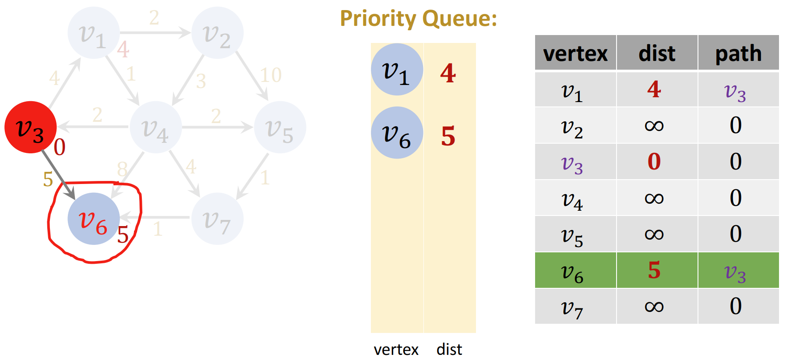

**第二次循环：**

- 取优先队列顶端 v1
- v1 邻居有：v2, v4
- 更新 v2
  - $d_{new}=4+2=6$，小于原距离 ∞
    - 更新 v2 距离：`dist[v2]=6`
    - 更新 v2 path: `path[v2]=v1`
    - 由于到 v2 的路径改变了，所以 `enqueue(v2)`

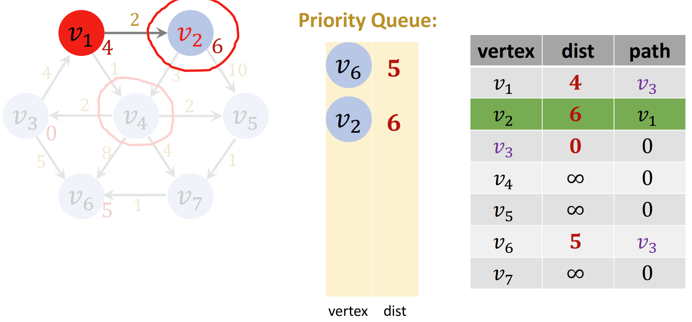

- 更新 v4
  - $d_{new}=4+1=5$，小于原距离 ∞
    - 更新 v4 距离：`dist[v4]=5`
    - 更新 v4 path: `path[v4]=v1`
    - `enqueue(v4)`

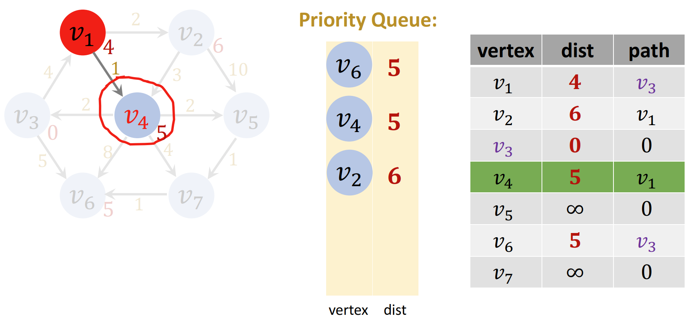

**第三次循环：**

- `v6 <- dequeue()`
- 相邻节点：无
- v6 不可能是其它节点的路径，忽略 v6

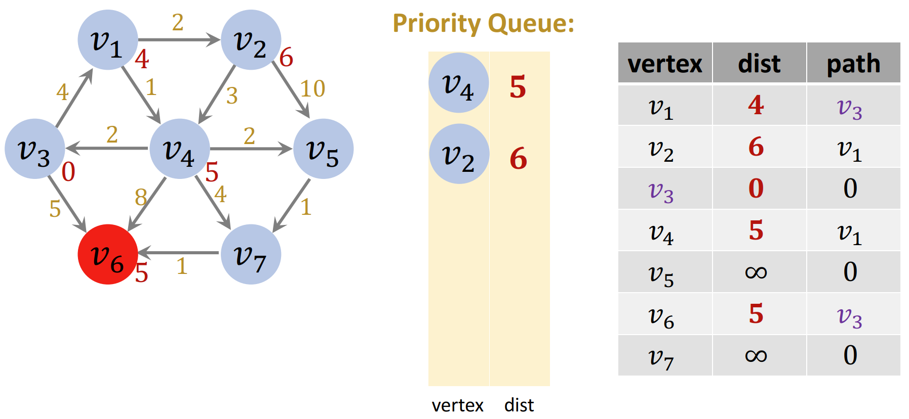

**第四次循环：**

- `v4 <- dequeue()`
- 相邻节点：v3, v5, v6, v7
- 更新 v3
  - $d_{new}$=`dist[v4]`+2=7，表中 v3 原路径为 0，小于新路径，所以不更新 v3 路径，忽略 v3
- 更新 v5
  - $d_{new}$=`dist[v4]`+2=7，表中 v5 原路径为 ∞，新路径更小：
    - 更新 v5 距离：`dist[v5]=7`
    - 更新 v5 path: `path[v5]=v4`
    - enqueue(v5)
- 更新 v6
  - $d_{new}$=`dist[v4]`+8=13，表示 v6 原路径为 5，小于新路径，所以不更新 v6 路径
- 更新 v7
  - $d_{new}$=`dist[v4]`+4=9，表示 v7 原路径为 ∞，新路径更短：
    - 更新 v7 距离：`dist[v7]=9`
    - 更新 v7 path: `path[v7]=v4`
    - enqueue(v7)

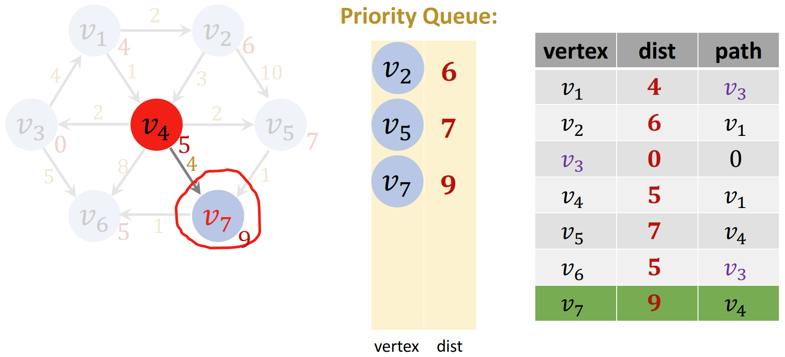

**第五次循环：**

- v2 <- dequeue()
- 相邻节点：v4, v5
- 更新 v4
  - $d_{new}$=`dist[v2]`+3=9，大于原路径长度 5，忽略
- 更新 v5
  - $d_{new}$=`dist[v2]`+10=16，大于原路径长度 7，忽略

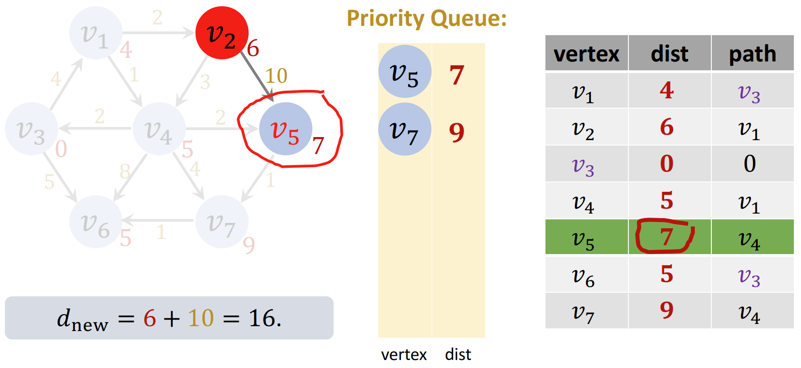

**第六次循环：**

- v5 <- dequeue()
- 相邻节点：v7
- 更新 v7
  - $d_{new}$=`dist[v5]`+1=8，小于原路径长度 9，因此：
    - 更新 v7 距离：`dist[v7]=8`
    - 更新 v7 path: `path[v7]=v5`
    - enqueue(v7)：v7 已经在优先队列中，不能再插入，而是将优先队列中 v7 的距离由 9 修改为 8

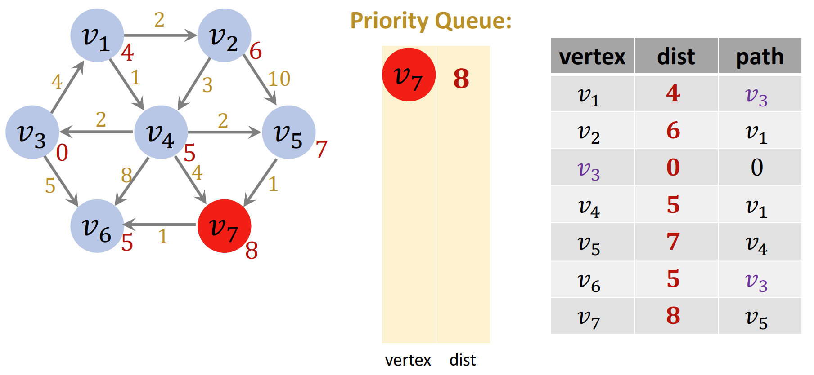

**第七次循环：**

- v7 <- dequeue()
- 相邻节点：v6
- 更新 v6
  - $d_{new}$=`dist[v7]`+1=9，大于原路径长度 5， 忽略 v6

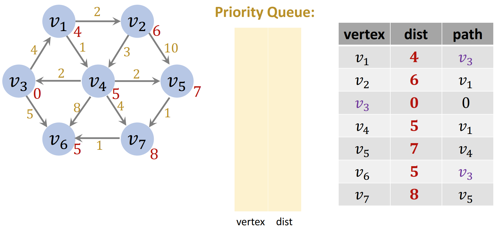

终止：

- 此时优先队列空了，因此终止算法

### 算法总结

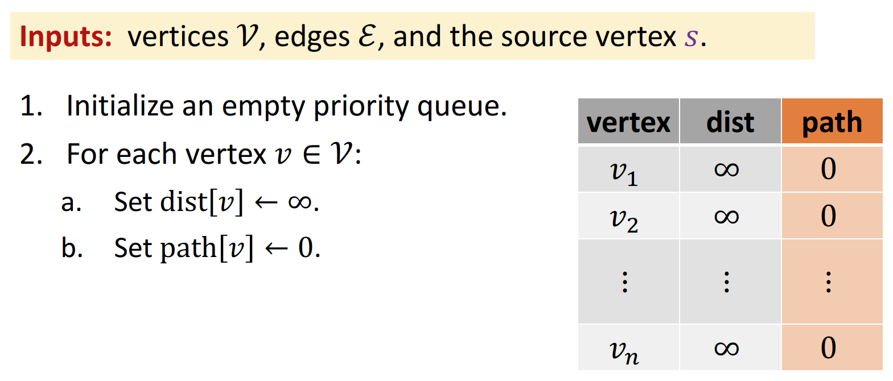

3. 设置 `dist[s]=0`
4. `enqueue(s, 0)`

开始循环

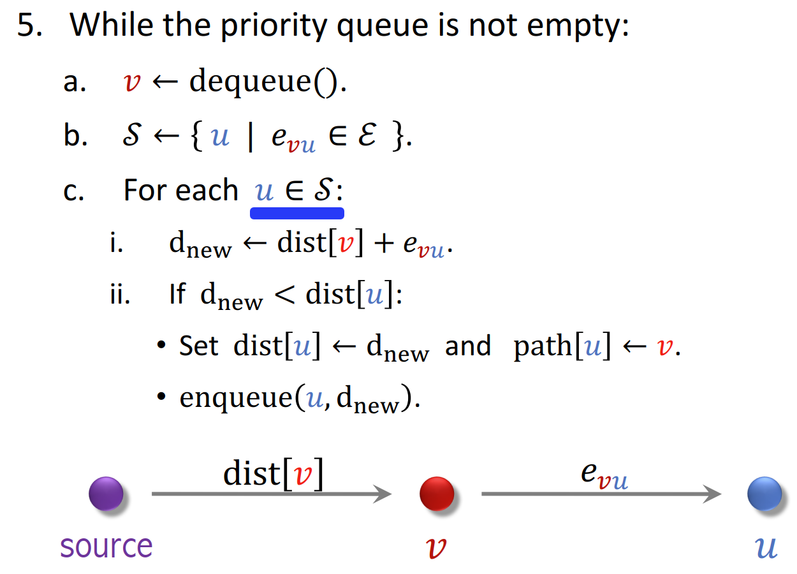

最终返回 dist（最短路径的长度） 和 path（最短路径的具体路径） 两个数组。

### 时间复杂度

Dijkstra 要求所有边的权重非负，否则算法会永远循环下去。

- enqueue 和 dequeue 总操作数为 $O(|V|+|E|)$
- enqueue 和 dequeue 操作时间复杂度均为 $O(\log |V|)$
- 总的时间复杂度为 $O((|V|+|E|)\cdot \log|V|)$

## Bellman-Ford 算法

Bellman-Ford 算法解决一般情况下的最短路径问题。
