# 拓扑排序

- [拓扑排序](#拓扑排序)
  - [1. 简介](#1-简介)
  - [2. 拓扑排序算法](#2-拓扑排序算法)
  - [3. 步骤](#3-步骤)
  - [4. Kahn 算法](#4-kahn-算法)
    - [处理 cycles](#处理-cycles)
    - [时间复杂度](#时间复杂度)

2024-08-19
***

## 1. 简介

如下图所示：

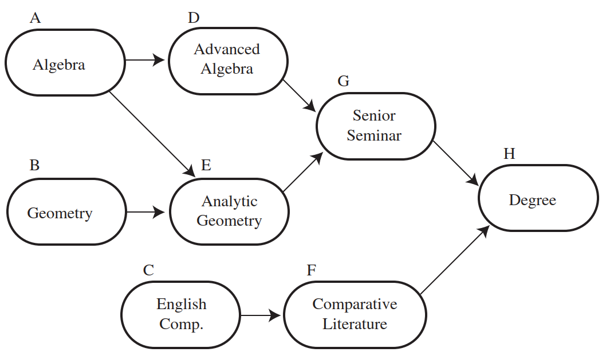

要获得学位，需要学习很多课程，而且这些课程因难易程度不同有不同的学习顺序。可以用上图所示的**有向无环图**（DAG）来表示这种关系。

拓扑排序：

- graph 必须为 DAG
- **拓扑排序**就是 vertices 的顺序，保证如果有从 u 到 v 的 path，那么 u 排在 v 前面

> [!NOTE]
>
> 有先后顺序的地方，就有拓扑排序。

例 1：

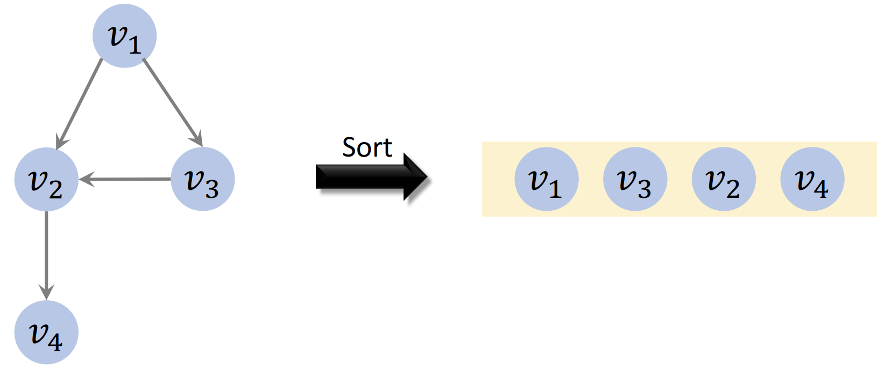

例 2：

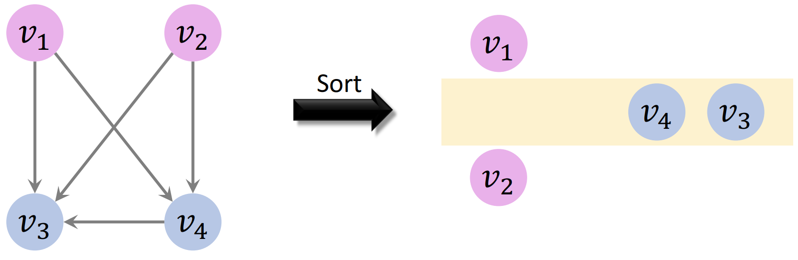

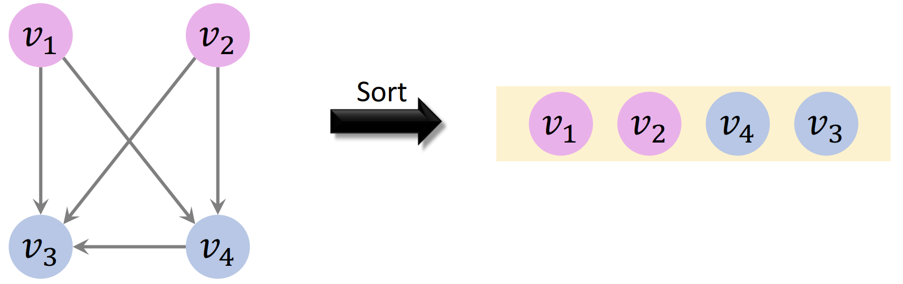

例 3：

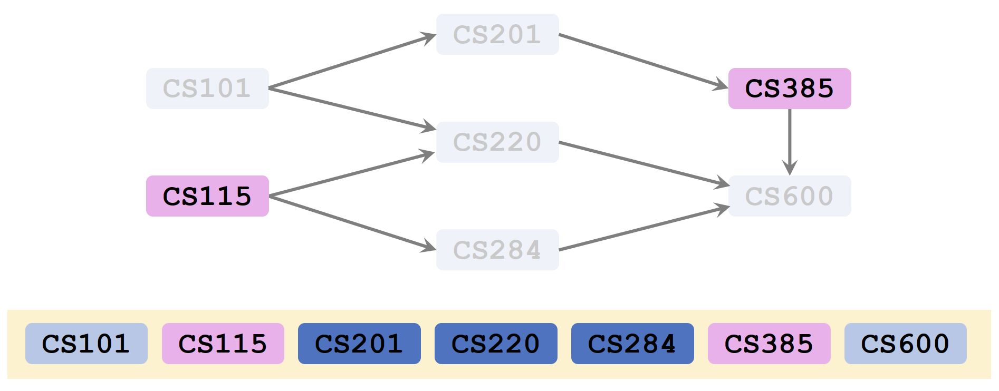

## 2. 拓扑排序算法

拓扑排序算法包括：

- Kahn 算法（基于广度优先搜索，BFS）
  - $O(N+M)$，最常用
- Corman-Tarjan 算法（基于深度优先搜索，DFS）
  - $O(N+M)$，实现的坑较多，但适合判断环
- 基于并行随机存取机（parallel random access machine）
  - $O(\log_2N)$,十分复杂

拓扑排序特点：

- 仅适用于有向无环图（DAG）
- 可能不唯一，即存在多个有效的拓扑排序

## 3. 步骤

重复直到 graph 为空：

1. 直到没有输入 edge 的 vertex
2. 将该 vertex 添加到序列
3. 从 graph 移除该 vertex

初始：

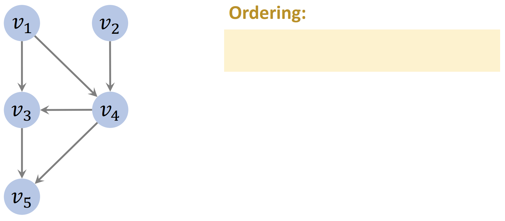

**第一次迭代：**

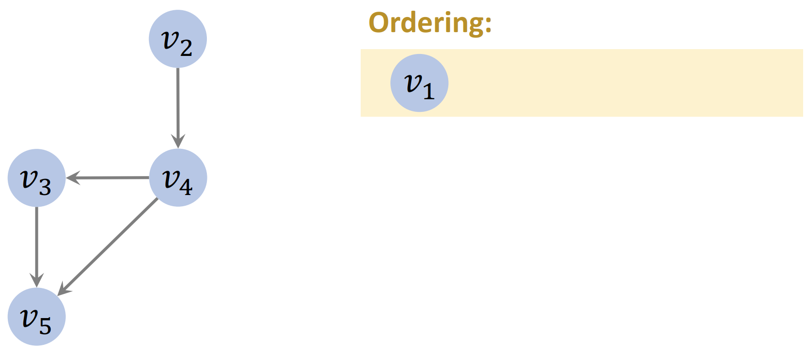

**第二次迭代：**

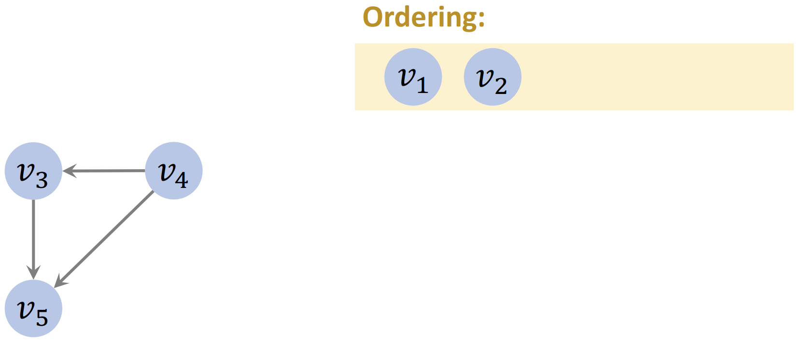

**第三次迭代：**

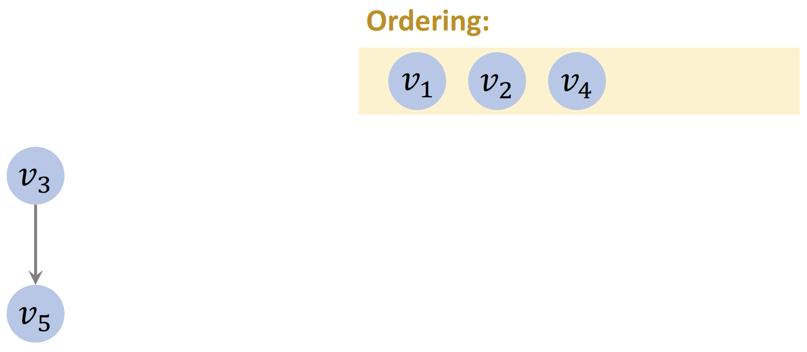

**第四次迭代：**

**结束：**

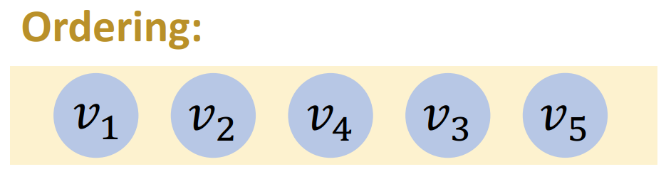

## 4. Kahn 算法

步骤：

1. 统计所有点的入度
2. 执行入度为 0 的点代表的任务
3. 每执行完一个任务，所有后续任务的入度减 1
4. 重复 2 和 3 直到所有可执行任务完成
5. 如果还有剩余任务，返回无界，否则返回任务执行顺序。

- indegree: 输入 edge 数
- m: edge 数
- 计算所有 indegree 的时间复杂度为 $O(m)$

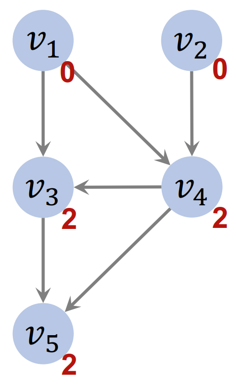

实现：

- 用队列存储 0 入度节点
- 每次从队首取节点并执行
- 新的 0 入度节点加入队尾

**初始状态：**

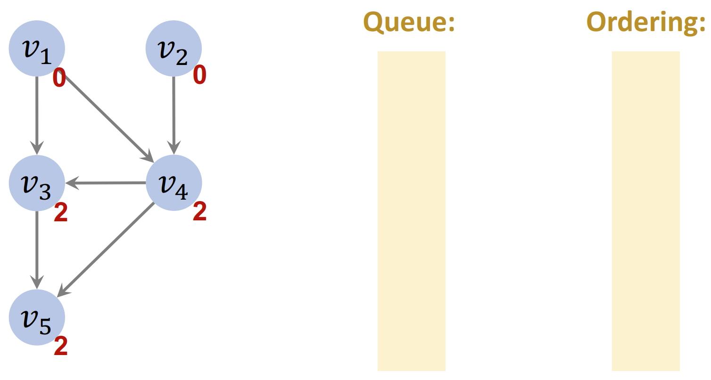

将 indegree 为 0 的 vertices 放入 queue 中。

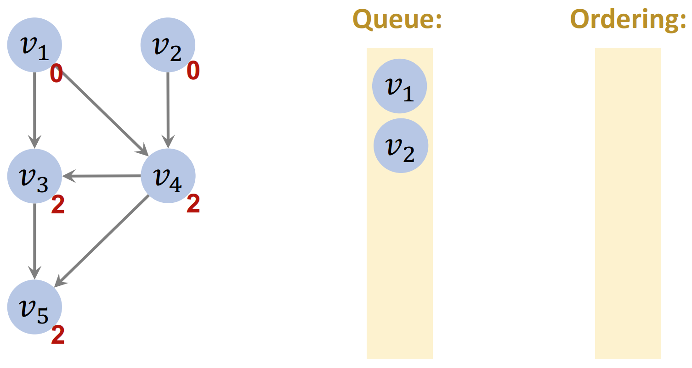

**第一次迭代：**

- v1 <- dequeue()
- 将 v1 指向的 vertices 的入度减 1

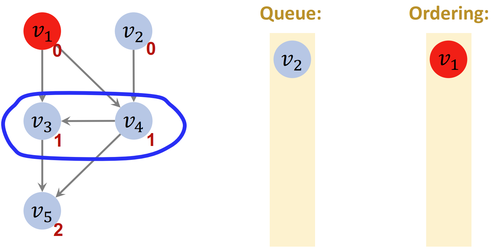

第二次迭代：

- v2 <- dequeue()
- 将 v2 指向的 vertices 的入度减 1
- v4 的入度变为 0，加入 queue

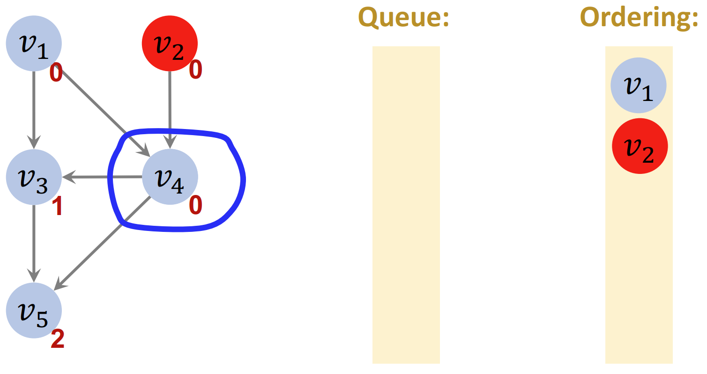

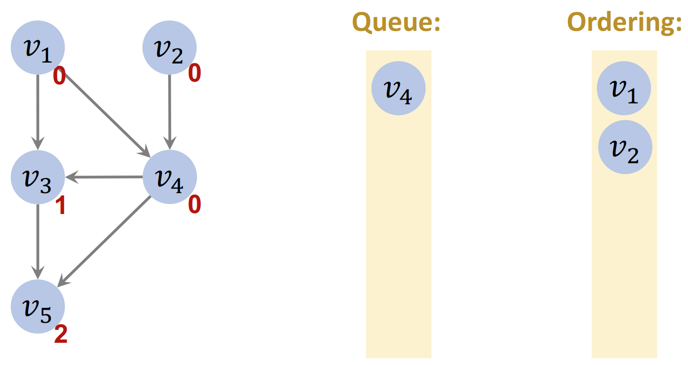

第三次迭代：

- v4 <- dequeue()
- 将 v4 指向的 v3 和 v5 入度减 1
- v3 的入度变为 0，加入 queue

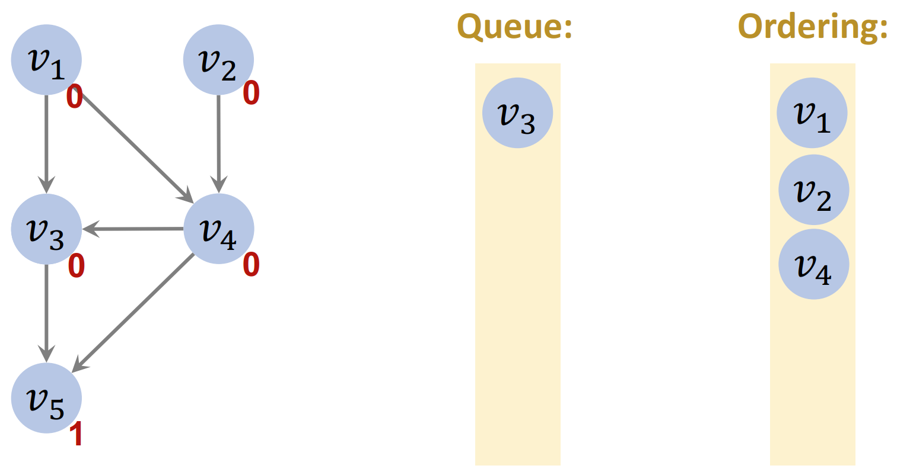

第四次迭代：

- v3 <- dequeue()
- 将 v3 指向的 v5 的入度减 1
- v5 的入度变为 0，加入 queue

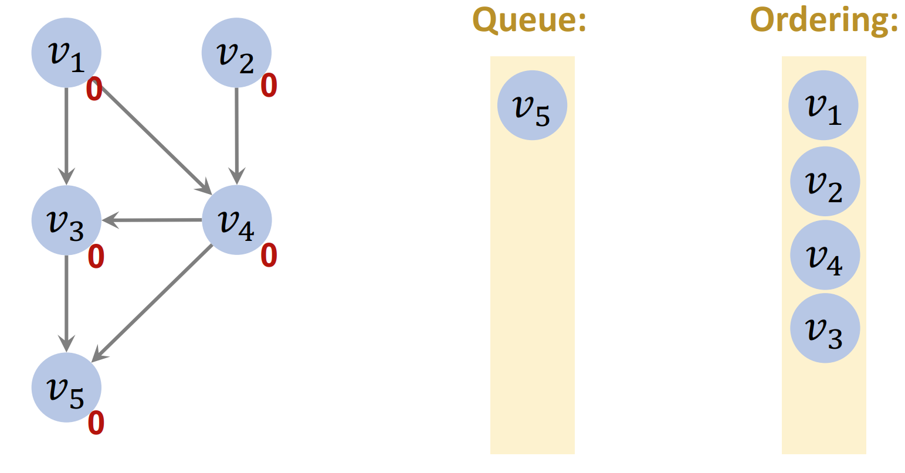

第五次迭代：

- v5 <- dequeue()
- v5 没有指向任何节点，程序终止

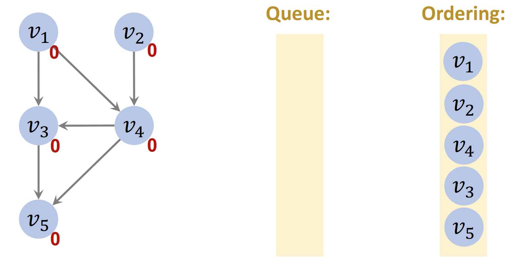

### 处理 cycles

清空 queue 后，检查迭代次数是否等于 vertices 个数，如果相等，表示没有 cycle，如果不等，表示有 cycle。

例如：

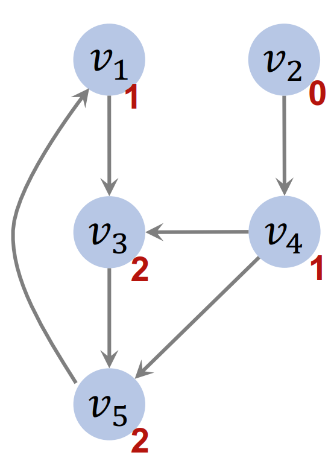

一次迭代：

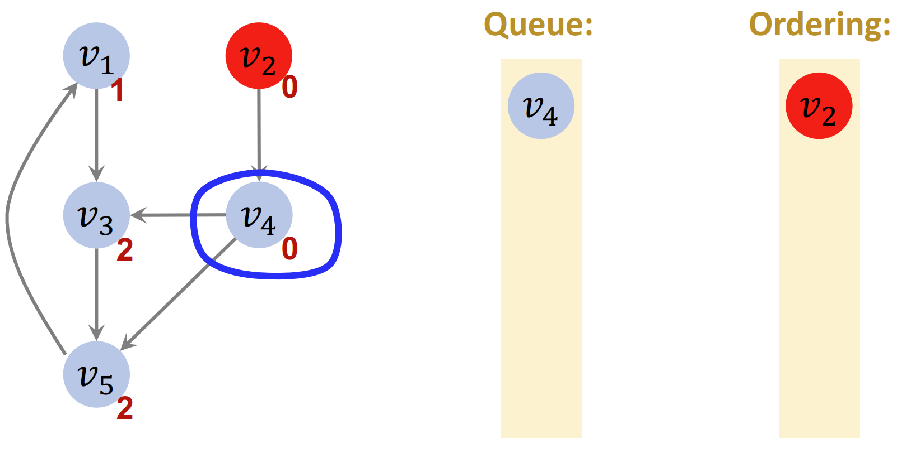

二次迭代：

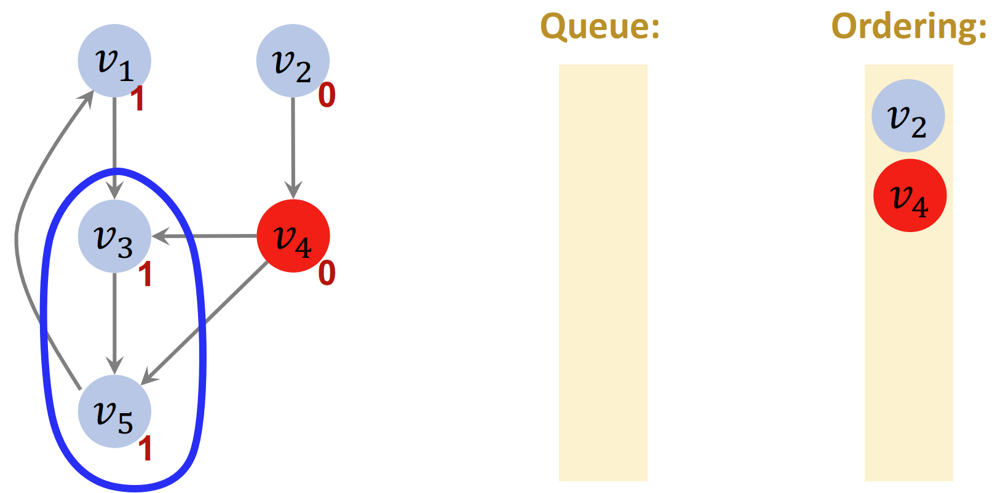

此时 queue 为空，循环终止。

- 迭代次数 2
- vertices 个数 5
- 迭代次数 ≠ vertices 个数
- 至少有一个 cycle
- 无法对 vertices 排序

### 时间复杂度

- $m$: edges 数
- $n$: vertices 数
- 计算入度 $O(m)$
- 每个 vertex 加入和移除队列一次 ，$O(n)$
- 每个 edge 访问一次，用于降低其相邻节点的入度：$O(m)$
- 总的时间复杂度 $O(m+n)$

## 参考

- https://mathworld.wolfram.com/TopologicalSort.html
