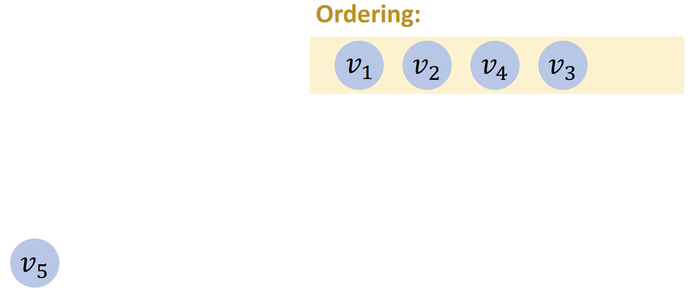

# 拓扑排序

- [拓扑排序](#拓扑排序)
  - [1. 简介](#1-简介)
  - [2. 拓扑排序算法](#2-拓扑排序算法)
  - [3. 简单算法](#3-简单算法)
  - [4. Kahn 算法](#4-kahn-算法)
    - [处理 cycles](#处理-cycles)
    - [时间复杂度](#时间复杂度)
  - [参考](#参考)

2024-11-23 添加伪代码实现 🧡
2024-08-19
@author Jiawei Mao
***

## 1. 简介

如下图所示：


要获得学位，需要学习很多课程，而且这些课程因难易程度不同有不同的学习顺序。可以用上图所示的**有向无环图**（DAG）来表示这种关系。

拓扑排序：

- 只针对有向无换图
- **拓扑排序**就是 vertices 的顺序，保证如果有从 u 到 v 的 path，那么 u 排在 v 前面

> [!NOTE]
>
> 有先后顺序的地方，就有拓扑排序。

例 1：


例 2：


例 3：


## 2. 拓扑排序算法

拓扑排序算法包括：

- Kahn 算法（基于广度优先搜索，BFS）
  - $O(N+M)$，最常用
- Corman-Tarjan 算法（基于深度优先搜索，DFS）
  - $O(N+M)$，实现的坑较多，但适合判断环
- 基于并行随机存取机（parallel random access machine）
  - $O(\log_2N)$,十分复杂

拓扑排序特点：

- 仅适用于有向无环图（DAG）
- 可能不唯一，即存在多个有效的拓扑排序

## 3. 简单算法

重复直到 graph 为空：

1. 找到没有输入 edge 的 vertex
2. 将该 vertex 添加到序列
3. 从 graph 移除该 vertex 和从该 vertex 输出的 edges

初始：


**第一次迭代：**找到没有输入 edge 的 vertex v1


**第二次迭代：**


**第三次迭代：**


**第四次迭代：**



**结束：**


实现伪代码：

```java
void topsort( ) throws CycleFoundException {
    for(int counter = 0; counter < NUM_VERTICES; counter++ ){
        Vertex v = findNewVertexOfIndegreeZero();
        if( v == null )
        	throw new CycleFoundException( );
        v.topNum = counter;
        for each Vertex w adjacent to v
        	w.indegree--;
    }
}
```

计算所有顶点的入度，假设 graph 已经表示为邻接表。`findNewVertexOfIndegreeZero` 扫描 vertex 数组，查找入度为 0 还没有分组拓扑编号的 vertex。如果 `findNewVertexOfIndegreeZero` 找不到入度为 0 的 vertex，说明 graph 包含 cycle，返回 null。

因为 `findNewVertexOfIndegreeZero` 只是对顶点数组进行简单的顺序扫描，所以每次调用都需要 $O(|V|)$ 时间。由于有 $|V|$ 次调用，所有时间复杂度为 $O(|V|^2)$。

## 4. Kahn 算法

简单算法运行时间较差的原因是顺序扫描顶点数组，对稀疏 graph，每次迭代只有少数顶点的入度会更新。然而，在搜索入度为 0 的顶点时查看了所有顶点。可以将所有入度为 0 的顶点保存到一个单独的队列中来消除该问题。`findNewVertexOfIndegreeZero` 返回队列中的任意 vertex。当减少相邻 vertex 的入度时，检查这些 vertex 的入度，将入度为 0 的 vertex 放入队列。

队列可以使用 stack 或 queue，这里采用 queue。具体步骤：

1. 统计所有点的入度
2. 将入度为 0 的 vertex 放入队列
3. 当队列不为空，从中移除 vertex v；将所有与 v 相邻的 vertex 的入度减 1，将入度降为 0 的 vertex 加入队列
4. 重复 2 和 3 直到迭代完所有 vertex
5. 如果还有剩余任务，返回无解，否则返回任务执行顺序。

伪代码实现：

- 假设 graph 已经表示为邻接表
- 已计算所有 vertex 的入度，并与顶点一起存储
- 假设每个 vertex 都有一个 topNum 字段，用于存储拓扑编号

```java
void topsort() throws CycleFoundException {
    Queue<Vertex> q = new Queue<Vertex>();
    int counter = 0;
    
    for each Vertex v
        if( v.indegree == 0 )
        	q.enqueue(v);
    
    while(!q.isEmpty() ){
        Vertex v = q.dequeue( );
        v.topNum = ++counter; // Assign next number
        
        for each Vertex w adjacent to v
            if(--w.indegree == 0 )
            	q.enqueue( w );
    }
    if( counter != NUM_VERTICES )
    	throw new CycleFoundException( );
}
```

如果使用邻接表，执行此算法的时间复杂度为 $O(|E|+|V|)$。因为 for 循环最多每条边执行一次。可以使用如下代码计算入度：

```java
for each Vertex v
	v.indegree = 0;
for each Vertex v
    for each Vertex w adjacent to v
    	w.indegree++;
```

计算入度的时间复杂度也是 $O(|E|+|V|)$。


实现：

- 用队列存储 0 入度节点
- 每次从队首取节点并执行
- 新的 0 入度节点加入队尾

**初始状态：**


将 indegree 为 0 的 vertices 放入 queue 中。


**第一次迭代：**

- v1 <- dequeue()
- 将 v1 指向的 vertices 的入度减 1


第二次迭代：

- v2 <- dequeue()
- 将 v2 指向的 vertices 的入度减 1
- v4 的入度变为 0，加入 queue


第三次迭代：

- v4 <- dequeue()
- 将 v4 指向的 v3 和 v5 入度减 1
- v3 的入度变为 0，加入 queue


第四次迭代：

- v3 <- dequeue()
- 将 v3 指向的 v5 的入度减 1
- v5 的入度变为 0，加入 queue


第五次迭代：

- v5 <- dequeue()
- v5 没有指向任何节点，程序终止


### 处理 cycles

清空 queue 后，检查迭代次数是否等于 vertices 个数，如果相等，表示没有 cycle，如果不等，表示有 cycle。

例如：


一次迭代：


二次迭代：


此时 queue 为空，循环终止。

- 迭代次数 2
- vertices 个数 5
- 迭代次数 ≠ vertices 个数
- 至少有一个 cycle
- 无法对 vertices 排序

### 时间复杂度

- $m$: edges 数
- $n$: vertices 数
- 计算入度 $O(m)$
- 每个 vertex 加入和移除队列一次 ，$O(n)$
- 每个 edge 访问一次，用于降低其相邻节点的入度：$O(m)$
- 总的时间复杂度 $O(m+n)$

## 参考

- https://mathworld.wolfram.com/TopologicalSort.html
- Data Structures and Algorithm Analysis in Java, 3ed
