# Range Minimum Query

2025-03-07⭐
@author Jiawei Mao
***

## 简介

Range Minimum Query (RMQ) 问题定义：

给定固定数组 $A$ 和两个索引 $i\le j$，找到 $A[i],A[i+1],\cdots,A[j-1],A[j]$ 最小元素。

例如：

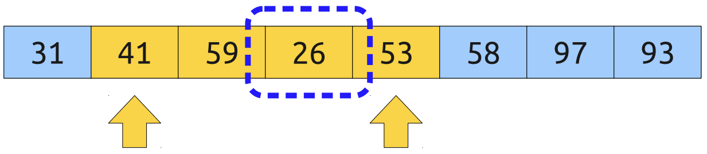

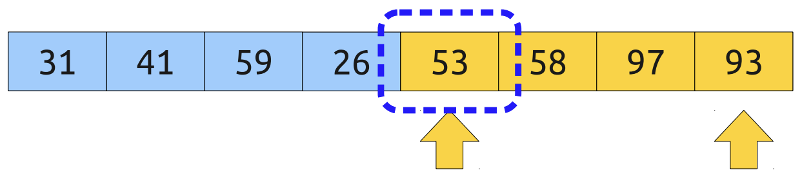

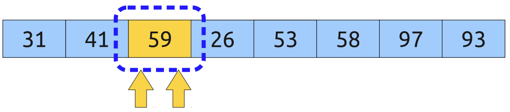

## 简单方案

有一个简单的 $O(n)$ 时间复杂度的解决方案：遍历 $i$ 到 $j$ 之间的元素（包括 $i$ 和 $j$），然后取最小值。

为什么对这个问题感兴趣：

- 假设数组 $A$ 是固定的，那么需要对其执行 $j-i+1=k$ 次查询
- 能否更快？

## 构建表格

对长度为 $n$ 的数组，只能 $Θ(n^2)$ 种可能的查询：

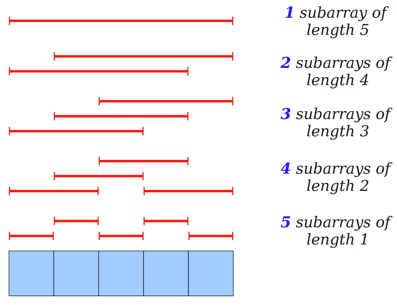

如果预先计算所有这些计算，就可以在 $O(1)$ 时间回答 RMQ 问题。

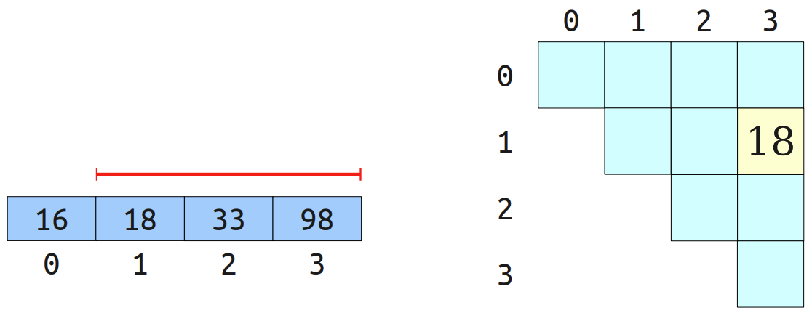

### 暴力法

一种简单的方法：对表中每个值，遍历相关范围并找到最小值。

效率：

- 表格元素项：$\Theta(n^2)$
- 计算每项的时间：$O(n)$
- 总时间：$O(n^2)$

运行总时间为 $O(n^3)$，经过计算也是 $\Theta(n^3)$。

这种计算表格的方式过于低效。

###  动态规划

使用动态规划能够降低构建表格的时间复杂度？

- 先计算单个元素范围的最小值

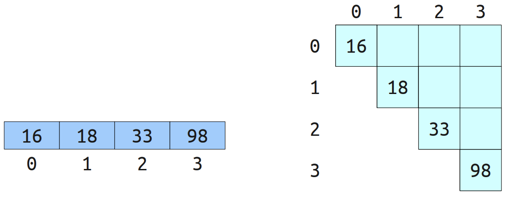

- 再计算两个元素范围的最小值

例如，[0,1] 范围的最小值，取 $A[0]$ 和 $A[1]$ 的较小值：

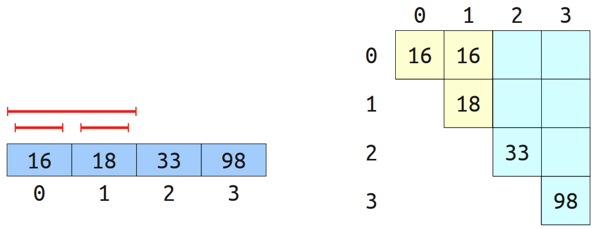

完成效果：

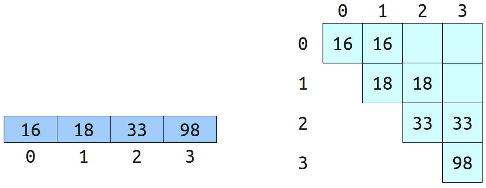

- 再计算三个元素范围的最小值

在 2 个元素范围的基础上计算，思路一样：

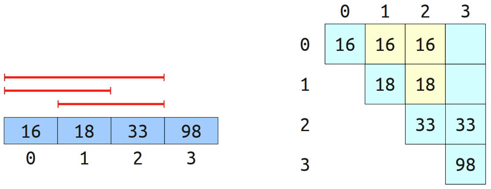

完成效果：

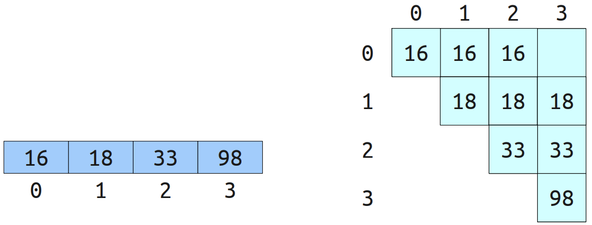

- 最后计算整个数组范围的最小值

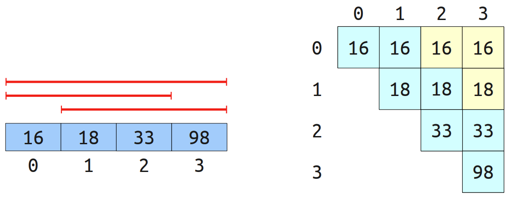

最终表格：

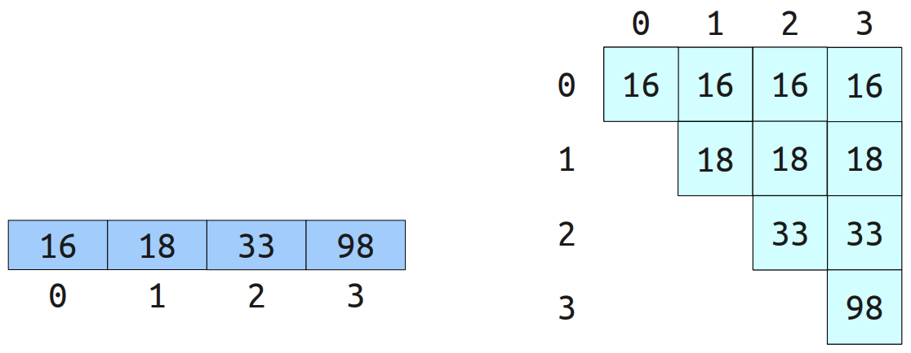

对 RMQ 数据结构，如果

- 预处理时间最多为 $p(n)$
- 查询时间最多为 $q(n)$

就称其时间复杂度为 $\lang p(n), q(n)\rang$。

目前已有两个数据结构：

- $\lang O(1),O(n)\rang$ 不预处理
- $\lang O(n^2),O(1)\rang$ 完全预处理

这是权衡曲线上的两个极端。问题是，这两个极端之间是否有一个黄金分割点？

### 块分解

令 block size 为 $b$，将输入拆分为 $O(n/b)$ 个 blocks。例如，令 $b=3$：

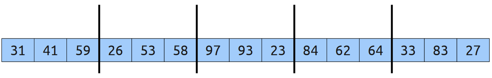

然后，计算每个 block 的最小值：

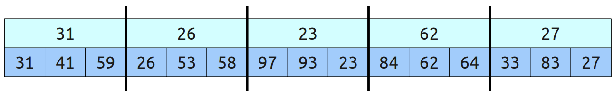

对每个范围，就可以快速查询：

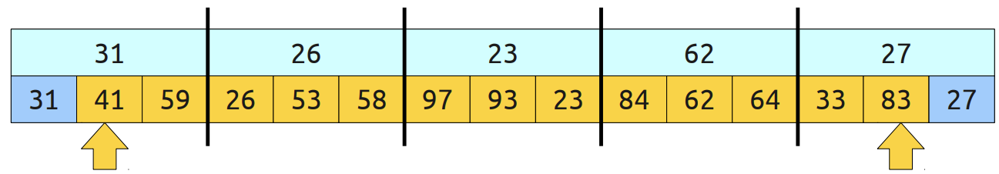

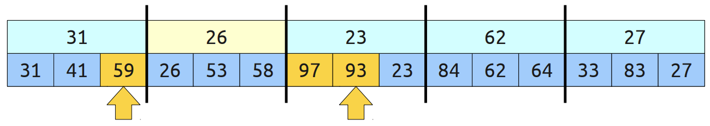

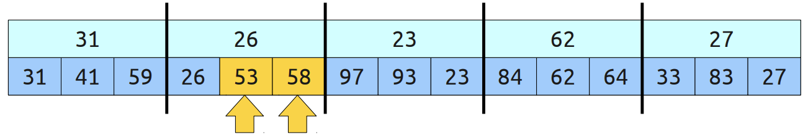

预处理时间：

- 对 $O(n/b)$ 个 blocks 查找最小值需要 $O(b)$ 次
- 总时间 $O(n)$

查询时间：

- $O(1)$：查找 block 索引
- 在 $i$ 和 $j$ blocks 内部扫描 $O(b)$
- 在 $i$ 和 $j$ 之间的 blocks 查找最小值 $O(n/b)$
- 总时间 $O(b+n/b)$

总时间受块的尺寸 $b$ 影响：

- b 增加：每个 block 的扫描时间增加，$n/b$ 降低
- b 减小：每个 block 的扫描时间减小，$n/b$ 增加

$b$ 的最佳值是多少？取微分：
$$
\frac{\partial (b+n/b)}{\partial b}=1-\frac{n}{b^2}
$$
令微分为 0，得到：
$$
b=\sqrt{n}
$$
此时，运行时间为：
$$
O(b+n/b)=O(n^{1/2}+n/n^{1/2})=O(n^{1/2})
$$
**总结：** 目前有三种方案

- 不处理：$\lang O(1),O(n)\rang$
- 完全预处理：$\lang O(n^2),O(1)\rang$
- 块分解：$\lang O(n),O(n^{1/2})\rang$

适度的预处理可以带来适度的性能提升。

## 稀疏表

$\lang O(1),O(n)\rang$ 方案查询最快，每个范围都预先计算过了。这个解决方案总体来说比较慢，因为必须计算每个可能范围的最小值。

问题：能够不预处理所有范围，依然得到 $O(1)$ 查询性能？

例如：

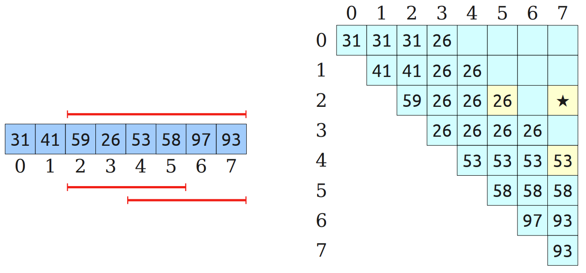

对长度为 6 的范围，不需要用两个长度为 5 的来计算最小值，用两个长度为 4 的子元素也可以。

全长拆分为两段：

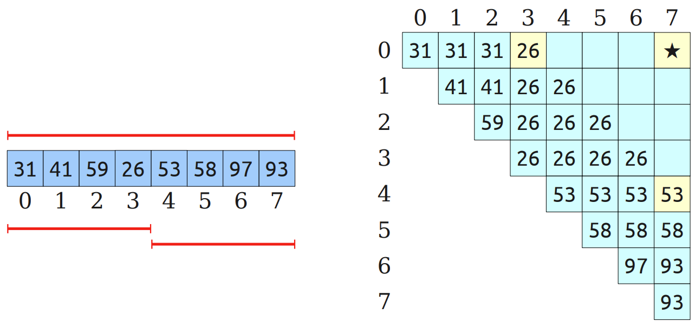

更复杂的情况：

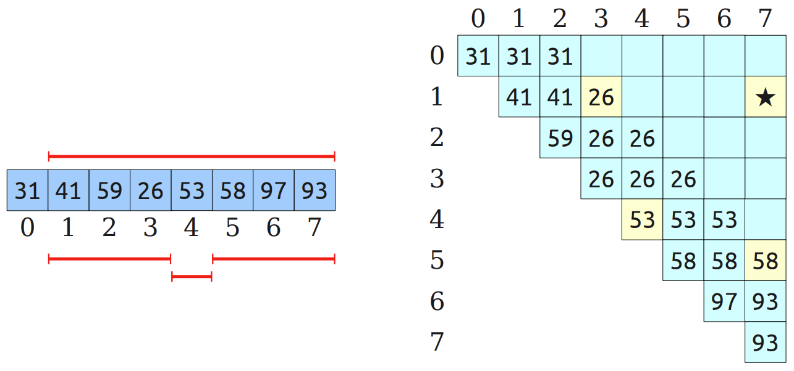

从这里可以看出：

- 不需要计算提前计算所有范围的 RMQ 也可以在 $O(1)$ 时间内得到然和 query

目标：计算部分 ranges 的 RMQ，以保证：

- 总体的有 $O(n^2)$ 个 ranges，但是
- 有足够的 ranges 以支持 $O(1)$ query

**方法**

对每个索引 $i$，计算从 $i$ 开始的大小为 $1,2,4,8,16,\cdots,2^k$ 范围的 RMQ：

- 对每个元素，只需要计算 $O(\log n)$ 个 ranges
- 总的 ranges 数为 $O(n\log n)$

数组中的任何 range，都可以使用上面两个 range 的组合得到。例如：长度 18 可以从两个长度为 16 的 ranges 得到：

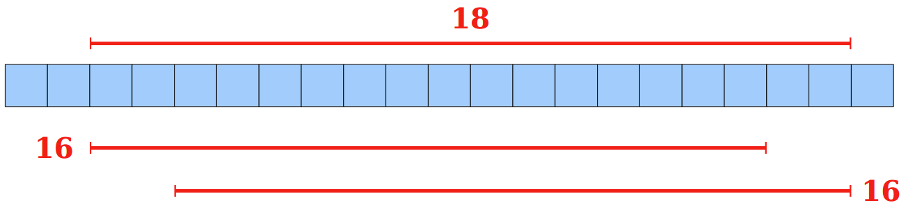

长度 7 的 range 可以从两个长度为 4 个 ranges 得到：

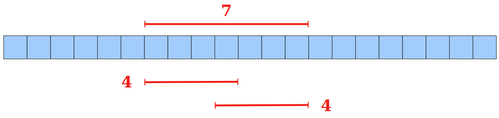

查询过程 $RMQ_A(i,j)$：

- 找到满足 $2^k\le j-i+1$ 的最大 k
- 范围 $[i,j]$ 可以由两个交叉的 ranges $[i,i+2^k-1]$ 和 $[j-2^k+1,j]$ 形成
- 每个 range 查找时间为 $O(1)$
- 总时间为 $O(1)$

预计算过程：

- 需要计算 $O(n\log n)$ 个 ranges
- 使用动态规划，可以在 $O(n\log n)$ 时间内计算完

首先，计算 $2^0=1$ 范围：

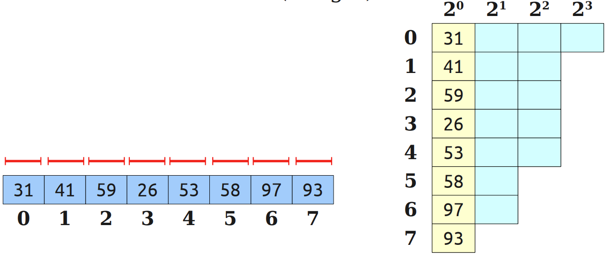

然后，计算 $2^1=2$ 范围：

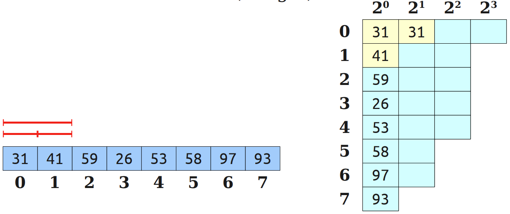

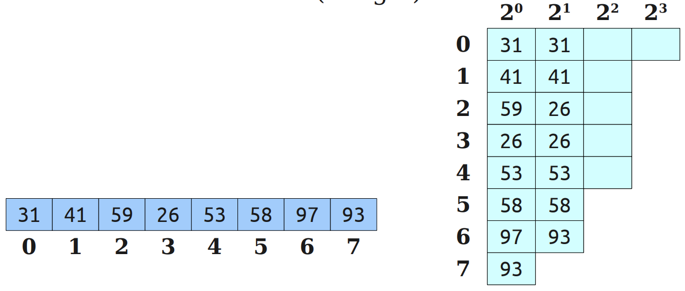

接着，计算 $2^2=4$ 范围：

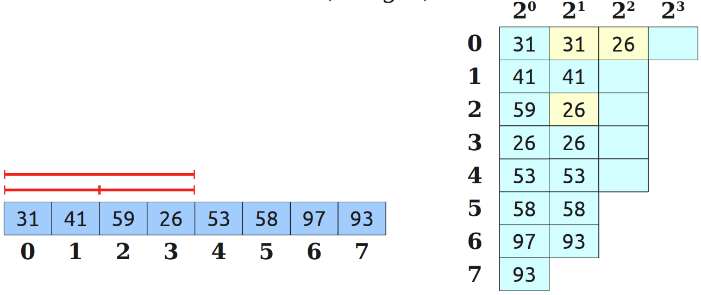

最终表格：

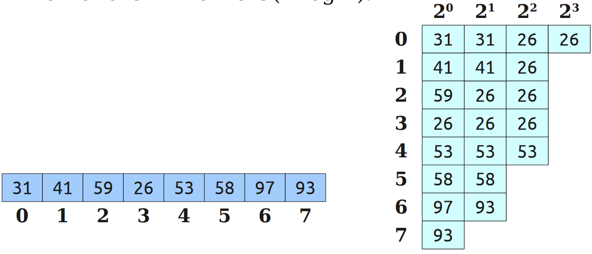

该表格称为稀疏表（sparse table），时间复杂度为 $\lang O(n\log n), O(1)\rang$，渐进优于预先计算所有范围的方案（暴力法）。

所以，目前有 4 种方案：

- 不处理：$\lang O(1),O(n)\rang$
- 完全预处理：$\lang O(n^2),O(1)\rang$
- 块分解：$\lang O(n),O(n^{1/2})\rang$
- 稀疏表：$\lang O(n\log n), O(1)\rang$

## 混合策略

在块分解中，有两种 RMQ：

1. 针对每个 block 最小值的 RMQ

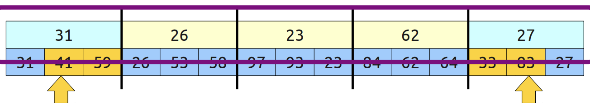

2. block 内部的 RMQ

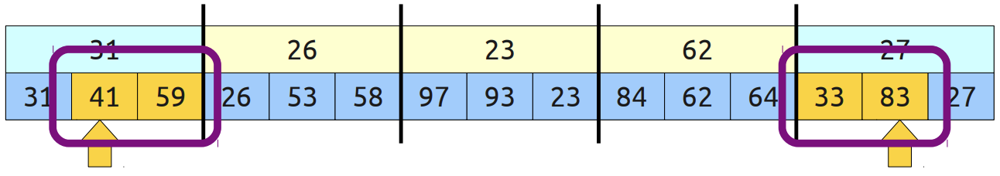

新的 RMQ 解决方案：

- 将输入拆分为大小为 $b$ 的 blocks
- 对每个 block，计算最小值
- 以最小 block-mins 构建 RMQ 结构
- 对每个 block 构建 RMQ 结构
- 合并 RMQ 答案解决整个 RMQ 问题。

该方案也称为 macro/micro decomposition，包含一个数据结构框架。需要选择：

- block size
- 那个 RMQ 结构放在上面
- 那个 RMQ 结构用于 blocks

summary 和 block RMQ 结构类型不需要相同。

如果选择 $\lang p_1(n), q_1(n)\rang$ 作为 block-mins  RMQ 解，$\lang p_2(n), q_2(n)\rang$ 作为每个 block 的 RMQ 解。

假设 block size 为 $b$，对这个混合结构，预处理时间为：
$$
O(n+p_1(n/b)+(n/b)p_2(b))
$$
查询时间为：
$$
O(q_1(n/b)+q_2(b))
$$

## Segment Tree

使用分治法，通过每个点将数组一分为二来加速计算 RMQ。

- 问题拆分

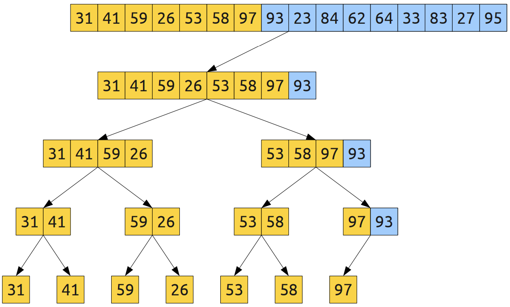

- 依次解答

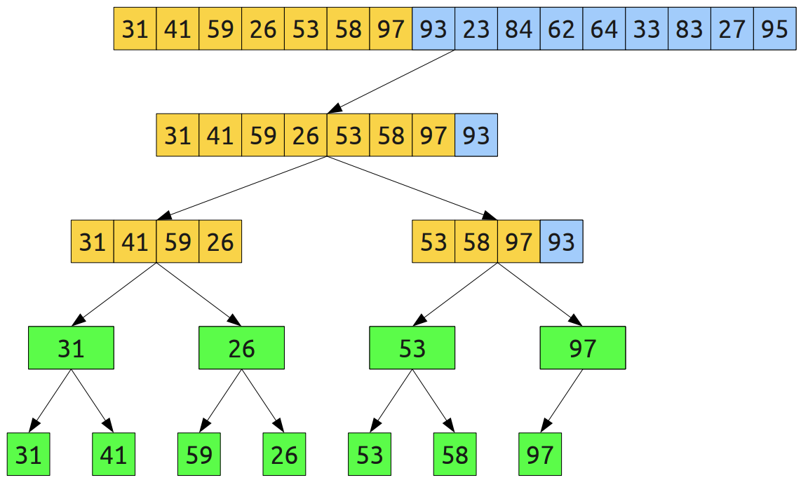

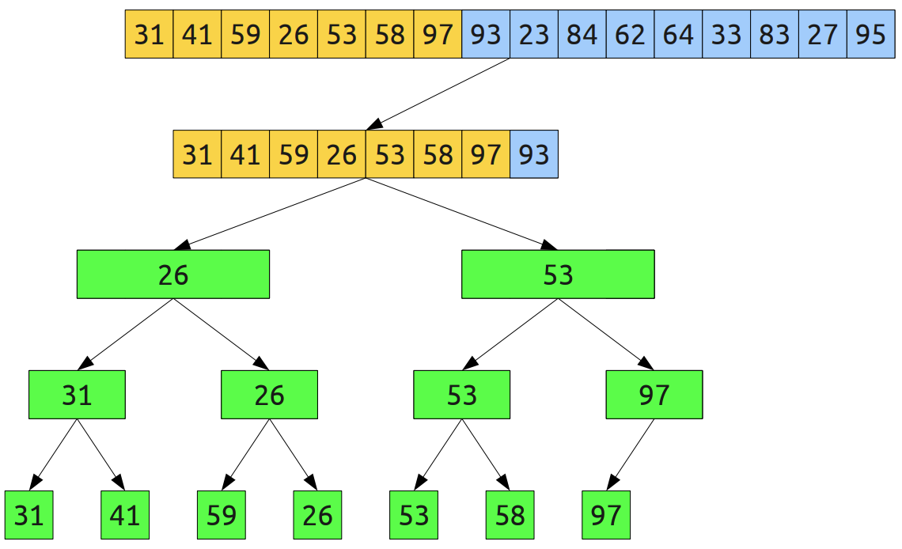

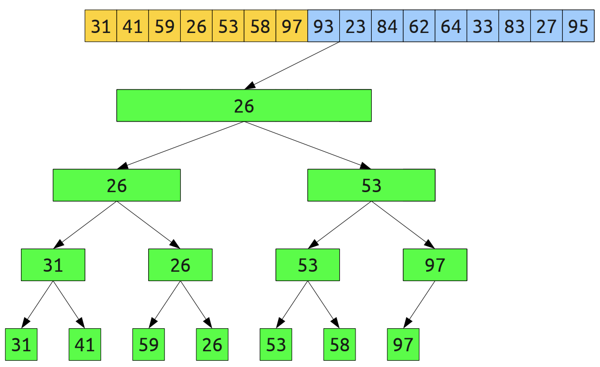

性能分析：

- 每次递归最多调用两次，合并性能为 $O(1)$，因此递归关系为

$$
T(n)=2T(n/2)+O(1)
$$

其解为 $O(n)$，并不是最初的方案好。

改进方法：对每个递归访问的子数组，计算器最小值并保存，称为 segment-tree。构建时间复杂度为 $O(n)$。

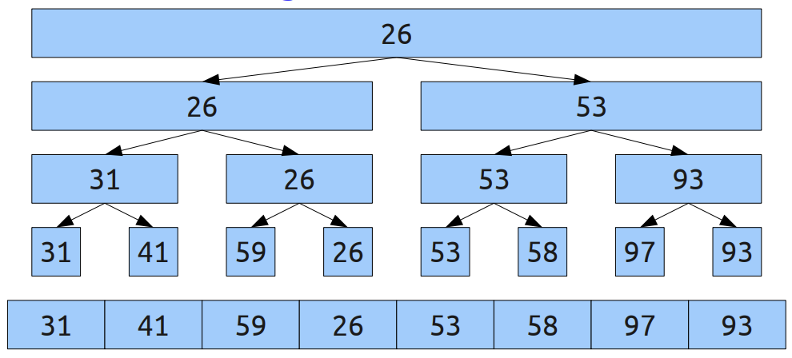

修改递归算法：

- 如果搜索的范围等于当前 node 的范围，则返回该范围的最小值
- 如果该 range 在前一半或后一半，递归到 subrange
- 否则，将 range 拆分，递归搜索两部分

例如：

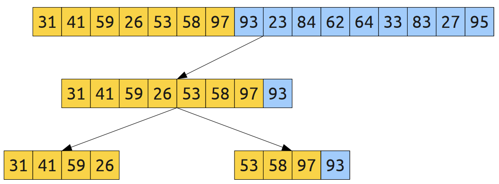

此时，左侧刚好有对应的 node，直接返回最小值：

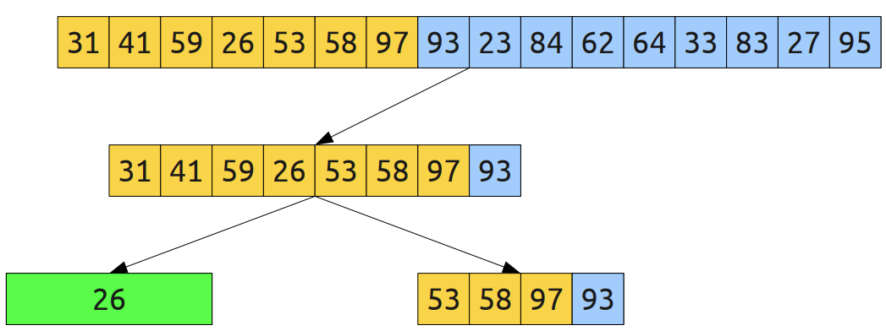

右侧继续拆分：

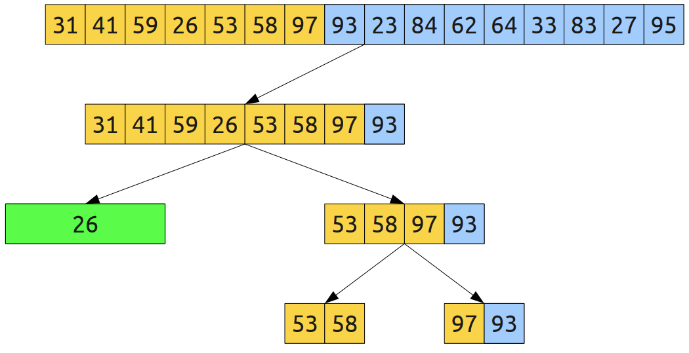

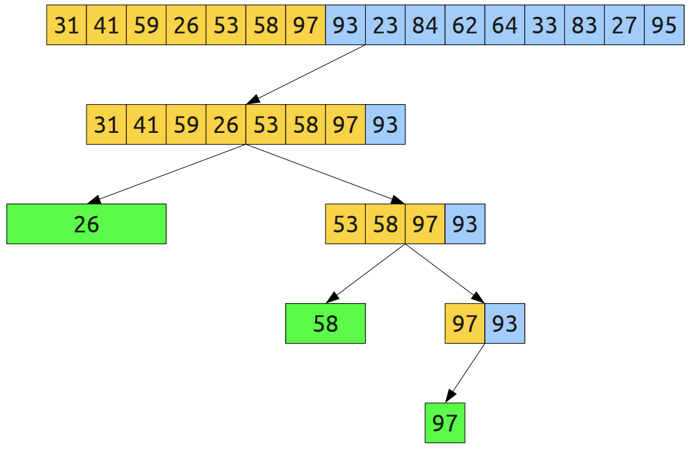

这个方法比之前的方法都快，查询只需要 $O(\log n)$。

预处理需要 $O(n)$。

## 参考

- https://web.stanford.edu/class/archive/cs/cs166/cs166.1146/