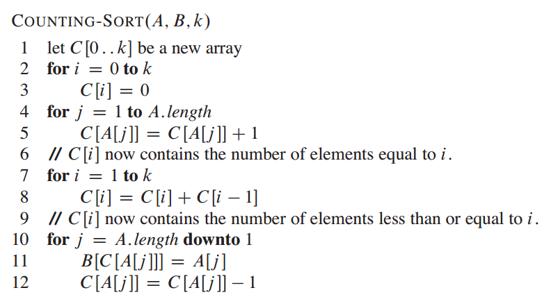

# 计数排序

- [计数排序](#计数排序)
  - [简介](#简介)
  - [实现](#实现)
    - [Java 实现](#java-实现)

2021-05-28, 09:30
@Jiawei Mao
***

## 简介

计数排序的核心在于将输入的数据值转换为键存储在额外开辟的数组中。作为一种线性时间复杂度的排序，计数排序要求输入的数据必须是确定范围的整数。

对待排序的数组 A，其中元素值的范围是 $[0, k]$。建立一个长度为 k 的数组 C，用来记录不大于每个值的元素的个数。

算法思路如下：

1. 扫描序列A，以A中的每个元素的值为索引，把出现的个数存入C。此时 `C[i]` 表示 A 中值为 `i` 的元素个数。
2. 对C从头开始累加，使 `C[i] = C[i] + C[i-1]`。这样 `C[i]` 表示 A 中值不大于 i 的元素的个数。
3. 按照统计出的值，输出结果。

由线性表 C 我们可以很方便地求出排序后的数据。

计数排序动画演示：


## 实现

伪代码：



### Java 实现

```java
public class CountingSor{
    private CountingSort() { }

    public static Integer[] sort(Integer[] unsorted){
        int maxValue = findMax(unsorted);
        int[] counts = new int[maxValue + 1];
        updateCounts(unsorted, counts);
        populateCounts(unsorted, counts);
        return unsorted;
    }

    private static int findMax(Integer[] unsorted){
        int max = Integer.MIN_VALUE;
        for (int i : unsorted) {
            if (i > max)
                max = i;
        }
        return max;
    }

    private static void updateCounts(Integer[] unsorted, int[] counts){
        for (int e : unsorted)
            counts[e]++;
    }

    private static void populateCounts(Integer[] unsorted, int[] counts){
        int index = 0;
        for (int i = 0; i < counts.length; i++) {
            int e = counts[i];
            while (e > 0) {
                unsorted[index++] = i;
                e--;
            }
        }
    }
}
```
