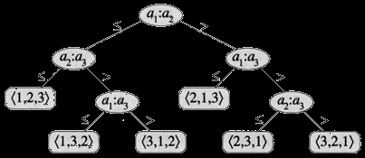
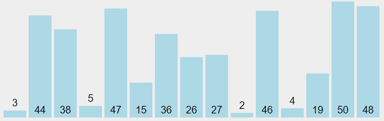

# 排序算法

- [排序算法](#排序算法)
  - [基本概念](#基本概念)
  - [常见排序算法](#常见排序算法)
  - [比较排序](#比较排序)
  - [决策树模型](#决策树模型)
  - [线性时间排序](#线性时间排序)
  - [排序算法实现](#排序算法实现)
  - [选择排序（Selection sort）](#选择排序selection-sort)
    - [Java 实现](#java-实现)
  - [插入排序（Insert Sort）](#插入排序insert-sort)
    - [Java 实现](#java-实现-1)
  - [参考资料](#参考资料)

2021-05-28, 09:24
@Jiawei Mao
***

## 基本概念

排序是按照某种规则对一系列对象进行重新排列的过程。

排序算法可以分为**内部排序**和**外部排序**：

- 内部排序是数据记录在内存中进行排序。
- 外部排序，用于文件排序，或者排序的数据很大，一次不能容纳全部的排序记录，在排序过程中需要访问外存。

根据内存需求，排序可以分为原位排序（in place）和非原位排序（out place）：

- 原位排序不需要额外的内存，在原数组上进行操作。
- 非原位排序（out place），占用额外内存。

**稳定性**：如果排序算法保留等值元素的相对位置，则称该算法是稳定的。大多数简单的算法是稳定的。

常见的内部排序算法有：插入排序、希尔排序、选择排序、冒泡排序、归并排序、快速排序、堆排序、基数排序等。

## 常见排序算法

|排序算法|平均时间复杂度|最好情况|最坏情况|空间复杂度|排序方式|稳定|
|---|---|---|----|---|---|---|
|[冒泡排序](bubble_sort.md)|$O(N^2)$|$O(N)$|$O(N^2)$|1|in place|Yes|
|[选择排序]())|$O(N^2)$|$O(N^2)$|$O(N^2)$|1|in place|No|
|[插入排序](#%E6%8F%92%E5%85%A5%E6%8E%92%E5%BA%8Finsert-sort)|$O(N^2)$|$O(N)$|$O(N^2)$|1|in place|Yes|
|[希尔排序](shell_sort.md)|$O(N log N)$|$O(N log^2 N)$|$O(Nlog^2 N)$|1|in place|No|
|[归并排序](merge_sort.md)|$O(N log N)$|$O(N log N)$|$O(N log N)$|N|out place|Yes|
|快速排序|$O(N log N)$|$O(N log N)$|$O(N^2)$|$clg N$|in place|No|
|堆排序|$O(N log N)$|$O(N log N)$|$O(N log N)$|1|in place|No|
|[计数排序](counting_sort.md)|$O(N+k)$|$O(N+k)$|$O(N+k)$|$k$|out place|Yes|
|[桶排序](bucket_sort.md)|$O(N+k)$|$O(N+k)$|$O(N^2)$|$N+k$|out place|Yes|
|[基数排序](radix_sort.md)|$O(N\times k)$|$O(N\times k)$|$O(N\times k)$|$N+k$|out place|Yes|

> 说明：
> - k，桶的个数
> - N，数据规模

时间复杂度
- 平方阶 ($O(N^2)$) 排序，各类简单排序大致性能对比：希尔排序 > 插入排序 > 选择排序 > 冒泡排序。
- 线性对数阶 ($O(NlogN)$) 排序：快速排序 > 归并排序 > 堆排序。
- O(n1+§)) 排序，§ 是介于 0 和 1 之间的常数。：希尔排序
- 线性阶 ($O(n)$) 排序：计数排序、基数排序，此外还有桶、箱排序。

稳定性
- 稳定的排序算法：冒泡排序、插入排序、归并排序和基数排序。
- 不是稳定的排序算法：选择排序、快速排序、希尔排序、堆排序。

## 比较排序

排序算法根据元素的比较运算符对给定数组或列表的元素重新排列。

在排序的结果中，各元素的次序依赖于它们之间的比较，这类排序算法称为**比较排序**。任何比较排序在最坏情况下都要经过 $\varOmega(nlgn)$ 次比较。因此归并排序和堆排序是渐近最优的，并且任何已知的比较排序最多就是在常数因子上优于它们。

插入排序、选择排序、归并排序、快速排序、堆排序和树排序都是对比排序。

## 决策树模型

比较排序在执行排序时，每次对比两个元素，根据大小关系决定下一步操作，构成一个操作决策树。例如对元素 $a_1$, $a_2$和 $a_3$ 执行插入排序：



共有 $3!=6$ 种结果，对应 6 个叶节点。对包含 N 个元素的组合，有 $N!$ 种排列组合形式，决策树就有 $N!$ 个页节点。

从决策树的根结点到叶结点的最远距离，对应最坏情况需要的对比次数，即最坏情况需要的对比次数等于树的高度。这是基于对比的排序算法的最坏情况的运行时间下界。

## 线性时间排序

线性时间复杂度的排序算法有**计数排序**、**基数排序**和**桶排序**。这些算法是通过运算而不是比较来确定排序顺序，因此比较排序算法的下界 $\varOmega(nlgn)$ 对它们不适用，在一定条件下它们的时间复杂度可以达到 $O(n)$，即线性时间复杂度。

## 排序算法实现

Java 接口：

```java
public interface Sort{
    /**
     * method for sorting array
     *
     * @param unsorted an array to be sorted.
     * @return sorted array
     */
    <T extends Comparable<T>> T[] sort(T[] unsorted);

    /**
     * swap places in array
     *
     * @param array The array which elements to be swap
     * @param i     index of the first element
     * @param j     index of the second element
     */
    static <T> boolean swap(T[] array, int i, int j){
        T swap = array[i];
        array[i] = array[j];
        array[j] = swap;
        return true;
    }

    /**
     * This method checks if first element is less then the other element
     *
     * @param v first element
     * @param w second element
     * @return true if the first element is less then the second element
     */
    static <T extends Comparable<T>> boolean less(T v, T w){
        return v.compareTo(w) < 0;
    }

    /**
     * Swaps all position from {@param left} to @{@param right} for {@param array}
     *
     * @param array is an array
     * @param left  is a left flip border of the array
     * @param right is a right flip border of the array
     */
    static <T extends Comparable<T>> void flip(T[] array, int left, int right){
        while (left <= right) {
            swap(array, left++, right--);
        }
    }

    /**
     * Test whether the array are in order.
     */
    static <T extends Comparable<T>> boolean isSorted(T[] a){
        for (int i = 1; i < a.length; i++) {
            if (less(a[i], a[i - 1])) return false;
        }
        return true;
    }

    /**
     * print the array on a single line.
     */
    static void show(Comparable[] a){
        for (Comparable comparable : a) System.out.print(comparable + " ");
        System.out.println();
    }
}
```

## 选择排序（Selection sort）

最简单的排序算法之一，流程如下：

1. 找到数组中值最小的元素
2. 将值最小的元素和第一个元素交换位置
3. 找到数组中值第二小的元素
4. 将值第二小的元素和第二个元素交换位置
5. 重复以上步骤

反复选择数组中余下元素的最小值，这也是选择排序名称的由来。

选择排序的动画演示：



总结：

- 选择排序需要大约 $N^2/2$次对比和N次交换操作。
- 运行时间对输入不敏感，即不管输入是否已排序，都需要相对固定的操作步骤。
- 数据移动操作较少，最多N次交换操作，这是其它排序算法没有的性质。

### Java 实现

```java
public class SelectionSort implements Sort{
    @Override
    public <T extends Comparable<T>> T[] sort(T[] unsorted){
        int N = unsorted.length;
        for (int i = 0; i < N; i++) {
            int min = i;
            for (int j = i + 1; j < N; j++) {
                if (Sort.less(unsorted[j], unsorted[min])) min = j;
            }
            Sort.swap(unsorted, i, min);
        }
        return unsorted;
    }
}
```

## 插入排序（Insert Sort）

插入排序是一种简单的排序算法，和玩扑克牌一样。最简单的算法之一，算法流程：

1. 索引从 `1` 开始，和该索引前面所有的元素对比
2. 如果该元素大于对比的元素，交换位置

该算法保证当前索引前面的元素都是排序好的。不像选择排序，插入排序运行时间依赖于数组的原始顺序，对已经排序好的数组，插入排序的速度要快许多。

- 对长度为 N 的随机排序的数组，插入排序需要 ~$N^2/4$ 次对比和 ~$N^2/4$ 次交换，平均情况。
- 最坏情况需要 ~$N^2/2$ 次对比和 ~$N^2/2$ 次交换
- 最好情况需要 $N-1$ 次对比和 0 次交换

使用：待排序的元素不多时使用，当数组里只有少量元素未排序，使用插入排序也很合适。对包含大量元素的数组，其性能低于更高级的算法，如 quicksort, heapsort 以及 merge sort。

插入排序动画演示：


### Java 实现

```java
public class InsertSort implements Sort{
    @Override public <T extends Comparable<T>> T[] sort(T[] unsorted){
        int N = unsorted.length;
        for (int i = 1; i < N; i++) {
            for (int j = i; j > 0 && Sort.less(unsorted[j], unsorted[j - 1]); j--) {
                Sort.swap(unsorted, j, j - 1);
            }
        }
        return unsorted;
    }
}
```

## 参考资料

- https://en.wikipedia.org/wiki/Sorting_algorithm
- https://en.wikipedia.org/wiki/Comparison_sort
- https://en.wikipedia.org/wiki/Insertion_sort
- https://www.geeksforgeeks.org/sorting-algorithms/
- https://github.com/hustcc/JS-Sorting-Algorithm
- https://www.cnblogs.com/chengxiao/p/6104371.html
