# Entropy & Coding

2025-04-14 ⭐
@author Jiawei Mao
***

## worst-case entropy

以扑克牌为例：

- suit：花色编号，设为 $\{♠:0,♥:1,♦:2,♣:3\}$
- rank: 不同牌的编号，设为 $\{A:0, 2:1,3:2,\cdots,K:12\}$

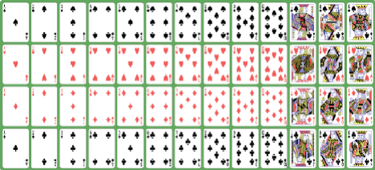

使用 suit 和 rank，就可以给所有扑克牌编号，例如：
$$
code=suite\times 13+rank
$$
示例：

| Card | Integer code | Binary code |
| ---- | ------------ | ----------- |
| A♠   | 0            | 0           |
| 2♠   | 1            | 1           |
| 3♠   | 2            | 10          |
| 4♠   | 3            | 11          |
| 10♣  | 48           | 110000      |
| J♣   | 49           | 110001      |
| Q♣   | 50           | 110010      |
| K♣   | 51           | 110011      |

编码 $U$ 元素所需的 bits 数为：
$$
H_{wc}(U)=\log_2|U|
$$
该值又称为集合的 **worst-case entropy**。

- 如果要求所有 codes 长度相同，那么长度必须 $\ge \log_2(|U|)$，最佳选择为 $⌈\log_2(|U|)⌉$
- 如果 codes 长度可以不同，那么最长 code $\ge \log_2(|U|)$

如果 $|U|=2^n$，那么 $H_{wc}(U)=n$。

如果 $U=$ 来自 $\sum=\{1,\cdots,\sigma\}$ 长度为 $n$ 的字符串，那么
$$
H_{wc}(U)=\log_2\sigma^n=n\log_2\sigma
$$
如果 code 长度可变，那么对高频事件可以采用更短的 code。以最小化平均编码长度 $\overline{l}$：
$$
\overline{l}=\sum_{u\in U}Pr(u)\cdot l(u)
$$
其中，$l(u)$ 为 $u$ 的编码长度，$Pr(u)$ 为 $u$ 出现的概率。以摩斯码为例：

## Shannon entropy

对离散随机变量 $X$ 及其样本空间 Ω、概率函数 $Pr$：
$$
\begin{aligned}
    H(X)&=\sum_{s\in Ω}Pr(s)\cdot\log_2\frac{1}{Pr(s)}\\
    &=-\sum_{s\in Ω}Pr(s)\cdot\log_2Pr(s)
\end{aligned}
$$

$H(X)$ 称为 Shannon entropy。

例如，对抛硬币：$X=\{\text{Head}:0.5, \text{Tail}:0.5\}$：
$$
\begin{aligned}
    H(x)&=0.5\cdot\log_2\frac{1}{0.5}+0.5\cdot\log_2\frac{1}{0.5}\\
    &=0.5+0.5\\
    &=1
\end{aligned}
$$

如果修改概率值：$X=\{\text{Head}:0.9, \text{Tail}:0.1\}$
$$
\begin{aligned}
    H(x)&=0.9\cdot\log_2\frac{1}{0.9}+0.1\cdot\log_2\frac{1}{0.1}\\
    &=0.9\cdot 0.15+0.1\cdot 3.32\\
    &=0.47
\end{aligned}
$$

> [!TIP]
>
> 对概率大的事件用更短的 code 编码，使得平均编码长度降低。
>

$H(X)$ 相对概率 $p$ 的分布：

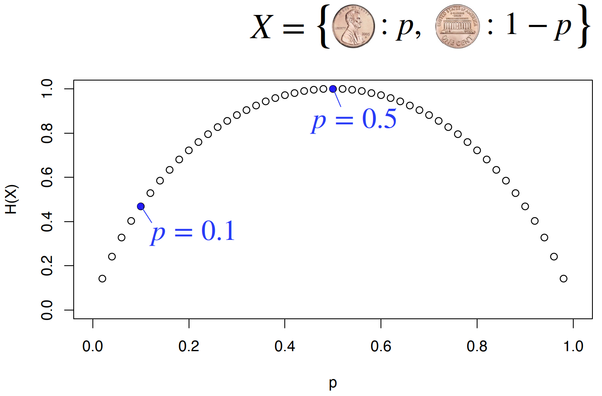

对一个均匀的骰子，每个点数的概率为 $1/6$：
$$
\begin{aligned}
H(X)&=\sum_{i=1}^6\frac{1}{6}\log_26\\
&=\log_26=2.58    
\end{aligned}
$$

如果骰子不均匀，例如：

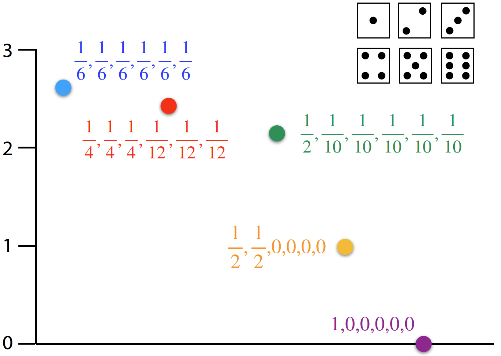

显然，概率分布越均匀，$H(X)$ 越大。

当所有概率值相等：
$$
\begin{aligned}
H(X)&=\sum_{s\in Ω_X}Pr(s)\cdot \log_2\frac{1}{Pr(s)}\\
&=\sum_{s\in Ω_X}\frac{1}{|Ω_X|}\cdot\log_2|Ω_X|\\
&=\log_2|Ω_X|
\end{aligned}
$$

与 worst-case entropy 的定义对应。

总结：

- Shannon entropy $H(X)$ 为随机变量的函数
- 随机变量模拟数据源，如人说的话、DNA 字符串的字符等
- 假设数据源为无记忆的，即独立同分布 (i.i.d) 抽样
- worst-case entropy $H_{wc}(U)$ 为集合的函数
- shannon entropy $H(X)$ 为随机变量的函数
- 当随机变量所有可能值的概率相等，$H(X)=H_{wc}(Ω_X)$

## Empirical zero order entropy

当没有合适的模型，但有样本数据 B（binary 序列，全部为 0 或 1），则可以根据样本计数来定义熵：

- $m$ 为 B 中 1 的个数
- $n=|B|$
- Bern 指伯努利分布

$$
\begin{aligned}
    H_0(B)&=H(X\textasciitilde \text{Bern}(\frac{m}{n}))\\
    &=\frac{m}{n}\log_2\frac{n}{m}+\frac{n-m}{n}\log_2\frac{n}{n-m}
\end{aligned}
$$

$H_0$ 称为**零级经验熵（empirical zero order entropy)**。

总结：序列 B 的零级经验熵 $H_0(B)$ 为 B 的 memoryless Shannon 熵。

## 编码

一个好的编码应该满足：

- 最小化平均编码长度
- 为编码和解码提供**明确的映射**
- 支持高效编码和解码

Shannon 熵的定义：
$$
H(X)=\sum_{s\in Ω}Pr(s)\cdot\log_2\frac{1}{Pr(s)}
$$
$\log_2\frac{1}{Pr(s)}$ 部分起始等效于编码长度。

假设 $\sum=\{a,c,g,t\}$，数据源为 memoryless，由随机变量模拟：
$$
X=\{a:\frac{1}{2},c:\frac{1}{4},g:\frac{1}{8},t:\frac{1}{8}\}
$$
函数 $C$ 从符号映射到 binary-code 序列。

什么样的函数 C 比较合适

**函数一**：变长编码

- `a` 概率最高，采用最短的编码

$$
\begin{aligned}
C(a)&=0\\
C(c)&=10\\
C(g)&=110\\
C(t)&=111
\end{aligned}
$$

编码示例：

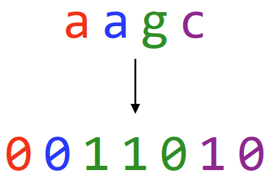

解码示例：

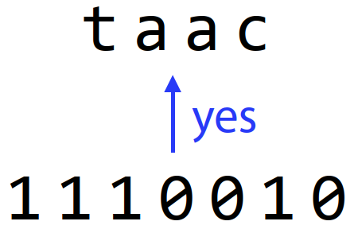

**函数二**
$$
\begin{aligned}
C(a)&=0\\
C(c)&=1\\
C(g)&=01\\
C(t)&=10
\end{aligned}
$$
编码示例：

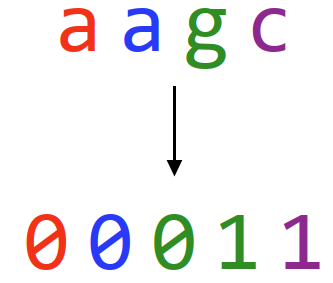

解码：无法得到唯一解码

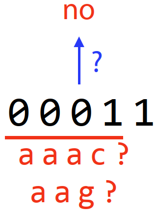

令 $C'$ 为序列的编码：C 和 C' 都必须得到唯一编码

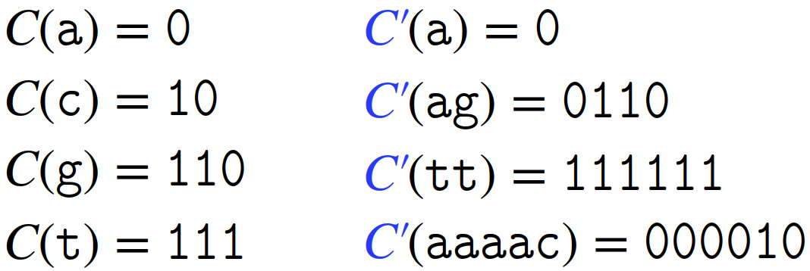

**prefix-free**：不存在一个 code 是另一个 code 前缀，这种编码更容易解码。

## Huffman

字符串：$abracadabra$

获得所有字符的频率：$\{a:5,b:2,c:1,d:1,r:2\}$

每次合并 total-weight 最小的两个 subtrees，得到一个完整 tree，称为 Huffman-tree：

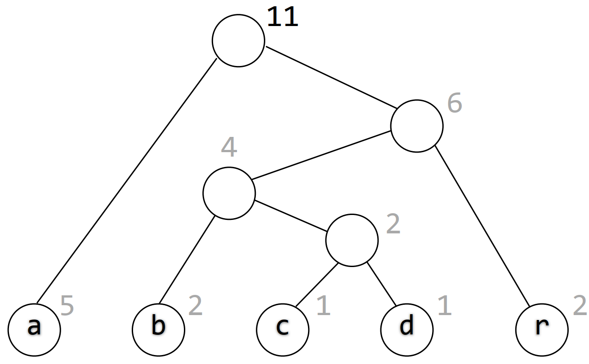

如何从 Huffman-tree 得到想要的编码：

- 将所有 left-edge 标为 0，right-edge 标为 1

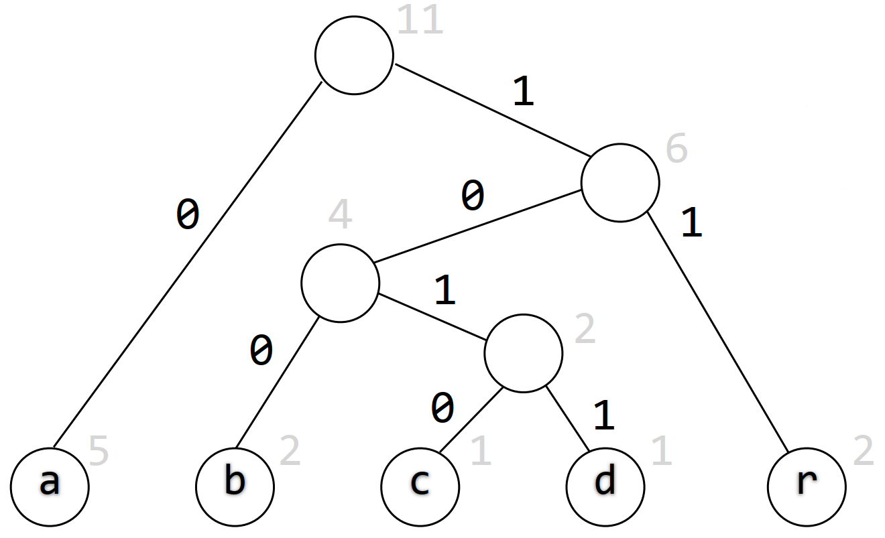

- 编码就是 root-to-leaf 的路径

$$
\begin{aligned}
C(a)&=0\\
C(b)&=100\\
C(c)&=1010\\
C(d)&=1011\\
C(r)&=11
\end{aligned}
$$

Huffman 编码可以保证任意编码不是另一个编码的前缀。

Huffman 编码的每个 code 最多比最佳 code 多 1 bit。换言之，对输入字符串 $S$:
$$
|C'(S)|\le |S|(H_0(S)+1)
$$

## High order entropy

当上下文存在关系，即不是 i.i.d 抽样，零级经验熵就不够用了。例如，下表是包含 4,0000 个单词的 bigram 频率。

| th   | 1.52 | en   | 0.55 | ng   | 0.18 |
| ---- | ---- | ---- | ---- | ---- | ---- |
| he   | 1.28 | ed   | 0.53 | of   | 0.16 |
| in   | 0.94 | to   | 0.52 | al   | 0.09 |
| er   | 0.94 | it   | 0.5  | de   | 0.09 |
| an   | 0.82 | ou   | 0.5  | se   | 0.08 |
| re   | 0.68 | ea   | 0.47 | le   | 0.08 |
| nd   | 0.63 | hi   | 0.46 | sa   | 0.06 |
| at   | 0.59 | is   | 0.46 | si   | 0.05 |
| on   | 0.57 | or   | 0.43 | ar   | 0.04 |
| nt   | 0.56 | ti   | 0.34 | ve   | 0.04 |
| ha   | 0.56 | as   | 0.33 | ra   | 0.04 |
| es   | 0.56 | te   | 0.27 | ld   | 0.02 |
| st   | 0.55 | et   | 0.19 | ur   | 0.02 |

此时 context 很重要，i.i.d 假设不成立。考虑 context，能得到更好的编码，从而更好地压缩数据。

根据 context 不同，采用不同 code，即 $C$ 根据周围符号的不同而改变。

下面将 $a$ 标为红色，将其 right-context 标为蓝色：

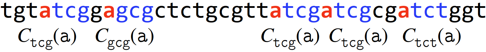

对包含 $k$ 个字母的 context，定义其 code 为 $C_i\in \{C_{\sum^k}\}$

也可以根据 left-context 进行定义：

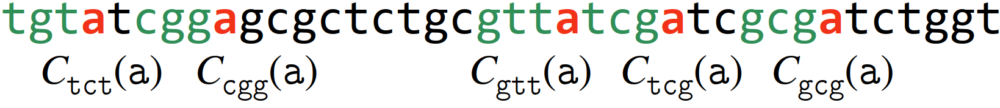

那么，如何根据 context 定义 code？

和之前 Huffman 中定义方式相同，只是单词字符的频率，替换为 context 的频率。

例如，以 left-context 定义，$C_{gca}$ 根据在 gca 后出现的次数来定义。

以如下字符串为例：

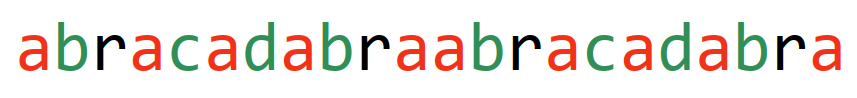

现在定义以 left-context 为 "a" 的 codes。

令 $S_a$ 为 a 后面字符连接起来的字符串，为：
$$
S_a=bcdbabcdb
$$
根据 $S_a$ 中字符频率构建 $C_a$：
$$
\{a:1,b:4,c:2,d:2,r:0\}
$$

> [!NOTE]
>
> $r$ 频率为 0，因此没有 code。

构建 Huffman tree：

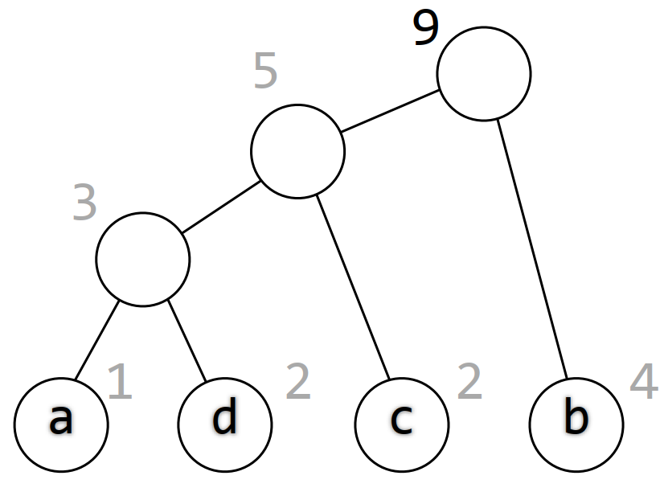

为 edges 分配值：

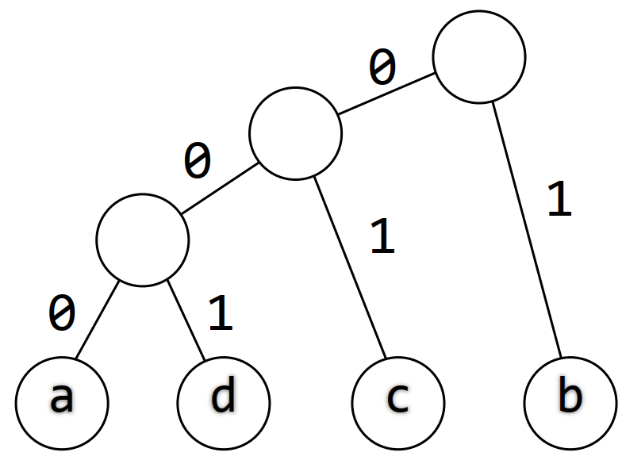

得到编码：
$$
\begin{aligned}
C_a(a)&=000\\
C_a(d)&=001\\
C_a(c)&=01\\
C_a(b)&=1
\end{aligned}
$$

下标 $a$ 表示 left-context 为 $a$。

**示例二**：

字符串为：
$$
mississippimississippi
$$
$S_i=sspmssp$ (以 $i$ 为 left-context 的字符)。

频率：
$$
\{s:4,p:2,m:1\}
$$
很容易得到：
$$
\begin{aligned}
C_i(p)&=00\\
C_i(m)&=01\\
C_i(s)&=1\\
\end{aligned}
$$

- $S_m=ii$, $\{i:2\}$，没有编码
- $S_p=pipi$，$\{p:2,i:2\}$，得到 $C_p(p)=0$, $C_p(i)=1$
- $S_s=sisisisi$, $\{s:4,i:4\}$，得到 $C_s(s)=0$, $C_s(i)=1$

总结一下，对字符串：
$$
mississippimississippi
$$
其 left-context code 如下：

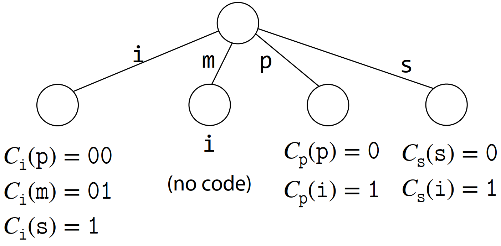

**定义**：长度为 n 的字符串 $S$ 的高阶熵 $H_k$ 为所有 contexts 下零级经验熵的加权和：
$$
H_k(S)=\sum_{t\in \sum^k}\frac{|S_t|}{n}\cdot H_0(S_t)
$$

$S_t$ 为具有 context $t$ 的所有字符的连接。

根据高阶熵定义，字符串最多可以被压缩到 $\le n(H_k(S)+1)$ bits。

不过，在不同 codes 之间切换，显然会降低性能。

$k$ 越大（context 长度），可能的 context 越多，存储和切换消耗越大，但压缩性能更好。

## 参考

- https://www.langmead-lab.org/teaching.html#burrows-wheeler-indexing