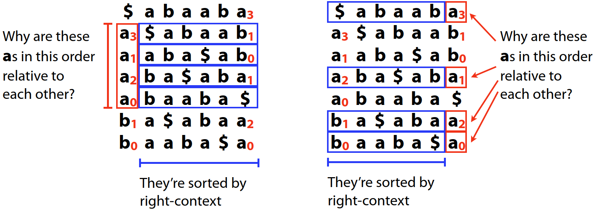

# BWT 和 FM Index

2025-04-08⭐
@author Jiawei Mao

***

## BWT

BWT（Burrows-Wheeler Transform）是一种将字符串 $T$ 转换为另一个字符串 $BWT(T)$ 的方法。这种转换是可逆的。BWT 最初由 David Wheeler 于 1983 年发现，并由 Michael Burrows 和 David Wheeler 于 1994 年出版。

BWT 有两个主要应用：压缩和索引。

下面介绍从 $T$ 到 $BWT(T)$ 的转换。

### 通过 BWM 实现 BWT

设 $T$ 为要转换的字符串，$m=|T|$ 为字符串 $T$ 的长度。令 $T$ 以特殊终止符结尾，该字符不在 $T$ 中出现，且字典排序优于其它字符，记为 `$`。例如，对 DNA 字符串，带 `$` 的字符顺序为 $<A<C<G<T。

取 $T=abaaba\$$。首先，写下 $T$ 的**旋转**，即反复从开头取一个字符放到末尾：

```
$ a b a a b a
a $ a b a a b
b a $ a b a a
a b a $ a b a
a a b a $ a b
b a a b a $ a
a b a a b a $
```

得到一个 $m\times m$ 矩阵。然后按字母顺序排序：

```
$ a b a a b a
a $ a b a a b
a a b a $ a b
a b a $ a b a
a b a a b a $
b a $ a b a a
b a a b a $ a
```

这就是 Burrows-Wheeler Matrix (BWM(T))，BWM 的每一行以及每一列，都是 $T$ 的一个重排。$BWM(T)$ 的最后一列，从上到下，就是 $BWT(T)$。

因此，对 $T=abaaba\$$，其 $BWT(T)=abba\$aa$。如下图所示：


如果将 BWT(T) 单独拿出来：


$BWT(T)$ 就是 $T$ 中字符按右侧字符串（right-context）排序后的字符顺序。

### 通过 suffix array 实现 BWT

BWM 看上去与后缀数组类似：将 $T$ 的后缀排序得到后缀数组 $SA(T)$；而将 $T$ 的旋转排序得到 $BWM(T)$。如下所示：


可以发现，它们的顺序完全相同。这很好理解：注意 `$` 的位置，序列的排序取决于 `$` 及其之前的字符，完全不受 `$` 后面的字符影响。所以到 `$` BWM 与后缀数组的字符完全相同。所以，后缀数组 $SA(T)$ 提供了另一种构建 $BWT(T)$ 的方式。

令 $BWT[i]$ 为 $BWT(T)$ 中第 $i$  个字符（0-based），$SA[i]$ 为 $SA(T)$ 的第 $i$ 个后缀（0-based），则有：

$$
BWT[i]=\begin{cases}
    T[SA[i]-1] \quad&\text{if } SA[i]>0\\
    \$\quad&\text{if } SA[i]=0
\end{cases}
$$
即取后缀在 $T$ 的前一个字符。构建 $BWT(T)$ 的 python 代码：

```python
def suffixArray(s):
    """ Given T return suffix array SA(T). We use Python’s sorted
    function here for simplicity, but we can do better. """
    # Empty suffix ’’ plays role of $.
    satups = sorted([(s[i:], i) for i in xrange(0, len(s)+1)])
    # Extract and return just the offsets
    return map(lambda x: x[1], satups)

def bwt(t):
    """ Given T, returns BWT(T), by way of the suffix array. """
    bw = []
    for si in suffixArray(t):
        if si == 0:
        	bw.append(’$’)
        else:
        	bw.append(t[si-1])
    return ’’.join(bw) # return string-ized version of list bw
```

### BWT 用于压缩

BWT 如何用于压缩？

- 首先，BWT 是可逆的：压缩使用的变换必须是可逆的，以便压缩后能够解压缩。
- 其次，BWT 使 $T$ 中具有类似 right-context 的字符聚集在一起。例如

```
>>> bwt("Tomorrow_and_tomorrow_and_tomorrow")
"w$wwdd__nnoooaattTmmmrrrrrrooo__ooo"
```

```
>>> bwt("It_was_the_best_of_times_it_was_the_worst_of_times$")
s$esttssfftteww_hhmmbootttt_ii__woeeaaressIi_______
```

这使得 $BWT(T)$ 更容易压缩。例如，可以采用 $BWT(T)$ 和游程编码（run-length encoding, RLE）进行可逆压缩。压缩软件采用多种方法来缩小 $BWT(T)$，如 move-to-front 变换、游程编码、Huffman 编码以及 arithmetic 编码等。

压缩策略：

1. 获得 BWT(T)
2. 拆分为 k-context
3. 对每个部分进行 $H_0$ 编码

解压策略：

1. 对每个部分进行 $H_0$ 解码
2. 连接每个 partitions
3. $BWT(T)$ 逆转换为 $T$

例如，为 "mississippi" 构建 $H_1$ 压缩：


$H_1(T)$ 为不同 right-context 的 $H_0$ 的加权平均值：
$$
H_1(T)=(4/11)H_0(\text{pssm})+(1/11)H_0(\text{i})+(2/11)H_0(\text{pi})+(4/11)H_0(\text{ssii})
$$

### 使用 LF-Mapping 实现 BWT 逆变换

如何实现 BWT 逆变换？


BWT 有一个关键属性，即 LF-Mapping，该属性定义 BWM 第一列（F, First）和最后一列（L, Last）的关系。以 $T=abaaba\$$ 的 BWM 为例：

```
$ a b a a b a
a $ a b a a b
a a b a $ a b
a b a $ a b a
a b a a b a $
b a $ a b a a
b a a b a $ a
```

下面对 $T$ 中 `$` 以外的每个字符添加一个下标：$T=a_0b_0a_1a_2b_1a_3\$$。下标表示该字符在 $T$ 中已出现次数。例如，第一次出现的 $a$ 变为 $a_0$，第二次出现的 $c$ 变为 $c_1$。将下标的数字称为 **rank**。对 $ 不设置 rank，因为它只出现一次。使用 rank 可以区分在不同位置出现的相同字符。

下面是包含 rank 的 BWM，rank 不影响字典排序。


只看第一列（F）和最后一列（L）的 a：


可以发现，在 F 和 L 中，$a$ 的顺序完全相同，都是 $a_3,a_1,a_2,a_0$。再看 b，结论一样：


**LF-Mapping**：字符 $c$ 在 L 第 $i$ 次出现的与字符 $c$ 在 F 中第 $i$ 次出现对应 $T$ 相同位置的字符，即具有**相同 rank**。

简而言之，不管字符 $c$ 的 rank 是多少，它在 F 和 L 中以相同顺序出现。

为什么 LF-Mapping 成立？

- 对 F 列，相同 a 以其 right-context 进行排序
- 对 L 列，相同  a 也是以其 right-context 进行排序

如下图所示：



相同的排序规则，得到相同的顺序。

下面根据 LF-mapping 属性实现 BWT 逆转换。

重新调整字符排序，之前的排序称为 T-ranking。下面根据 $BWT(T)$ 中相同字符出现的次数重新排序，称为 B-ranking。$BWT(T)$ 的 B-ranks 为：$a_0b_0b_1a_1\$a_2a_3$。如下图：


此时 F 的结构非常简单。从第一行开始，第一个字符必然是 `$`，每一行都是 $T$ 的旋转，因此第一行的最后一列包含 `$` 左侧的字符，这里为 $a$，其 rank 为 0。现在，如何得到 $a_0$ 左边的字符呢？可以找以 $a_0$ 开头的 row，通过 LF-Mapping 可以知道，因为 $a_0$ 的 rank 为 0，因此必然对应 F 列的第一个 $a$，即 F 第二行的 $a$。因此跳到第二行，查看第二行的 L 列为 $b_0$，$b_0$ 对应 F 列第一个 $b$，转到第 6 行，依此类推，直到最后一列为 `$` 的行。对上例，按以下顺序访问 rows，假设第一行的索引为 0：$(0,1,5,3,2,6,4)$，从右到左重新创建原始字符串：$a_3b_1a_1a_2b_0a_0\$$。

假设 $T$ 包含 300 A, 400 C, 250 G, 700 T，并且 $\$<A<C<G<T$。那么 BWM 的哪一行以 $G_{100}$ 开头？（rank 为 B-rank），记住，这些 rows 都是排好序的：

- Skip row starting with  `$` (1 row)
- Skip rows starting with  A (300 rows)
- Skip rows starting with C (400 rows)
- Skip first 100 rows starting with G (100 rows)

因此，$G_{100}$ 是第 1+300+400+100=801 行。

现在就可以实现 $BWT(T)$ 的逆变换了：


下面是 Python 实现。目前，我们假设预先计算 $T$ 的 rank 是合理的。如果 $T$ 很长，就不合理了，因为 rank 占用的内存甚至比 $BWT(T)$ 更多。bzip2 等方法通过将文本分解为较小的 blocks 来弥补这一点。

```python
def rankBwt(bw):
    """ Given BWT string bw, returns a parallel list of B-ranks. Also
    returns tots, a mapping from characters to # times the
    character appears in BWT. """
    tots = dict()
    ranks = []
    for c in bw:
        if c not in tots:
        	tots[c] = 0
        ranks.append(tots[c])
        tots[c] += 1
    return ranks, tots

def firstCol(tots):
    """ Return a map from characters to the range of cells in the first
    column containing the character. """
    first = {}
    totc = 0
    for c, count in sorted(tots.iteritems()):
        first[c] = (totc, totc + count)
        totc += count
    return first

def reverseBwt(bw):
    """ Make T from BWT(T) """
    ranks, tots = rankBwt(bw)
    first = firstCol(tots)
    rowi = 0
    t = "$"
    while bw[rowi] != ’$’:
        c = bw[rowi]
        t = c + t
        rowi = first[c][0] + ranks[rowi]
    return t
```

## Bitvector

可以表示字符串的 one-hot 编码：


rank 定义为到位置 $i$ (exclusive) 0 或 1 的个数：
$$
rank_1(i)=\sum_{j=0}^{i-1}B[j]
$$

$$
rank_0(i)=i-rank_1(i)
$$

示例：


## FM Index

2000 年，即 BWT 发布 6 年后，Paolo Ferragina 和 Giovanni Manzini 发表了一片论文，描述如何将 BWT 与小型数据结构结合作为 $T$ 的空间高效索引。索引占用的空间通常不到 $m$ 个整数的一半。他们将其命名为 **FM Index**。LF Mapping 是理解 BWT 逆转换的关键，也是用作索引的关键。

虽然 BWM 与 suffix-array 相关，但是不能以相同方式检索：


BWT 没有中间部分，因此不能使用 binary search。

先来看 BWM 的 F, L 列以及 rank 数组：

```
F  L  rank
$  a  0
a  b  0
a  b  1
a  a  1
a  $  0
b  a  2
b  a  3
```

下面分步介绍如何通过这 3 列信息实现 FM Index。

### 搜索

假设需要搜索字符串 $P=aba$ 的位置。与 suffix-array 类似，BWM 也是排序的，因此以 $P$ 开头的 rows 都是连续的。

首先找到以 $P$ 的最短后缀开头的 rows，即以 $a$ 开头的 rows。F 列都已排序，因此很容易找到在 [1,5) 之间（0-based）。下面在整个 matrix 中将其可视化：


> [!NOTE]
>
> 虽然这里给出整个矩阵，但是 index 只使用 **F**, **L** 和 **rank**.

接下来检索以 $P$ 长度为 2 后缀开头的 rows，即 $ba$。上图 L 列的高亮部分可以看到 2 个 `b`，表示有两个 `a` 前面是 `b` 的情况。然后根据 LF-Mapping 和 rank 数组可以确定哪些 rows 以 $ba$ 为前缀，即以 $b_0$ 和 $b_1$ 开头的两个 rows：


接下来检索最后一个后缀 $aba$ 开头的 rows。依然查看 L 列中高亮部分的字符，可以发现 $ba$ 前面可能出现 $a_2$ 和 $a_3$，从而得到以 $P$ 为前缀的 rows 的范围：


该过程称为**向后匹配（backwards matching）**。简而言之，反复使用 LF-Mapping 查找以 $P$ 后缀开头的 rows，并不断延长后缀长度，直到 range 为空（表示 $T$ 中没有 $P$），或者后缀长度达到 $P$。如果后缀达到 $P$，range 的大小就等于 $T$ 中 $P$ 出现的次数。

以下是 Python 实现：

```python
def countMatches(bw, p):
    """
    给定 BWT(T) 和 pattern 字符串 p，返回 p 在 T 中出现的次数
    """
    ranks, tots = rankBwt(bw)
    first = firstCol(tots)
    l, r = first[p[-1]]
    i = len(p)-2
    while i >= 0 and r > l:
        c = p[i]
        # scan from left, looking for occurrences of c
        j = l
        while j < r:
            if bw[j] == c:
                l = first[c][0] + ranks[j]
                break
            j += 1
        if j == r:
            l = r
            break # no occurrences -> no match
        r -= 1
        while bw[r] != c:
        	r -= 1
        r = first[c][0] + ranks[r] + 1
        i -= 1
    return r - l
```

输出示例：

```python
>>> bw = bwt("Tomorrow_and_tomorrow_and_tomorrow")
>>> bw
’w$wwdd__nnoooaattTmmmrrrrrrooo__ooo’
>>> countMatches(bw, "tomorrow")
2
>>> countMatches(bw, "Tomorrow")
1
>>> countMatches(bw, "tomorrow")
2
>>> countMatches(bw, "omorrow")
3
>>> countMatches(bw, "and")
2
>>> countMatches(bw, "r")
6
>>> countMatches(bw, "o")
9
>>> countMatches(bw, "xyz")
0
```

但是该方法有几个缺点：

1. 在每一步，需要扫描 L 一定范围的元素，即时间复杂度为 $O(m)$(其中 $m=|T|$)
2. 保存 ranks 需要占用较多空间
3. 无法确定 $P$ 在 $T$ 中出现的位置


**Fast rank calculations**

按如下方式扩展 rank 数组可以将第一步扫描时间降低到 $O(1)$。此时存储的不是 $m\times 1$ rank 数组，而是 $m\times|\sum|$ **rankAll** 矩阵。在 rankall 的每个 row，存储 alphabet 中每个字符到目前为止在 $BWT(T)$ 中出现的次数。例如：

```
        rankAll
F  L  $  a  b
$  a  0  1  0
a  b  0  1  1
a  b  0  1  2
a  a  0  2  2
a  $  1  2  2
b  a  1  3  2
b  a  1  4  2
```

此时，就不需要扫描 L 列，而是直接查看 rankAll 中对应字符在 range 两个端点的数值。如果没有差别，表示在该 range 该字符没有出现，如果出现 1 次或多次，根据两个端点的差值得到结果。


以下是次改进的 Python 实现：

```python
def rankAllBwt(bw):
    """ Given BWT string bw, returns a map of lists. Keys are
        characters and lists are cumulative # of occurrences up to and
        including the row. """
    tots = {}
    rankAll = {}
    for c in bw:
        if c not in tots:
            tots[c] = 0
            rankAll[c] = []
    for c in bw:
        tots[c] += 1
        for c in tots.iterkeys():
        	rankAll[c].append(tots[c])
    return rankAll, tots

def countMatches2(bw, p):
    """ Given BWT(T) and a pattern string p, return the number of times
    	p occurs in T. """
    rankAll, tots = rankAllBwt(bw)
    first = firstCol(tots)
    if p[-1] not in first:
    	return 0 # character doesn’t occur in T
    l, r = first[p[-1]]
    i = len(p)-2
    while i >= 0 and r > l:
        c = p[i]
        l = first[c][0] + rankAll[c][l-1]
        r = first[c][0] + rankAll[c][r-1]
        i -= 1
    return r - l # return size of final range
```

### Rank checkpoints

预先计算并存储 rank 数组或 rankAll 矩阵会占用较多内存。如果丢弃 rankAll 矩阵的大部分 rows，比如每 32 个 rows 保留 1 个，这样可以节省大量内存。保留的 rows 称为 **rank-checkpoint**。

此时，每次查找 `rankAll[c][i]` 会遇到两种情况：

1. row-i 没有被丢弃，此时可以直接查找
2. row-i 被丢弃，此时可以从 $i$ 开始向上后向下扫描 $L$ 中的字符，直到到达下一个 rank-checkpoint


如果在到达第 $i'$ row 的 checkpoint 途中发现 $x$ 个字符 $c$，那么 `rankAll[c][i']-x` 与 `rankAll[c][i]` 相等。

另一个示例（tally 表示计数，比 rank 值大 1）：


如果 checkpoints 之间的间隔为 $C$ rows，$C$ 是一个较小的常量，那么操作的时间为 $O(1)$。此时，反向搜索长度为 $n$ 的 pattern  $P$ 的时间为 $O(n)$。

通过添加 checkpoint，解决了前面 2 个问题：


### 确定位置

到目前为止，我们已经讨论如何使用 FM Index 确定子字符串 $P$ 在 $T$ 中是否出现以及出现的次数，但是还没讨论如何确定 $P$ 在 $T$ 中的位置。

如果上面的 index 包含 suffix-array $SA(T)$，那么直接查看 $SA(T)$ 就可以确定。例如，在 $BWT(abaaba\$)$ 中查找 $P=aba$ 得到如下范围：


$SA(T)$ 告诉我们匹配位置索引在 $T$ 的 0 和 3 处。

但是，suffix-array 需要 $m$ 个整数，占用空间太多。我们可以再次使用 rank-checkpoint 思路，即丢掉大部分 suffix-array 值，比如每 4 个存储一个 $SA(T)$ 值。如果需要查找 $SA[3]$，但发现它被丢掉（丢掉的 rows 在下面标记为 "-"）：


可以使用 LF-Mapping 沿着文本向左移动：


依然处于被丢掉的 rows，因此继续向左移动，直到到达保留的 rows。这里还需要两步：


此时 $SA(T)$ 的值为 0，而我们移动了 3 步，因此起点位置为 3.

如果每 $C$ 个位置保留一个 $SA(T)$ 值，其中 $C$ 是一个很小的常数，那么查找 BWM 指定 row 文本位置的时间为 $O(1)$。

通过添加一些 SA 值进行索引，解决了最后一个问题。

总结，FM Index 包含：

- 第一列 (F): ~ $|\sum|$ 个整数，可以压缩
- 最后一列 (L): $m$ 个字符, 对应 BWT
- SA 样本: $m\cdot a$ 个整数，其中 $a$ 是保留 rows 的比例
- checkpoints: $m\times |\sum|\cdot b$ 个整数，其中 b 是 rank-checkpoint 比例

## Suffix Arrays, BWT 和 FM-index

**Naïve exact search**

- Text="banana"
- Query="nana"
- Linear search


- Naïve search is too slow
- Complexity of search scales **linearly** with the length of the text

**Suffix array**

- suffix-array 比 suffix-tree 空间效率高
- 是指定文本所有后缀的排序数组
- 支持大型文本的快速搜索，如基因组

构建 suffix array: 生成后缀并按字母顺序排序，suffix-array 是排序后的后缀在原字符串中的 index 数组。


- 在 suffix-array 中搜索与查询字符串匹配的前缀
- SA 已排序，因此可以使用 binary search


**SA vs. naïve search**

在人类基因组（约 30 亿个碱基对，记为 n）中搜索单个 read（约 100 个碱基对，记为 m):

- naïve search $O(mn)$
- suffix array search $O(m\log(n))$

| n    | O(n) | O(log(n)) |
| ---- | ---- | --------- |
| 8    | 8    | 3         |
| 16   | 16   | 4         |
| 32   | 32   | 5         |
| 64   | 64   | 6         |
| 128  | 128  | 7         |
| 256  | 256  | 8         |
| 512  | 512  | 9         |

> [!IMPORTANT]
>
> Human genome is ~3 billion basepairs
>
> assume 5 bytes per basepair (1 byte characters, 4 byte integers)=**~14 GB**

**Burrows-Wheeler transform**

- Invented by Burrows and Wheeler (1994)
- used in compression (.bz2)
- BWT matrix truncated at "$" in each row is the suffix array of the same text
- BWT can be computed directly from the suffix array

**FM-Index**

- All BWT allows us to do is compress text
- Ferragina and Manzini (2000) "**F**ull-text index in **M**inute space"
- Combine BWT with other auxiliary data stuctures to get an index
- Space savings: e.g. Human genome (3 billion bp)
  - SA=~14 GB (5  bytes/bp)
  - FM=~1.5 GB(2 bits/bp)

Cannot search BWT like SA:

- rotation matrix contains the suffix array
- but we only store F and L columns, so binary search of prefixes not possible

BWT search:

- in SA, we matched successively long prefixes (left-to-right) of query string (binary search)
- in BWT, we will match successively longer suffixes (right-to-left) of query string (reverse BWT transform)

we know BWT **contains** the query, but unlike SA, we do not know the **location** of the match in T!

## 参考

- https://www.langmead-lab.org/teaching.html
- https://www.youtube.com/watch?v=4n7NPk5lwbI
- https://www.youtube.com/watch?v=kvVGj5V65io
- https://www.youtube.com/playlist?list=PL2mpR0RYFQsADmYpW2YWBrXJZ_6EL_3nu
- http://loytynojalab.biocenter.helsinki.fi/data/evogeno/SA_BWT_FMI_lecture.pdf
- https://www.youtube.com/watch?v=5G2Db41pSHE&list=PL2mpR0RYFQsADmYpW2YWBrXJZ_6EL_3nu
