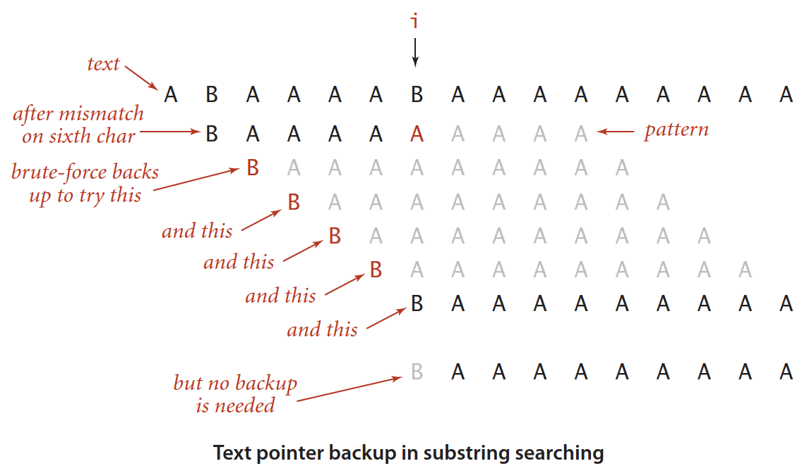

# KMP 算法

## 简介

Knuth, Morris 和 Pratt 发现算法的基本思想是：每当检测到 mismatch，

如下图所示，假设有一个 2 字符的字母表，搜索 pattern "BAAAAAAAAA"，假设成功匹配 5 个字符，第 6 个字符不匹配。当检测到不匹配时，我们知道文本前 6 个字符是 "BAAAAA"，此时 `i` 指向末尾的 B。因为 B 前面 4 个字符都是 A，不可能与 B 匹配，所以可以直接跳过这几个 A。

KMP 是以上思想的泛化。 

当 pattern 自身包含重复片段，就不能完全跳过匹配字符。例如，假设 pattern 为 "AABAAA"，text 为 "AABAABAAAA"，在 index=5 检测到 mismatch，但我们需要从 index=3 开始继续搜索，否则会错过 match。KMP 算法的思想是，这种情况可以提前确定，因为它只取决于 pattern。

