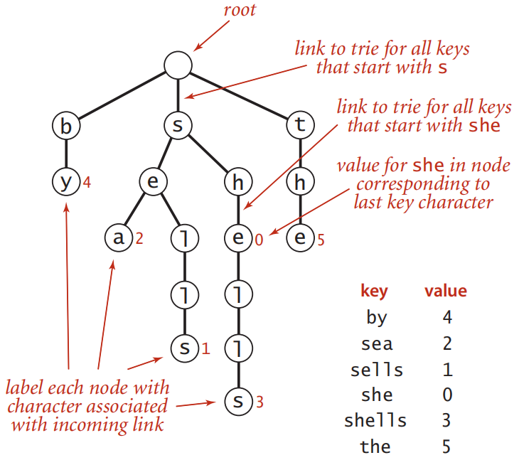

# 字典树（Trie）

@author Jiawei Mao
***

## 简介

字典树（Trie），又叫前缀树（prefix tree），是一个针对字符串的**数据结构**。可用于自动补全和拼写检查等场景。

名称 "trie" 由 E. Fredkin 在 1960 年引入，因为该数据结构用于检索（re**trie**val），不过一般读作 "try"，以避免与 "tree" 混淆。

下面从 trie 的基本属性开始，包括搜索和插入算法。

## 基本属性

和查找树一样，tries 由节点（node）和连接（link）组成：

- 每个节点只有一个父节点（parent），根节点（root）没有父节点；
- 每个节点有 R 个 links，R 为字母表大小（alphabet-size）；
- trie 通常有大量 null links，绘制 trie 时一般忽略 null links；

虽然 link 指向 node，但每个 node 也可以看作一个 trie 的 root。

每个 link 对应一个字符值，因为每个 link 只指向一个 node，所以可以用 link 的字符值标记 node（除了没有 link 的 root）。

每个 node 也有一个相应的值，该值可以为 null，也可以

